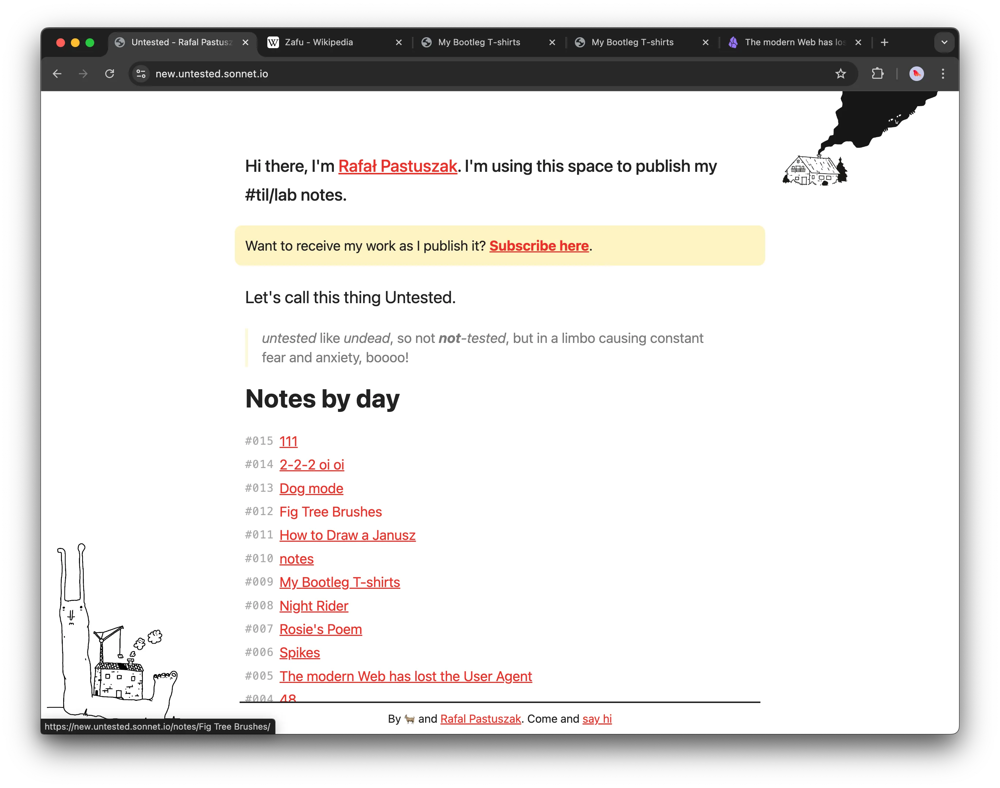

Hi! How have you been? I'm starting my holiday in about 10...9 minutes, so I'll keep this one quick: I want to extend [my experiment](<../111>) indefinitely and have a space to write, think and build in public with as little friction as possible.

I've been consciously avoiding ~~leaving Obsidian Publish~~ _yak shaving_ during the past few months, so I could focus on what then felt scary -- writing! So I left the redesign as a little reward for myself for reaching 111 posts.

> You can check the current version [here](https://new.untested.sonnet.io).

**Note: this is just a playground. and the design as well as the structure will change quite a bit!** My main focus at the moment is building a solid pipeline to import the content from Obsidian, not the design.

### Here's how the test site looks now

#### (temporary) Article view

#### (t...temporary!) Table of Contents

**Don't fix what's not broken.** I don't want to change the way I organise my personal notes, so I needed to build a slightly more complex way of publishing my notes from Obsidian. You can check the [code here](https://github.com/paprikka/obsidian-eleventy).

## What to expect

- better, albeit more idiosyncratic UX, especially on mobile
- more interactivity, less linearity
- fixes for the issues mentioned here: [Abusing and reviewing Obsidian Publish](<../Abusing and reviewing Obsidian Publish>)
- ~~MY BRAIN ONLINE~~ one place for all of my projects (for now, my work is split between untested and sonnet.io)
- hopefully some tools you can borrow and reuse

## Here's how I'm going to work on this

- messily.
- with a ton of [Spikes](<../Spikes>)

I'll keep a replica of my notes from [untested.sonnet.io](https://untested.sonnet.io) on [new.untested.sonnet.io](https://new.untested.sonnet.io) and as soon as new.untested works as good as this version, we'll make the switch.

**One must embrace the snail of Theseus, the constantly changing anthropod, the not so distant cousin of [Proteus](<../Proteus>).**

Ok, enough rambling. Time to say hi to some volcanoes and a glass of limoncello. Thanks for reading this!

Hugs, R.

P.S. I still love Obsidian Publish and highly recommend it if you just want to start sharing your thoughts in public. It just doesn't work for my specific use case. I enjoy coding with HTML/CSS as much as I enjoy drawing or calligraphy. It's a medium I grew (up) with so I want to spend more time with it!
