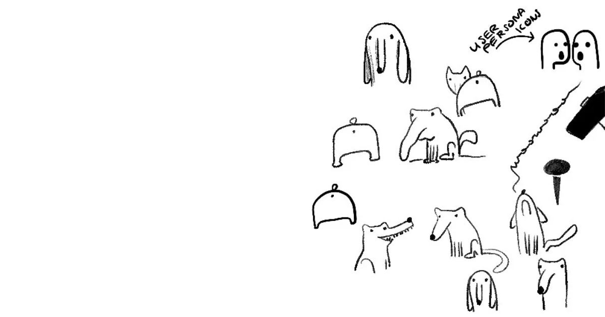

_My **earlier** work titled: "A Quick Study of the Canine Form"_

2-2-2 stands for 2 hours, 2 days and 2 weeks. It's a technique of scoping experiment work I learned from [Jordi Bruin](https://twitter.com/jordibruin) and I've applied it to a bunch of projects including [Sit.](https://sit/sonnet.io) .

> It reminds me of the [3-3-3 Rule for Rescue Dogs](<../3-3-3 Rule for Rescue Dogs>), but imagine that you're replacing dogs with... idea puppies!

Edit: Jordi!!! published a [talk](https://vimeo.com/865555649) about his approach on Vimeo. I haven't watched it yet, so please consider the note below a weird cousin of his idea (probably very similar).

## 2-2-2 101

So, you have an idea. Here's how to test it:

1. You have **2 hours to build a proof of concept**. Answer the question: is it possible? does it even make sense?
   - if not: [bin it](<../Kill your darlings, their bones are the best fertiliser>), start again!
2. You have **2 days to build a prototype to share with friends**. Is it solving their problem? Is it entertaining? Does it have the effect you want it to have?
   - if not [bin it](<../Kill your darlings, their bones are the best fertiliser>), start again!
3. You have **2 weeks to build an MVP**. Make it **useful**. Make it a paid product if your goal is to charge for it.

None of this is really new. Perhaps you've built your own products or worked for an [XP](<../XP>) shop, a [HCD](<../HCD>) shop, or any design-driven organisation that that does more than [Agile Pantomime](<../Agile Pantomime>) — this split of work should sound familiar.

And that's what I like about this approach: it's so concise. It communicates so well the value of:

- sharing your work often ([Share your unfinished, scrappy work](<../Share your unfinished, scrappy work>))
- testing your work with real users and learning from them
- being strategic about your time and resources:
  - bailing if things don't work
  - scaling up your effort (e.g. time) and testing scope (e.g. audience)

Plus, it's an excuse to give yourself some structure by separating focussed time from play. 2 hours just doesn't seem like a huge time commitment to start with.

### But what if 2 hours is not enough?

Related: _Code [Spikes](<../Spikes>)_.

1. Reduce scope:
   1. Rick a subproblem.
   2. Redefine the problem (turn it into _n_ problems).
2. Allocate more than 2 hours.
   - **This is not a cult, you're allowed to make changes.** No one will spank you if you do (I think.)
3. Don't do it. Pick a different idea to work on.

Related: [Instead or writing a comment, write a post and link it](<../Instead or writing a comment, write a post and link it>)
