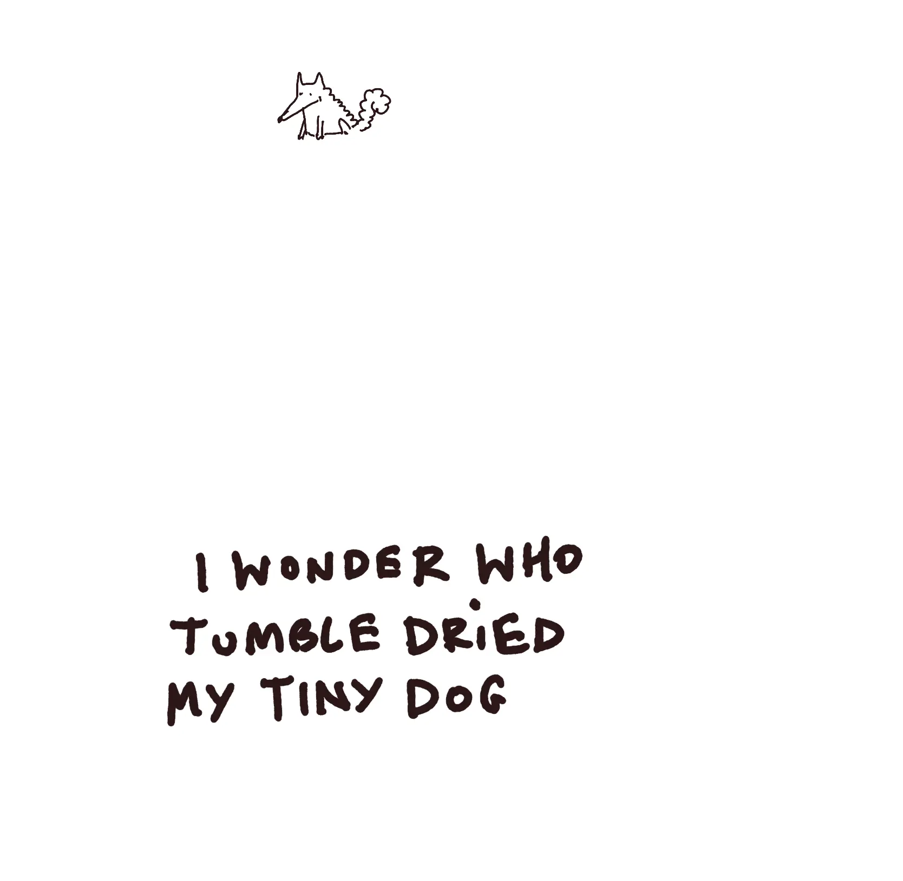
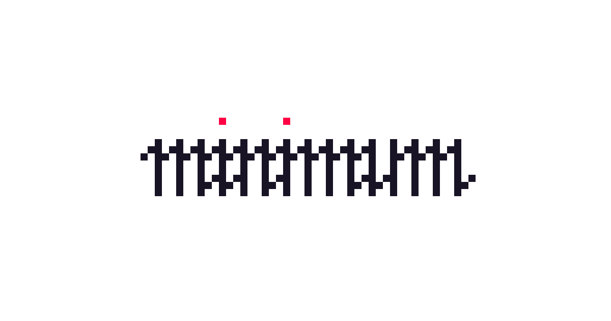

[433](https://github.com/paprikka/433/tree/main) is a font that masks the visible text and replaces it with dots. I'm using it with the [Coffeeshop Mode](<../Sketch - Ensō Coffeeshop Mode>) in [Ensō](<../New Enso - first public beta>).

You can see it in action here:

<video src="https://res.cloudinary.com/dlve3inen/video/upload/v1753181245/coffeeshop-underpant-gnomes_kiecvn.mp4" loop controls muted playsinline autoplay style='aspect-ratio: 640/422; width: 100%'></video>

Beautiful.

## Why

**In short: because it's the simplest way to add the Coffeeshop mode to the app.**  
(Also, because I was curious)
(OK, mainly because I was curious, [Dog mode](<../Dog mode>))

**Longer version:**
The previous [note on Ensō](<../New Enso - first public beta>) ended up on the front page of HN and gave us almost 400 TestFlight testers. This is way more than I had expected. In fact, I set initial limit at 50, and kept bumping it every few ours, in disbelief! It's also a relatively diverse group of people with many using non-Latin writing systems, e.g.: Chinese (pinyin), Japanese, Persian, Arabic, Hebrew to name a few.

This was a perfect opportunity to test a bunch of text rendering/input approaches to [IME](<../IME>), custom carets, hiding text in Coffeeshop Mode, IME and having a prettier/snappier, easier to style preview. 

So, I prototyped a few of them, then settled on a much simple solution: no need to use Canvas, or wrap each character in a fancy styled `<span>`. Just make the font render the mystery raisin (`·`) for anything that is not whitespace.

So, buckle up buckaroos, we're (un)making a font!

## Why 433

The name was inspired by [4′33″](<../4′33″>).

## How it works

You can find the script [here](https://github.com/paprikka/433/blob/main/generate-font.py). But, don't click away yet, we'll go through it step by step in the next section.

### What is a font

To make more sense from this note, let's establish a (grossly oversimplified) [Working Definition](<../Operational Definition>): 

A font is a bunch of **glyphs**. A glyph is a **visual representation**, actual **shape** of a character, usually drawn as bezier curves. Each glyph is mapped to an address, called a **code point**. These addresses cover a huge range of characters, supporting various languages, diacritic marks, etc... and are grouped into ranges, e.g.:

1. **Basic Latin**
    Range: U+0000 to U+007F
    *Example characters: standard ASCII – letters, digits, punctuation.*
2. **CJK Unified Ideographs**
    Range: U+4E00 to U+9FFF
    *Example characters: Chinese, Japanese, Korean common Han ideographs.*
3. **Arabic**
    Range: U+0600 to U+06FF
    *Example characters: Arabic script letters and symbols.*

To reduce size, fonts generally support only a subset of ranges (e.g. Basic Latin). These ranges are grouped into 17 **planes** of 65k characters each, e.g. *Basic Multilingual Plane* for most existing languages, *Secondary Multilingual Plane* for emojis.

Fun fact: there are separate planes supporting hieroglyphs, cuneiform writing or even [𐬛𐬍𐬥𐬛𐬀𐬠𐬌𐬭𐬫𐬵](https://en.wikipedia.org/wiki/Avestan_alphabet)! *Glyphs*, *planes* and any other esoteric language aside, understanding those subjects and mastering the font related vocabulary is what separates *Adeptus Exemptus* from becoming *Master of the Temple* in Thelema. 


*(and it takes more time than performing the [Abramelin operation](https://en.wikipedia.org/wiki/The_Book_of_Abramelin))*

Related  [How a Font is Rendered](<../How a Font is Rendered>).

We've established the context, so now we can be more explicit about what we want to achieve:

> Create a font that for **all non-whitespace characters** returns a glyph rendering a dot.

1. ensure that all code points are covered by the font
	- otherwise unsupported characters will be rendered using the OS fallback font which would result in unmasking it
2. keep the size small
	- the Basic Multilingual plane covers 65k characters, so an unoptimised version of this font would be several megabytes in size
	
### The script

#### Set up font metadata:

```python
font = fontforge.font()
font.fontname = "Masked"
font.familyname = "Masked"
font.fullname = "Masked Regular"
font.weight = "Regular"
font.encoding = "UnicodeFull"
```

Initially I tried to reuse an existing, well designed, multi-lingual font here instead of creating a new one, and then iterate on each of its glyphs. However, none of the fonts were comprehensive enough.

#### Set the font metrics: 

```python
font.em = 1000
font.ascent = 800
font.descent = 200
```

These will help define the "canvas" on which to draw the glyph and control the space occupied by characters on the screen:

#### Draw the glyph:

```python
dot_width = 600
dot_glyph = font.createChar(0x25CF, "blackcircle")
dot_glyph.width = dot_width
dot_glyph.clear()

pen = dot_glyph.glyphPen()
pen.moveTo((300, 200))
pen.curveTo((350, 200), (400, 250), (400, 300))
# ...
pen.curveTo((200, 250), (250, 200), (300, 200))
pen.closePath()
pen = None
```


#### Create whitespace characters and empty glyphs: 

```python
whitespace_chars = {
    0x0020: 500,  # Space
	# ... 
    0x205F: 250,  # Medium mathematical space
    0x3000: 1000, # Ideographic space
}

for codepoint, width in whitespace_chars.items():
    glyph = font.createChar(codepoint)
    glyph.width = width
```

This is less relevant for Ensō and somewhat pedantic as we're using this font only in the Coffeeshop Mode.

#### Assign a glyph to each available code point:

```python
total_glyphs = 0
# Use Basic Multilingual Plane (0x0000-0xFFFF) 
# which covers most common characters
for codepoint in range(0x21, 0x10000):  # Start from 0x21 to skip control chars
    # Skip if it's a whitespace character
    if codepoint in whitespace_chars:
        continue
        
    # Skip the dot glyph itself to avoid self-reference
    if codepoint == 0x25CF:
        continue
        
    # Create glyph that references the dot template
    try:
        glyph = font.createChar(codepoint)
        glyph.width = dot_width
        # Use addReference instead of drawing - much more efficient
        glyph.addReference(dot_glyph.glyphname)
        total_glyphs += 1
    except Exception:
        # Skip invalid codepoints
        pass
```

This step is especially important. Instead of drawing the same glyph for each code point we *reference* the original dot glyph to avoid duplication. This will help reduce the size and build time drastically.

```python
try:
	glyph = font.createChar(codepoint)
	glyph.width = dot_width
	# Use addReference instead of drawing - much more efficient
	glyph.addReference(dot_glyph.glyphname)
	total_glyphs += 1
```

#### Generate the font:

```
font.generate(args.font_output) # normally .woff2
```

I started with [TTF](https://en.wikipedia.org/wiki/TrueType), but the generated `.ttf` font file was ca. 2.4mb, even with de-duplicated glyphs. This is because TTF stores individual glyph definitions plus associated table data for each mapped code point. Additionally, TTF does not support internal compression, so all glyph outlines and tables are stored uncompressed.

On the other hand, [WOFF2](https://en.wikipedia.org/wiki/Web_Open_Font_Format) stores less data by default, supports [brotli](<../brotli>) compression, and even pre-processes glyph curves to make them easier to squash. 

Switching to WOFF2 reduced the file size to 70kb, so by 97% compared to TTF, brilliant!

{style="max-width: 400px"}
## What I learned/noticed

#### Using font stitching as an alternative to font stacks

Here's a problem I know how to solve now:

- your brand font doesn't support Japanese characters
- you need to use it both on the web and in your native app (so, you can't rely on font stacks and fallback fonts)

As long as licensing is not a problem, you can merge the Japanese font into the Latin font replacing only the missing ranges. *As long as licensing is not a problem.* 

I'm obviously [missing](<../Dunning-Kruger>) missing complexity here, but batch operations, CRISPR-style cutting and pasting different glyphs to create font variants supporting multiple languages is not as hard as I had originally anticipated. `fontforge` API doesn't seem scary at all. 

Also, literally on the same day I worked on this, over a beer, I met a person who had this problem, and I was able to share some of this brain food! (or make their lives more complicated, time will tell)

#### MISS 


"minimum" rendered as pixel art / Fraktur

It's weird but also almost always very satisfying to look at the code as a *reductive* medium. I mean, yes, engineers love commits with negative LoC in diffs as much as and anthropomorphised version of Claude enjoys produce piles of semi-random, somewhat useful crap. But this felt different, as I started with the assumption that I wanted to find a shortcut and was open to accepting its limitations, rather than cleaning up or refactoring.

I feel like this is another exercise falling under that category – we dropped a bunch of complexity by moving it to the font. Is it [L’appel du vide](<../L’appel du vide>) or [Horror vacui](<../Horror vacui>)? It's neither, it's [MISS](<../MISS – Make It Stupid, Simple>)!

On a personal level, messing with this was a good reminder of how many skills were involved into getting this done: linguistics, typography, unicode, understanding font architecture/data structures, compression, CSS and font stacks, to name a few. 

Since you've reached this far, chances are this will resonate: I'm not used to celebrating successes/noticing what I've learned, but instead I just move on to the next thing. This was a good reminder for me to pause for a second, because I learn more slowly if I just keep moving. There's no virtue in that. (related [Vicariously](<../Vicariously>))

Thanks for reading!

