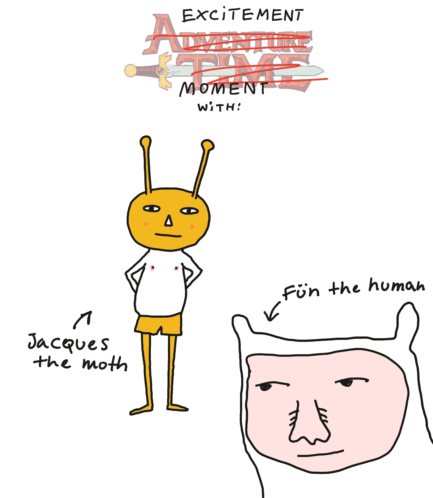
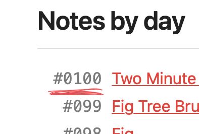
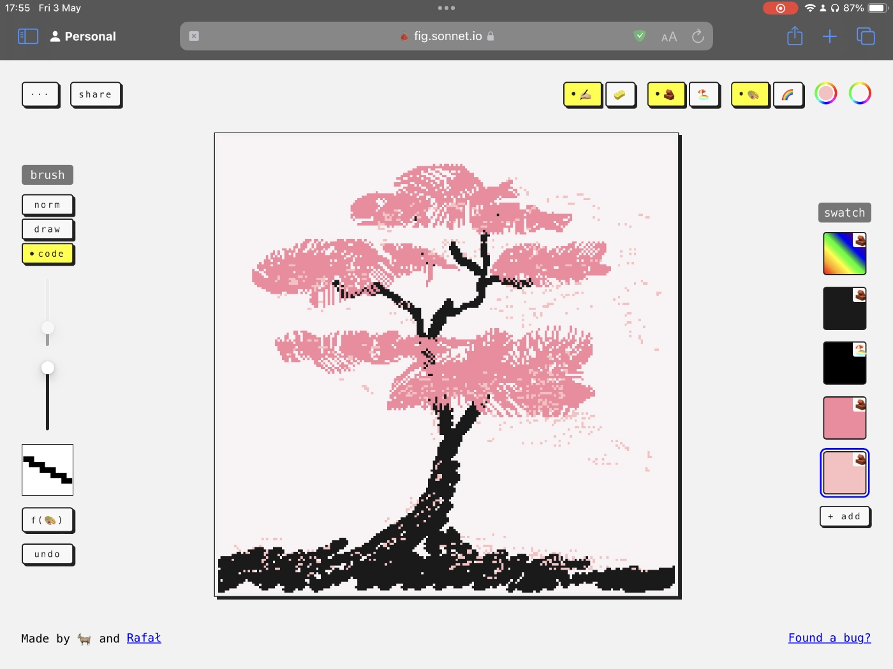
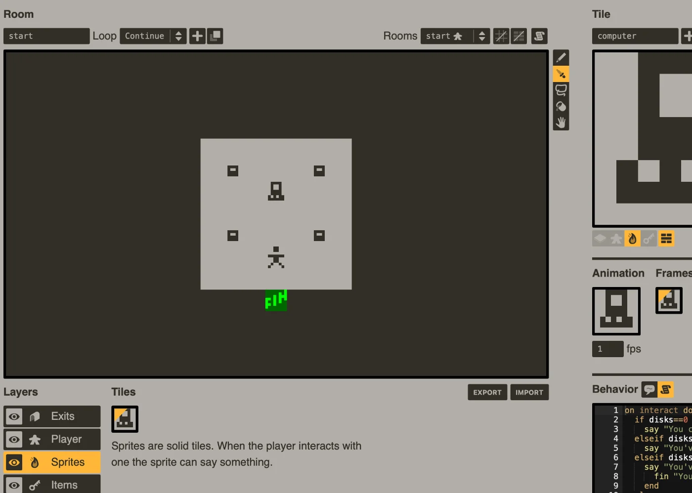
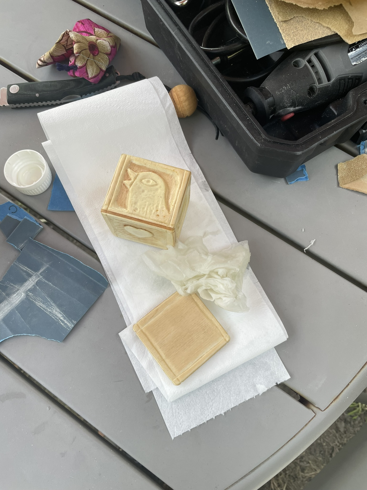

## Meta

Reminder: this site is an [iterative experiment](<../111>), so let's ~~put on the janitor hat~~ say hi to the (copyright-friendly) *Fün the human and Jacques the (copyright-friendly) shapeshifting moth*:

## This ~~week's~~ month's summary

It's been a while! How have you been? [Come sit next to me and tell me what you saw](https://www.youtube.com/watch?v=hE5vRGf9FpI)!

### 101

We're 101 posts in. Thank you for being here.

### Fig.

**I made a drawing app where every pixel has a lifespan and eventually dies.** 

**Check it out here: [https://fig.sonnet.io](https://fig.sonnet.io/).** 

Read about it [here](<../Fig>).

The idea behind Fig is to help you focus on the process of drawing without obsessing with the end result. In that sense, it's a bit similar to [Ensō](https://enso.sonnet.io) or [Sit](https://sit.sonnet.io).

(also it has hackable, programmable brushes and trippy geocities-eque gradients)

<video src='https://res.cloudinary.com/dlve3inen/video/upload/v1714758595/fig-brushes_dpkfwb.mp4' controls muted autoplay poster='https://res.cloudinary.com/dlve3inen/image/upload/v1714758192/fig-brushes_kaod6d.png' playsinline />

My work on Fig was motivated by the death of the fig tree in my garden, and partially inspired by this poem by my brother’s 3yo daughter:

> *Little ducklings were walking*
> *then they fell*
> *and they died.*
> 
> – by [Rosie](<../Rosie's Poem>)

(something tells me she’ll turn out to be a goth like her uncle)

### Future

The work from the past 2 years has... paid off and now I have enough time and space for research and more complex projects. This includes new stuff as well as the things people who read this have asked for. I'll share more on that in the next few weeks.

### Next week

- Let's crank it up! Forget Apple Vision Pro, I received a [Playdate](https://play.date) for my birthday, so I'm anxious to start hacking my way into the future of computing.
- Fig updates – some quality of life improvements based on user feedback + a potential phone friendly version
- A quick write-up on Sandbox/Sandspiel playthings
- I'm working on a schedule for bigger projects, incl. a little big update for Ensō

## Favourite project

[Shepherd](https://shepherd.com) – a book recommendation app which (to quote its creator) acts a bit like wandering through your favourite bookstore. Recommendations are sourced from interviews with almost 10,000 authors. I approached it with a bit of hesitation: the best recommendations I've received came from my close friends or kind [Say Hi](https://sonnet.io/posts/hi) strangers. Then, my biggest issue is not discovery itself but maintaining an actual, consistent reading habit. Having said that, the recommendations provided by Shepherd are [pretty good](https://shepherd.com/search/book/1484) and some of them ended up on my reading list.

[LazyVim](https://www.lazyvim.org) – an easy to configure, no fuss, just add water™ IDE using NeoVim. 

I'm a bit surprised about this one myself. Youtube Techbros bragging about slathering themselves in coconut oil (I'm still figuring this one out) promise that using vim will make you an alpha 10x engineer (yes, even you, you handsome devil with excellent hair and spicy sense of humour!) But, as a 0.1x dev, I decided to learn vim *precisely because it felt pointless*, hoping that doing so would make me *slower*. 

If it sounds dumb, it's because it is. [No activity can be truly pointless](<../No activity can be truly pointless>), I ended up accidentally learning a fair bit (mainly about lua, LSPs, modal text editors and their ergonomics).

[MOUSE](https://store.steampowered.com/app/2416450/MOUSE/) – a gritty, 1930s Disney-inspired, jazz-fuelled shooter. I'm sharing it because it looks lovely. I found out about them via [#ScreenshotSaturday](https://x.com/mousethegame/status/1786742577926172860) on the birdsite.

<video src='https://res.cloudinary.com/dlve3inen/video/upload/v1715355656/wipeout-pd_gt1sja.mp4' autoplay muted playsinline loop/>

[wipeoutPD](https://github.com/tsalvo/wipeoutPD) – port of Wipeout (the [PS1 game](https://en.wikipedia.org/wiki/Wipeout_(video_game))) to Playdate

## Favourite site

[rooster kind](https://roosterking.drewschorno.com/cherry-coke) – a hard to pigeonhole poem/website/collage/place. Just watch/listen to/inhale it. I particularly liked the end of [Cherry Coke](https://roosterking.drewschorno.com/cherry-coke) 

[Curius](https://curius.app) – a social bookmark sharing app. I didn't want to share it as the project hasn't changed for the past few years. Frankly, I assumed it was dead. What changed my mind was going through the logs of my Say Hi calls and realising how much of the brain food I received from people were their links to Curious. Give it a go, [Proteus](<../Proteus - Uncertainty is the only Certainty>). Let me if you like it.

[Sublime](https://sublime.app) – a mix between Curius, Are.na and [My Mind](https://mymind.com).

[pulp](https://play.date/pulp/) – Pulp is a simple browser-based game engine for Playdate. It reminds me a bit of [bitsy](https://bitsy.org).

## Favourite piece of tech

**My flimsy Dremel knock-off** – I bought a cheap rotary tool with an adapter that let's me to hold it like a pen.

## Interesting articles

- [Manifesto for a Humane Web](https://humanewebmanifesto.com)
- [Cocktail party ideas](https://danluu.com/cocktail-ideas/) (re-read this one)
- [my friends are making cool shit | the greg technology blog](https://blog.greg.technology/2024/04/29/my-friends-are-making-cool-shit.html)

### Reading list

- [Obituary for a Quiet Life — THE BITTER SOUTHERNER](https://bittersoutherner.com/feature/2023/obituary-for-a-quiet-life)
- [A Dictionary of Colour Combinations | RIBA Books](https://www.ribabooks.com/A-Dictionary-of-Color-Combinations_9784861522475)

## Things I wrote last week that people liked

- [Fig Tree Brushes](<../Fig Tree Brushes>)

Thanks for reading! See you on Monday!
