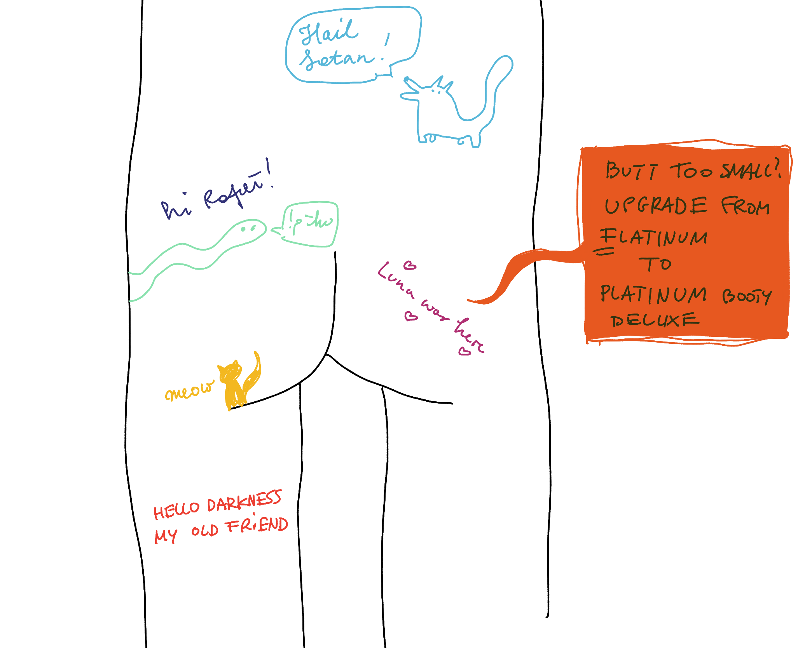

I love Obsidian. I think it's an [almost](<../My Ideal Writing and Thinking Tool>) perfect hypertext editor. In a weird way it's [closer to the spirit of the Web](<../Tools like Obsidian a true Web 1.0 platform>) than most web browsers [cable-tv internet](<../Cable TV Web>). 

I also immensely enjoy reading, writing and thinking in graphs ([Wikipedia rabbit holes and writing evergreen notes](<../Wikipedia rabbit holes and writing evergreen notes>)): entering someone's mind through a series of associations, rather than a linear stream of notes.

**But this note is about Obsidian *Publish*, not Obsidian (the *authoring/thinking tool*).** To make it useful, let's make sure we frame this properly.

I have fairly specific needs, experience, and biases: I've been building authoring and publishing tools for more than a decade, with clients ranging from a) me, to b) small indie publishers to c) large publishing enterprises. Even Storienteer was a publishing platform in a sense, although with 6 degrees of freedom and (possibly) commute required to navigate the content instead of scrolling, but I digress. The point is – I really like this stuff and, for better or worse, **I have opinions™**!

Then, I love playing with the Web Platform, either experimenting or just messing with simple HTML templates and CSS. It's one of my favourite forms of expression, it's my LEGOs! ([How I learned to love the web and stopped worrying about Javascript Fatigue](<../How I learned to love the web and stopped worrying about Javascript Fatigue>))

I also publish my content in several places, using a variety of technologies, from markdown, to plain HTML, to Next.js (examples: this site, sonnet.io, potato.horse, most of the mini-app/games and articles on sonnet.io/projects). 

In some ways this makes me a *terrible* user. I will dislike the things many people probably don't care about, I will err on the side of building my own thing, instead of buying, and try to abuse or hack whatever third-party tools I have at my disposal. Here's [How I Use Obsidian to Publish These Notes](<../How I Use Obsidian to Publish These Notes>).

In summary, please read **"bad"** as **"doesn't work for Rafał"** and use this more as guidance/brain food.

## Opinions

### Trivial to set up

- pay for the service
- hit *Publish: Publish changes*
- and, you're done!

### Updates take almost no time to propagate

Site updates are lighting fast. I don't recall a moment when I saw a stale version of the site, perhaps besides some custom .css and .js files. Hit *Publish*, and 5 sec later the changes are there.

It seems like a small thing, but it makes for a much more pleasant experience than waiting 1 minute for the CDN update when you pushed a typo fix.

### No proper custom domain support

I **strongly** encourage you to keep your email and your published content on your own domain ([Why own a personal domain](<../Why own a personal domain>)).

Currently (2023-11-23) there are two ways of setting up a custom domain: 

- Cloudflare
- proxy

I don't use Cloudflare, so I needed to follow the proxy route. [untested.sonnet.io](https://untested.sonnet.io) is a vercel project pointing to [publish.obsidian.md](https://publish.obsidian.md) via redirects (reference config [here](https://github.com/paprikka/untested/blob/314f2f57d3c17ef465f79a7e30818dfd57dc298a/vercel.json)).

```json
"rewrites": [
    {
      "source": "/",
      "destination": "https://publish.obsidian.md/serve?url=untested.sonnet.io/"
    },
    {
      "source": "/:path*",
      "destination": "https://publish.obsidian.md/serve?url=untested.sonnet.io/:path*"
    }
  ]
```

#### Two big problems with that:

**I want to avoid vendor lock-in.** Without a custom domain, if I'm not happy with Obsidian Publish in the future and decide to stop paying for it, I'd lose all of my links shared on social media, my other sites, forums, etc...

Finally, **using proxies instead of a proper DNS setup is slow** as every request to [untested.sonnet.io](/) has to do a round trip via vercel. This is especially noticeable on mobile.

### Performance
 
Notes with images can take ages to load. At some point this made some of my notes almost useless on mobile. Screenshots or pasted photos are the biggest offenders here because of how PNG compression works. That's unfortunate because copy/paste is a common way of adding content to Obsidian. The reason is that Obsidian Publish acts as a CDN, but it doesn't optimise most of the assets referenced in your notes. 

**I can understand why it works this way, but it irks me a bit that the official page states that Obsidian Publish has a 100 Lighthouse score.** 

Taking the usefulness of Lighthouse scores aside, that performance related statement is only correct if:

- [ ] You use publish.obsidian.md as your domain **or** you're a CloudFlare customer
- [ ] You don't use any images in your notes **or** you take care of optimising them yourself ([How to optimise images for Obsidian Publish](<../How to optimise images for Obsidian Publish>))

One good first step here would be to at least pre-calculate image aspect ratios, so even if they take longer to load, there's no layout shift.

I think the Obsidian team should be a bit more clear about this. 

### Accessibility

It's mostly OK, as markdown and wikilinks allow to specify alt text:

`` or `<div style='background: red' >local-cat.png</div>`

Things get a bit trickier when I want to use images with captions (\<figure\>), because Obsidian doesn't support those.

One approach is to use plain HTML:

```html
<figure>
	
	<figcaption>meow!</figcaption>
</figure>
```

In this case we lose the ability to link to the image in the vault and need to host it ourselves as markdown within HTML blocks is not processed.

Another one to just use markdown and add a paragraph with the caption below:

```md
<div style='background: red' >cat.png</div>

*meow*
```


*[Uncolouring Book](https://lines.potato.horse) v. 2 (the Uncolouring Butt)*


Accessibility is more than alt tags. The issue with this approach is that although it looks fine, semantically the paragraph of text and the image are two separate entities. It's just a paragraph of text close to an image.


### Lack of proper RSS support

Obsidian Publish does generate RSS feeds, e.g. untested.sonnet.io/rss.xml, however the feeds don't contain timestamps, and are (generally) not that useful. See the example feed for potato.horse and untested.sonnet.io in Feedly:

#### Obsidian Publish 

Besides lacking pictures and descriptions, none of these links work.


#### Potato.horse


### Choosing what content to publish (or not) is hard

My vault contains a mix of personal, fleeting and public notes:

- Personal: [Say Hi](https://sonnet.io/posts/hi) call logs, morning notes written with Ensō
- Fleeting notes or unfinished article ideas: the links marked with *todo* you see here
- Unedited brain farts I will probably remove
- Published articles, like this one

Obsidian Publish has a UI to automatically publish linked resources. For example, I have a note titled [Things to support my own well-being – a wishlist](<../Things to support my own well-being – a wishlist>). This note links to more detailed project descriptions, but:

1. it's useful on it's own
2. I'm not ready to publish the linked notes yet
3. Because of 1 and 2, I'd like to publish it first, then add detail.

What happens often is that I click Add Linked and see this:


So, now I have to scroll through 100s notes to make sure that I'm not including anything I don't want to share or don't want to share *yet*. 

Temporary workaround: if you type *something*, literally *anything* in the search box, the UI will display the newly linked notes:


This gets a bit unwieldy when you have +1 level of linked notes or you're not 100% sure if 2 of 10 linked notes are ready to be published. Currently I just go back and forth between the editing and publishing UI to double check that I'm not accidentally sharing a brain fart, my secret cacio e pepe recipe or the reason I convinced the board of Open AI to fire Sam Altman.

Two optional approaches here:

- use folders (antithetic to how I imagine an organic graph of ideas as *objects to manipulate* should work)
- use separate vaults (same point as above, but also with more steps)


### Opinionated UX

**In most cases this is a very good thing. Focus on writing instead of yak shaving.** 

I love using web tech as a creative medium. One of the most beautiful things about having HTML, CSS and JS at your disposal is that your content suddenly becomes 4-dimensional. Deep down [The (Medieval) Times](https://tidings.potato.horse) is a very elaborate article touching on the the concepts of authenticity and manipulation, then [useRainbow()](https://sonnet.io/posts/use-rainbow) can not only tell you about animation and colour spaces, but also lets you play with those concepts and learn by doing.

I have this idea for a virtual, jRPG style cemetery of ideas. Imagine walking through it and discovering little monuments or gravestones describing the ideas that didn't really die, but became a part of a larger story ([Kill your darlings, their bones are the best fertiliser](<../Kill your darlings, their bones are the best fertiliser>)). I want to do this with my notes!

This is an extreme example, so let's tone it down a bit:

- I want to add my newsletter button at the top of the page, *without* javascript
- I want this site to look and feel more like sonnet.io
- I want to be able to include interactive code on each note, without having one messy, global JS file with a bunch of hacks


**My point here is: if Obsidian Publish offered a feature called: *Publish to folder* or *Publish to JSON*, I'd still pay for it.**

### Small, responsive team

I miss the times when you'd post an issue on HN and the CEO would reply to you [with a temporary workaround](https://news.ycombinator.com/item?id=38068570), followed up by another comment saying *fixed*. I hope they'll never grow too much.

### Shush, no slugs, just links now

Example: [MISS – Make It Stupid, Simple](<../MISS – Make It Stupid, Simple>) was initially called *MISS – Make It Stupid, Simple!* (note the trailing `!`) . This broke some of the social links because social media platforms tend to ignore the trailing exclamation mark. That's not an issue with Obsidian *per se* but, from a practical point of view, this means that I have to worry about URLs when coming up with titles for these notes. 

I want slugs! site.com/miss-make-it-stupid-simple would be a much nicer URL than site.com/MISS+–+Make+It+Stupid%2C+Simple. At the same time, slugs might not be trivial to add: think of the situation when two different note titles are normalised to the same slug.

## Summary

Am I happy with it? Yes! It's still a huge time saver and most of the issues I'm dealing with come from the fact that I want to use it in a fairly unusual way. It's not a blogging tool, but if you want to start writing and sharing, consider giving it a go. 

**Worst case–you'll drop it, best case–you'll never notice it.**

The Obsidian team is small which means that some larger features *might* take longer to implement (yes, sometimes the opposite is true). They're focused on growing the product rather than trying to blitzscale a markdown editor into oblivion.

I will probably continue abusing it till I reach my goal of [111](<../111>) days of writing. If not, I'll need Obsidian Publish to tell you about it and drop the guillotine.


