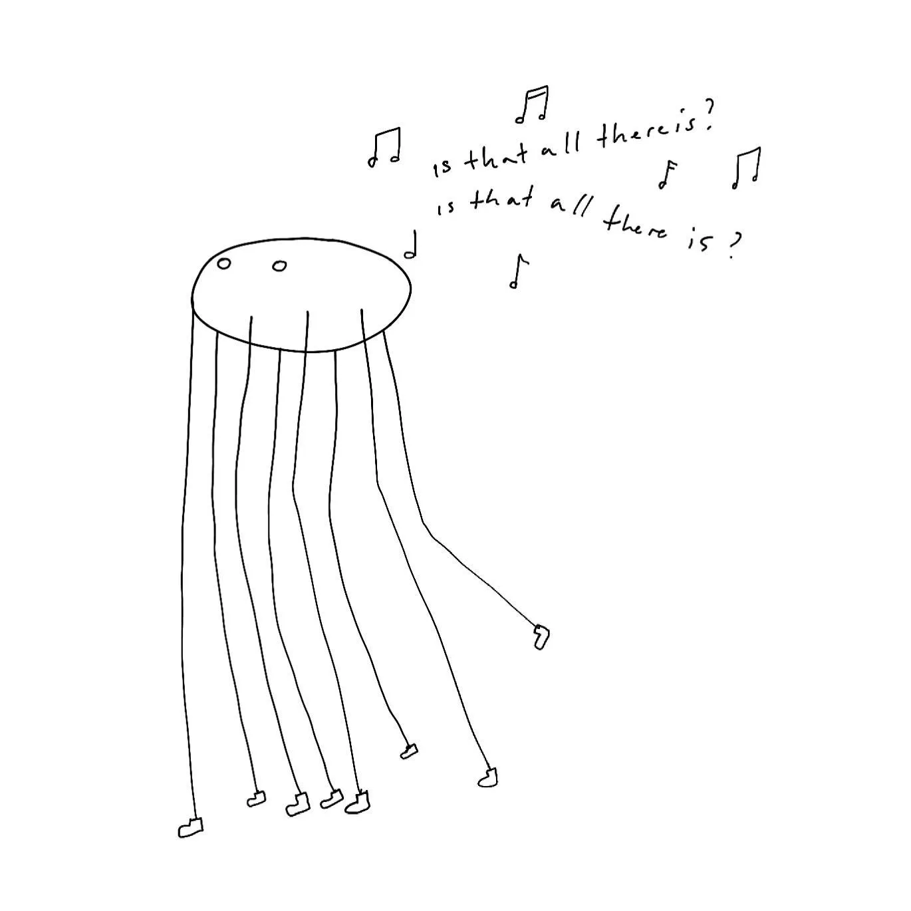

I've been using Photoshop since AD 2000. Flash paid for the unhealthy amounts of ~~ramen~~ [obwarzanki](https://en.wikipedia.org/wiki/Obwarzanek_krakowski) I ingested during my high school and uni. Still, since I ditched all Adobe software last year, I haven't looked back for a second.

That is because:

1. Adobe are a *terrible* company.
2. **The alternatives (including free, even OSS tools) are quite good!**

Here's the list of Adobe alternatives I'm using regularly. I'll split it on a per-use-case basis. If you have questions, message me and I'll update this note.

## Use cases:

### UX/Wireframes/Prototypes

> Edit for 2024: the Figma acquisition by Adobe fell through (yay). I still recommend checking out Penpot.
#### Figma → [PenPot](https://penpot.app) (still experimenting)

👍 
- simple to use
- OSS
- relies on open standards, it's SVG + HTML under the hood, which means that features such as autolayout or CSS units *just work*™

👎 
- Penpot can be self-hosted, but the process is still a bit too complicated for non-technical people. Seems like [Penpot Desktop](https://community.penpot.app/t/introducing-penpot-desktop/1468) is getting there though!

### Photo development

#### Lightroom Classic → [Capture One](https://www.captureone.com/en)

👍 

- It seems better at everything Lightroom does, *including importing the Lightroom Catalog*.
- It's a one-time payment, no subs.

👎

- The UI might seem daunting if you're moving from LR (I do think it's *unlearning* not *learning* that's hard though)
- Check if your camera model is supported before buying.

Tip: wait till late December and look for discounts. I saved 50% on CO this way. 
### Image processing

*Example: quick edits to non RAW files, finishing touches on my [Procreate](https://procreate.com) sketches*

#### Photoshop → [Affinity Photo](https://affinity.serif.com/en-us/photo/)

👍 
- Simple but powerful UX: Affinity Photo feels like Photoshop without the features no one uses. 
- Procreate and Apple Pencil is better than any of the Wacom tablets I've owned. 

👎 
- Those rare cases when the Affinity keyboard shortcuts don't match Photoshops. It's annoying but rare. It's annoying because it's rare.

### Automation

*Example: batch image processing (conversion, cropping, video → gif)*

#### Photoshop → Affinity Photo
#### **Photoshop → [ffmpeg](https://ffmpeg.org/download.html)**

👍 👎
I wish there was a nicer, contextual UI for ffmpeg. I used ffmpeg professionally (realtime video processing pipelines) and I still ask GPT to generate ffmpeg parameters.

### Diagramming/Vector sketches

#### Illustrator (yes) and pen and paper → [Concepts](https://concepts.app/en/)

👍 
- extremely configurable and simple UI
- infinite vector canvas

👎
- Concepts is a drawing tool, not a proper DTP tool

### Audio Editing

#### Audition → [Audacity](https://www.audacityteam.org)

👍 
- does exactly what I need
- OSS
- free

👎 
- no downsides from my perspective (the UI feels a bit ugly)

### Vector editing

#### Illustrator → [Affinity Designer](https://affinity.serif.com/en-us/designer/) or [Inkscape](https://inkscape.org)
(to be researched)

### Video editing

#### Premiere → [DaVinci Resolve](https://www.blackmagicdesign.com/products/davinciresolve)

👍 
- It does everything (editing, colour-grading, rendering) so well
- It's free

👎
- It does *everything*

*"Tiny cinema"*
### DTP

InDesign/Illustrator → ...

I'll have an excuse to try out some DTP tools soon. I met a (successful, talented) designer recently who managed to design her book in Figma, so I'm expecting to be surprised.

