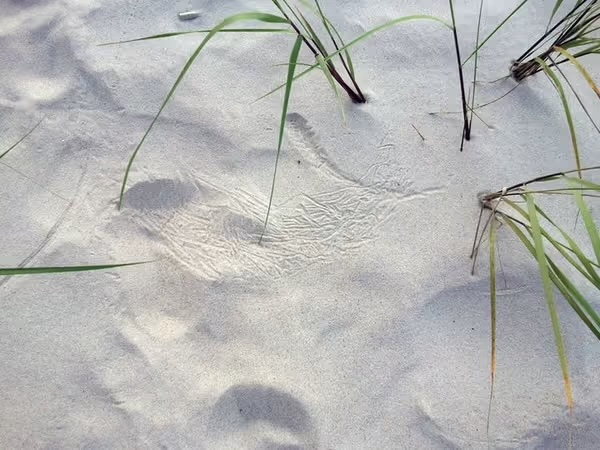

[Asemic Writing and the Desire for the Esoteric](https://www.samwoolfe.com/2022/06/asemic-writing-and-the-esoteric.html) — Asemic writing is a form of abstract writing without any specific semantic content. It *looks* and *feels* like traditional writing but it doesn't convey any fixed meaning. Check out Mirtha Dermisache for more examples. (found in [this birdshite thread](https://twitter.com/codexnoirmatic/status/1746598498470920251))

*I still wonder if this reed on one of the beaches of the Baltic was practicing asemic writing or nastaliq calligraphy. Read more [here](https://sonnet.io/posts/face/).*

Related: [Orthographic Shorthand](<../Orthographic Shorthand>)

