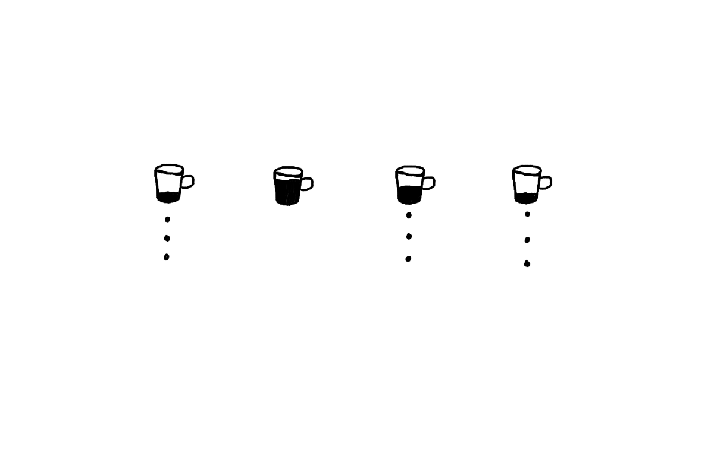

Balsamiq Cloud [doesn't charge you for the months you're not using it](https://balsamiq.com/wireframes/cloud/sales/subscription/#auto-hibernation).

I like this approach because it works for the customer and the business ([Kind software](<../Kind software>)):

- **The customer doesn't get locked in paying for a product they're not using any more, but forgot to cancel.** This is my biggest issue with subscriptions as it encourages dark UX patterns.
- **Software constantly evolves and needs to be maintained.** That costs money. Using subscriptions covers the ongoing maintenance costs.

The downside would be a higher upfront cost and complexity. I don't have much experience with the Stripe API, but I imagine you'd need to add logic to freeze/unfreeze subscriptions automatically based on usage.

This setup would already be more complex than some of the *completed* smaller projects I've built. I still think this could work for projects where I want to balance the risks from the customer and developer point of view, e.g. the [Group Meditation App](<../Sit., (together)>) I'm working on: the app itself will be trivial, but maintaining and troubleshooting realtime apps can get gnarly. 

## Related:

[How to charge for my work?](<../How to charge for my work?>)
