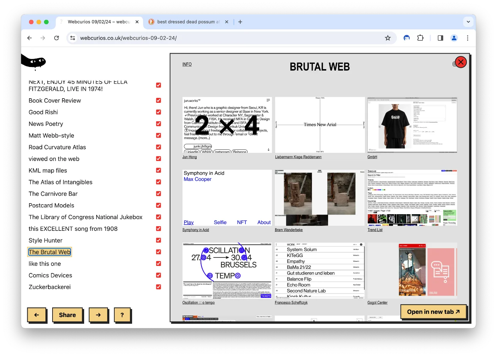
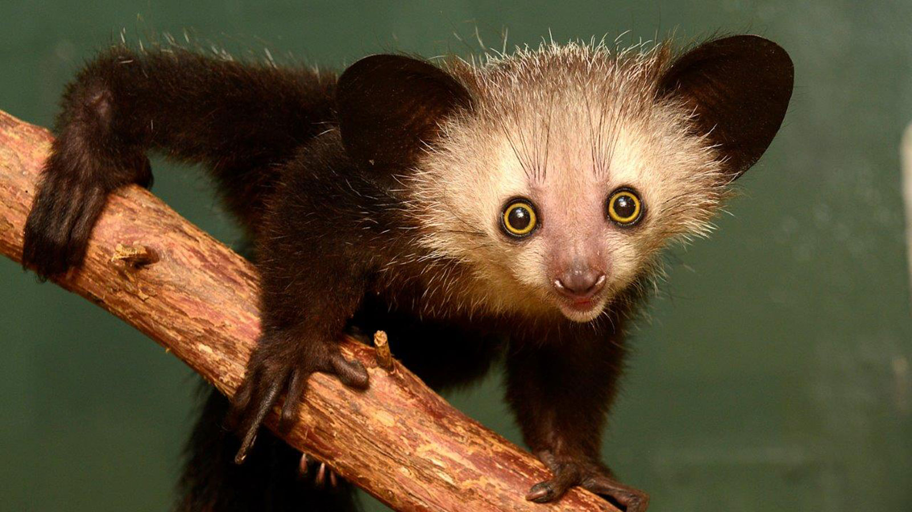
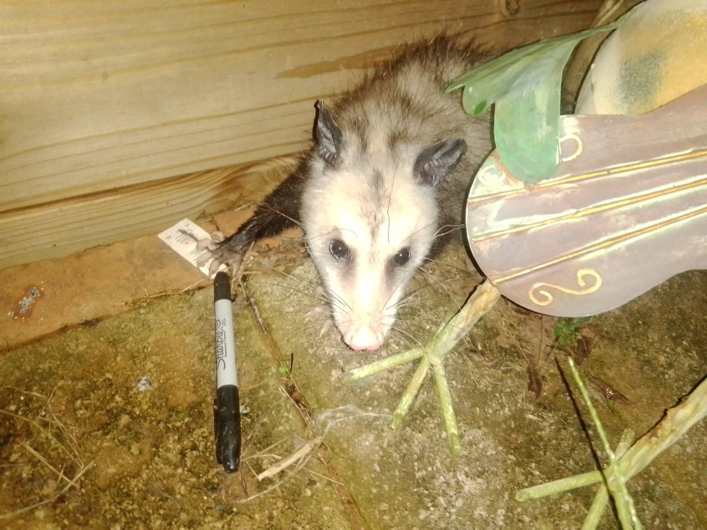

A few weeks back [Shawn Liu](https://mrshawnliu.com), a friend from [good enough](https://goodenough.us) asked me if I could build a tool to help him explore links in indie sites quickly. Here's what I've come up with.

Download it <a href='https://github.com/paprikka/aye-aye/releases'>here</a>

<iframe src="https://www.loom.com/embed/0c4d31fc2e5f4afa9ea9996209ae5165?sid=e50c0e22-a27e-4427-8192-482fdf21a98b" frameborder="0" webkitallowfullscreen mozallowfullscreen allowfullscreen style="position: absolute; top: 0; left: 0; width: 100%; height: 100%;"></iframe>

Aye-aye is browser extension that turns indie web sites and webrings into something you can binge on. There's no AI in aye-aye, just a weird lemur and a StumbleUpon-like GUI for exploration. That's it (related [MISS – Make It Stupid, Simple](<../MISS – Make It Stupid, Simple>)).

### Why "aye-aye"?

It's called an aye-aye for three reasons:

~~One: have you seen them? They're ridiculous!~~
One: aye-ayes have very long fingers. And, this is a link-grabber.
Two: aye-ayes have very, weirdly long *middle* fingers. And, this is a middle-finger towards the [Cable TV Web](<../Cable TV Web>).
Three: aye-ayes look like they've seen *things*. Spend enough time hitting the *random* button on Marginalia and you'll look the same.

### How to install it

1. Download the release from [here](https://github.com/paprikka/aye-aye/releases) and unpack it
2. Go to `chrome:extensions`
3. Click *Install unpacked extension*
4. Select the dist folder from the unpacked zip

Alternatively, skip step one and build it yourself from the [source code](https://github.com/paprikka/aye-aye).

### Next steps

- [ ] add keyboard shortcuts
- [ ] let more people use it for a few weeks

*This is not an aye-aye, but the creature the author of this note identifies with.*

That's all for today, see you tomorrow!

## Related: [aye-aye browser security, import maps](<../aye-aye browser security, import maps>)
