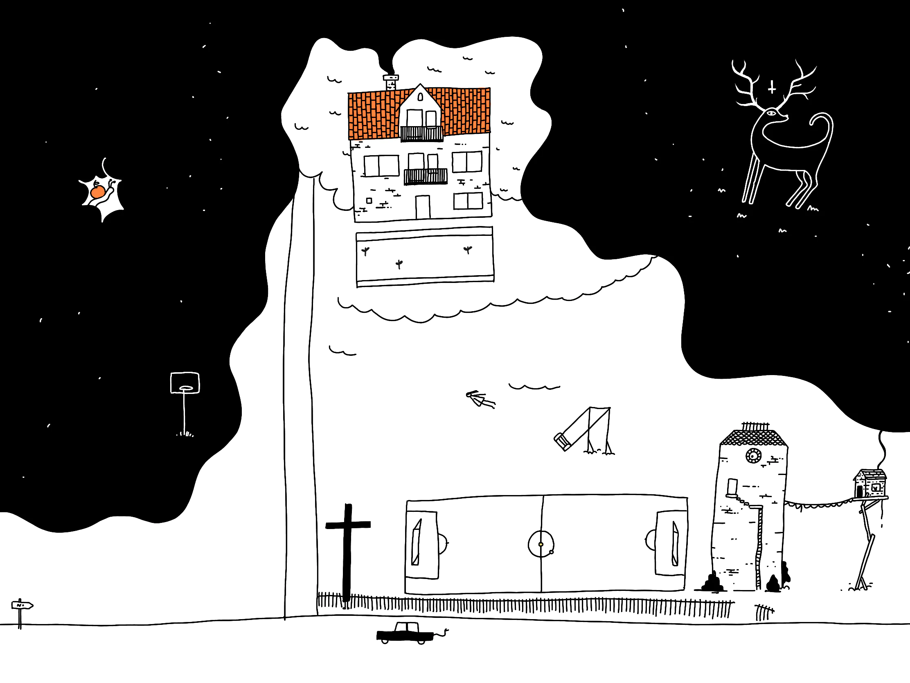

Some [ACT](<../ACT>) materials encourage people to imagine what they'd put on their gravestone. 

I think this works because it's a good lens separating you from the movie currently playing in your head, that is: the incessant, dulling noise of seemingly important things fighting for your attention. This means living your life in constant [Dog mode](<../Dog mode>). I don't want that.

So here's mine: **be kind, be curious.**

Be kind to people *and* yourself.
Be curious about the world around you, and the people.

Please feel free to understand it any way you want. To me this means that kindness and curiosity require courage. 

Courage is a loaded term. My definition: it's not a single Hollywood-like heroic act (cue canned applause here). It's not a single event, but thousands of smaller interactions happening to you every day. Here's a randomly sampled list:

- approaching a stranger on the street (they looked lost),
- saying hi to your neighbour (you missed the opportunity to do so earlier, and now it seems weird to start),
- not trying to help someone when the only thing they need is to be heard,
- **seeing something considered ugly or disgusting and finding beauty in it, taking it into hour hands and sharing it with others** 

I admire people who approach others with kindness and curiosity, seemingly with such effortlessness. We all know the kind, when they talk they rarely talk in labels, when you talk they truly listen and look you in the eyes, when they're with you, they're present. 

Now, think about a famous, kind and courageous person you admire. Who was their mother? 

## References

[Eva](<../Eva>) [ACT](<../ACT>) [What I want to do](<../What I want to do>).

> “Find joy in everything you choose to do. Every job, relationship, home… it is your responsibility to love it or change it.”
> 
> — Chuck Palahniuk (American Novelist)
