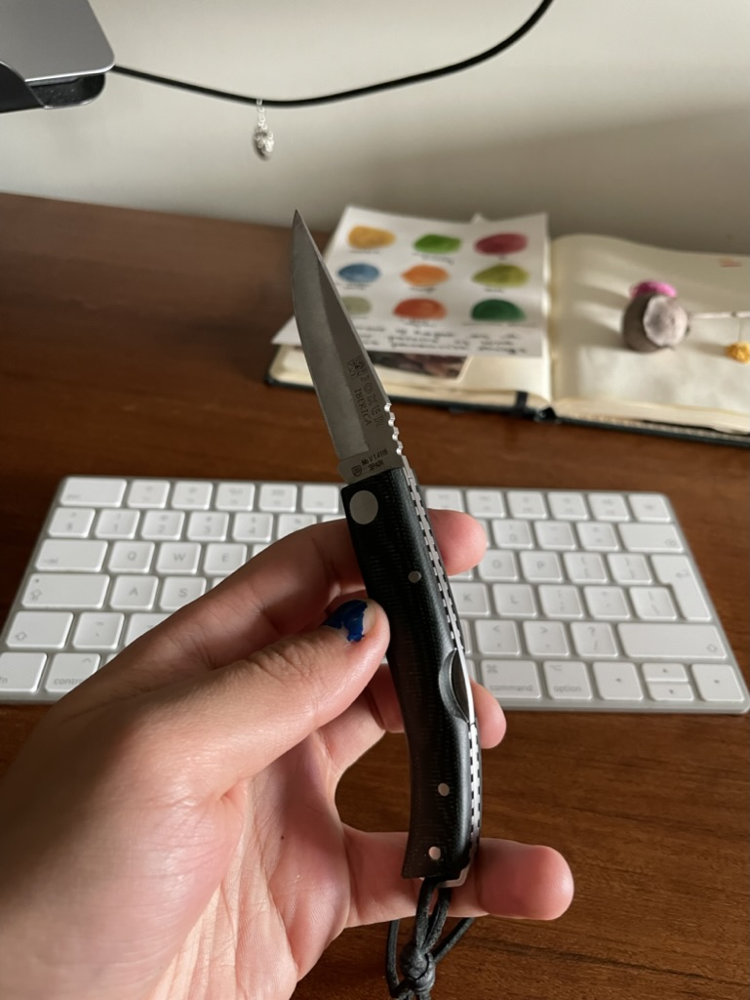
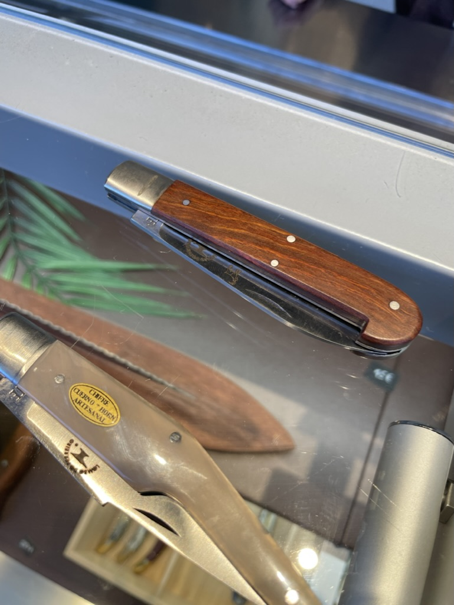
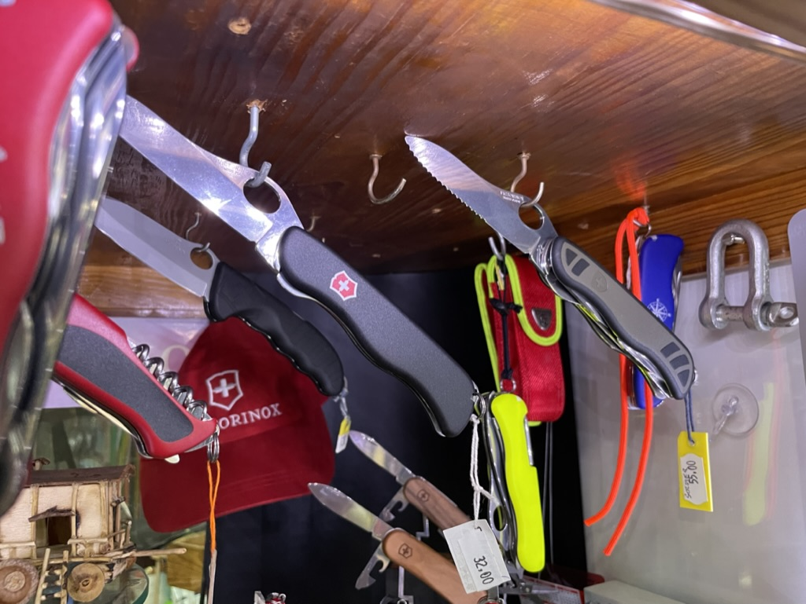
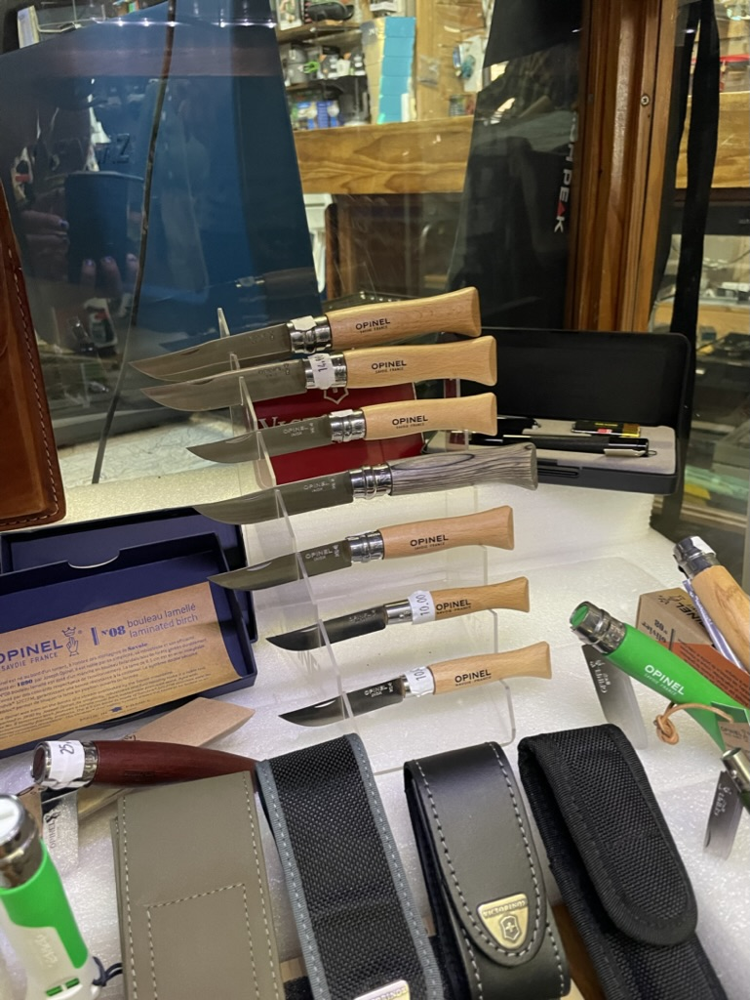
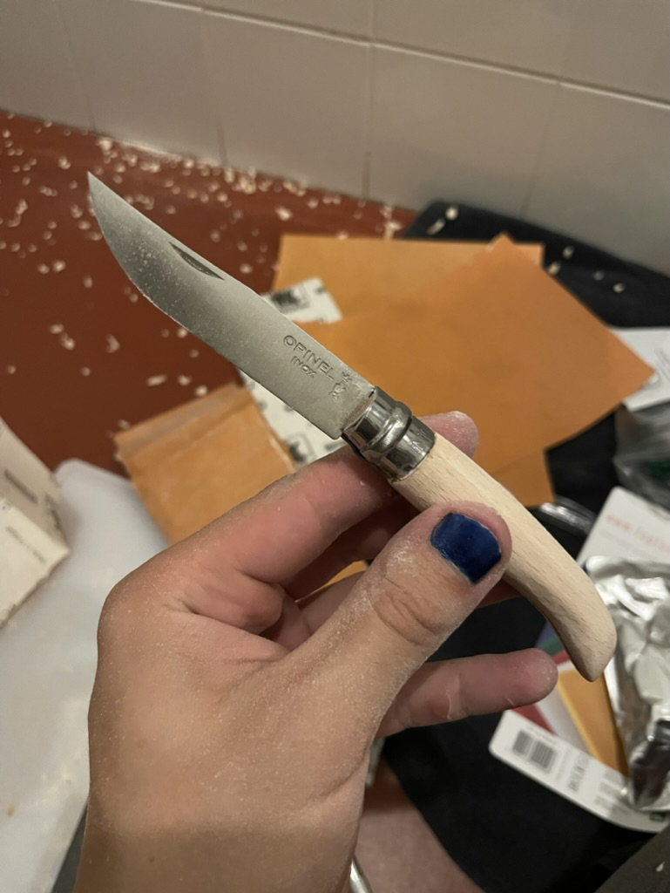
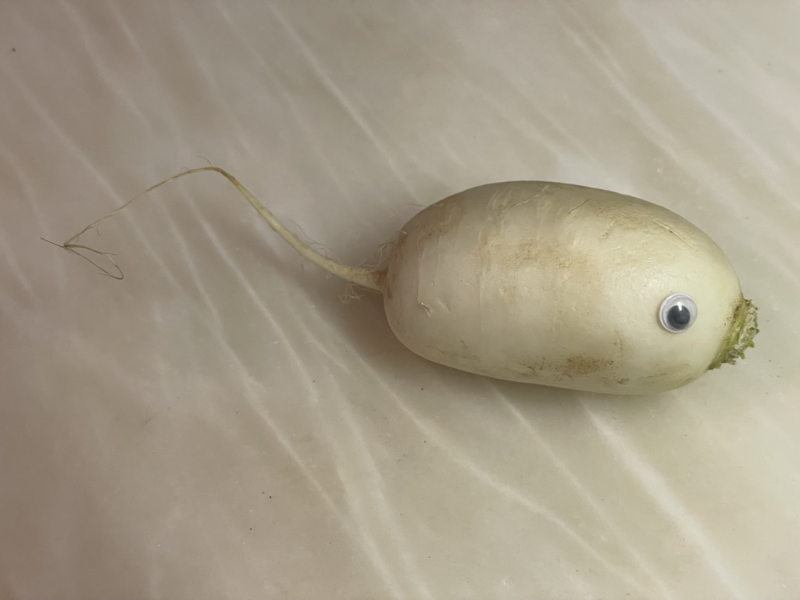
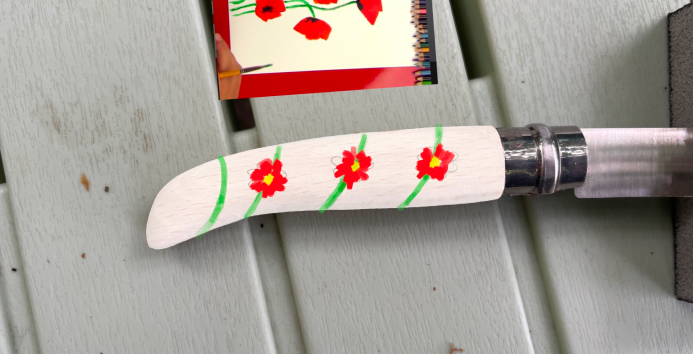
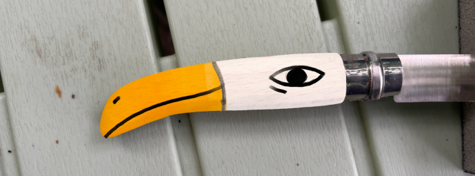
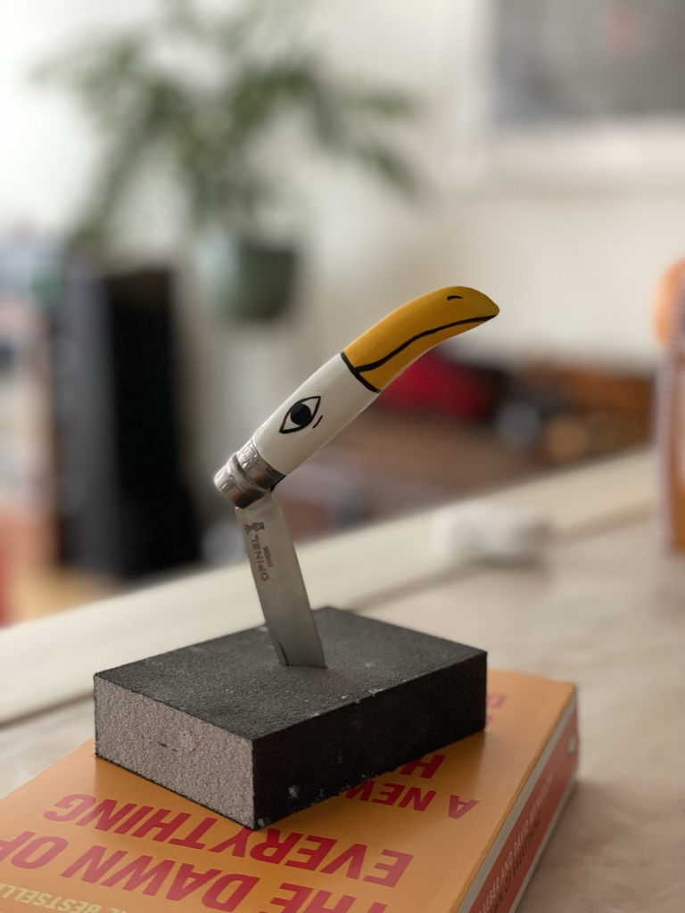
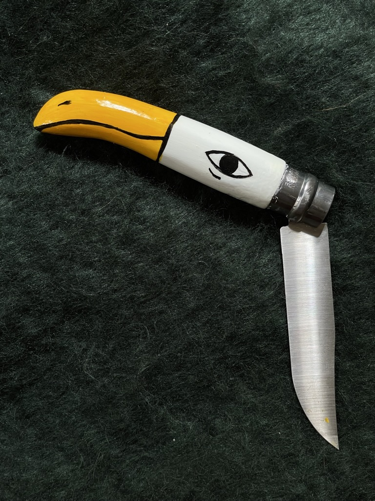

## What is it

It's a knife that looks like a bird, that's all! 
(You can scroll to the result [here](<#And here's the result>)).

## Why I made it

Luna gave me a beautiful pocket knife I still use when trekking, so I wanted to make one for her. Plus, I enjoy DIY.

In our old house we used to have this beautiful faux-porcelain cutlery set. Every knife, fork or spoon was slightly different from the rest. That was not intentional. It was a cheap set. The drawings were still the same, but the cracks, the tiny imperfections — all of that made those objects feel very precious to the 5-6 year old me. Likely, luckily, they were too precious to be thrown out and too old to be used. (To me they felt as old as the time itself.)

I also like the idea of taking an object associated with violence, and turning it into something beautiful, delicate (but delicate only in appearance.)

Finally, I know nothing about knives! How to make them? Where do they come from? Do they grow up in a tiny farm filled with creatures like [Pochita](https://chainsaw-man.fandom.com/wiki/Pochita)? 

## How it was made

Short version:

1. find the right base
2. shape it
3. paint it

Slightly longer version:
### Find the right base

We're looking for a base knife with a simple and sturdy construction and a safety lock. 

A version of this knife (gifted by Luna) seemed like a perfect starting point:

#### Pros:

- wooden base (we can easily sand and paint it)
- a safety lock

#### Cons:

- hard to find and order on time (I had a week)

I found this beauty in [Mercado de Bolhão](https://mercadobolhao.pt): 

#### Pros:

- excellent quality
- wooden handle

#### Cons:

- excellent quality
	- (I didn't feel confident enough that the end result of my work would look better than the original!)
- price

I also visited a bunch of stores with camping gear:

Pros:

- practical
- sturdy, solid, pragmatic

Cons:

- ugly
- cannot bird

Finally I went to a store with hunting gear, a got my hands on the Opinel knives:

Opinel is a classic. The original design hasn't changed much since the 1890s, when [Joseph Opinel](https://en.wikipedia.org/wiki/Opinel) started selling these *peasant's knives*. They're simple, affordable and have relatively strong blades. I didn't know anything about Opinel, but I liked that they looked a bit like a fish. 

#### Pros: 

- decent quality (both handle and blade)
- good value
- the shape of those handles makes them relatively easy to mod
- a simple ring lock mechanism makes the knife feel even more sturdy

#### Cons:

- the ring lock doesn't work automatically

Initially I looked for a broader, simpler handle, but this gave me an idea to change the design slightly. The narrow edge at the back of the knife could be shaped to look like a beak of a little bird!

### Shape it

This step was surprisingly easy. Hide in your bathroom with: sand paper (100 and 200), a crafting knife and a negroni. Then proceed to cut off one of the edges at the back of the handle and flatten it using the crafting knife. 

Soften the edges with a coarse sandpaper (100) and a finish it with a finer one (200).

Next time I'd go for even finer grit. The result here is not perfect, but we can mask  some of the imperfections with a bit of paint and patience.

### Paint it 

Unfortunately I didn't take any pictures of this step, but I also bought a radish and some googly eyes that day, so here you go:

*it's a beet-rat!*

I started with a mockup in Procreate:

*The initial idea looked better in my imagination than in would look in practice*

*It's simpler, and it plays with the form of the handle. I could draw that with my limited manual skills.*

Then I moved on to painting. To achieve the shiny effect and make sure that the paint doesn't flake, I decided to dilute the paint and apply it in multiple very, very thin layers. 

> I learned this from an old Austrian lady who had a 17 year old cat called Charles. He was named after and looked exactly like [Charles Bronson](https://en.wikipedia.org/wiki/Charles_Bronson#/media/File:Charles_Bronson_-_1966.JPG).
> 
> She also painted Orthodox icons as a hobby. I learned from her that the process of painting icons is formalised and it doesn't leave much space for stylistic freedom. An icon is an object of worship, a window into divine. And, the process of painting it is more akin to meditation or a pilgrimage. It's both an artistic and spiritual endeavour. In fact, I don't think it is common for people to paint new icons instead of creating reproductions of the existing ones (please do correct me if I'm wrong here!)
> 
> Why am I talking about this: traditionally, an icon is painted on a wooden board covered with multiple layers of thin chalk diluted with water. Just the process of preparing it alone can between 1-2 weeks. The result, however, is a perfectly white surface that is both: smooth enough to convey the most minuscule details and porous to absorb the paint. 

Anyway, neither of us are Orthodox saints, so I could speed up the process by gently drying each layer with a hairdryer.

After 4 hours I started applying varnish. My mistake was using the type of acrylic varnish used to fix acrylic paintings. Its advantage is that it doesn't change the colour with time. The downside is that it's still equally brittle and softens in hands.

## And here's the result:

It's shiny, it's happy, it's one of a kind. I'm rarely happy with my work, but I love it!

References

[Knife Lock Types Guide](https://www.bladehq.com/blog/knife-lock-types-guide/)

[DIY](<../DIY>)
