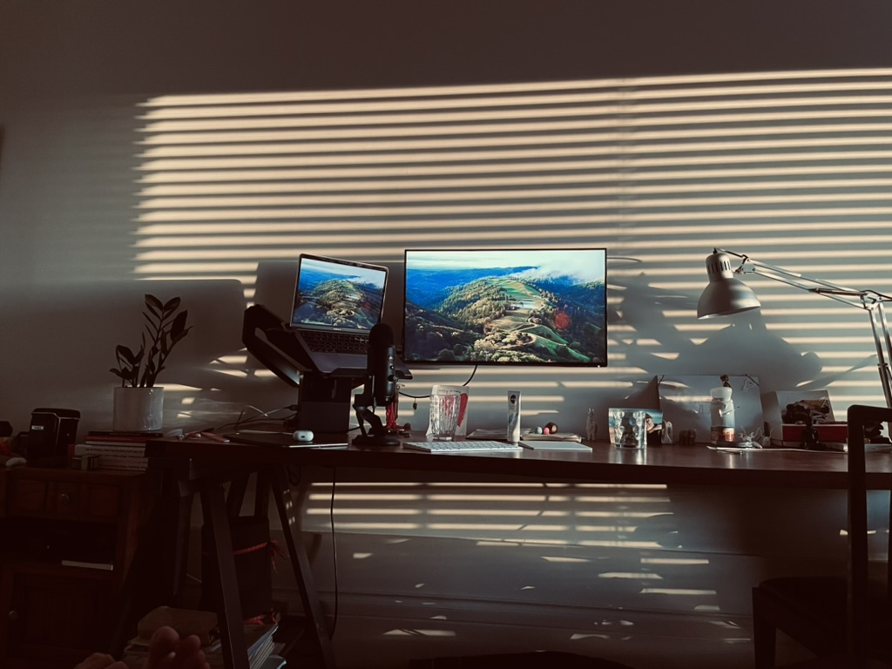
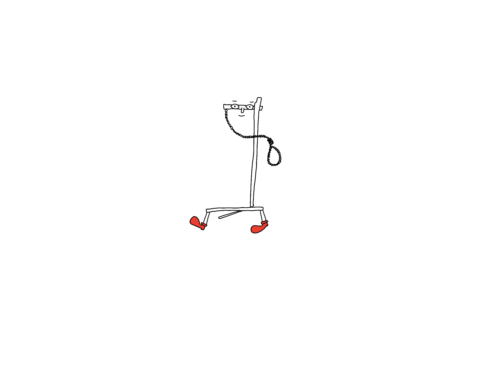

**Click [here](<../Bless this Mess>) to skip to the code snippet.**

I don't mind mess. My (physical) desk is covered drawings, tchotchkes, stuff I found, received as a gift or made myself. My desk is inhabited by tools, toys and alike.  


A little plastic llama wearing my old earring hangs out with my parents, somehow present both here and on the Baltic shore. A [Domovoy](https://en.wikipedia.org/wiki/Domovoy) made of plaster of Paris I made for Luna during the pandemic looks down at them and smiles with calmness and warmth I aspire to. A few years back Luna made me a birthday card with a little heart and a reproduction of one of my drawings. Sometimes I catch myself looking at it and smiling (even though the author of the card is sitting 0.5 m away from me). That's good mess.

> Midway upon the journey of our life  
> I found myself within a forest dark,  
> For the straightforward pathway had been lost.

Now, look at this shit. What the fuck. 


I mean, let's be serious for a second: I have no fucking clue how to find anything in this pile of crap. The picture in the background was made by [Graciela Iturbide](https://en.wikipedia.org/wiki/Graciela_Iturbide), one of my favourite photographers. This is the virtual equivalent of inviting my beloved role model to a dinner party, but then I trapping her in my office and covering with all of the trash I've hoarded so meticulously over the past 20 years or so.

Or, what's the difference between "Junk", "Junk II", and "Junk 7 or 8"?

"Junk 7 or 8" has more junk inside. I went full reverse WinAmp on it and skipped a number, there is no "Junk 6", only "Junk 5".

Then "Junk II" was named that only because I ran out of Arabic numerals, so I moved on to Roman. "Junk_2" (note snake case) is a booby trap. Frankly, I'm just excited to try out a different numeric system, Sexagesimal sounds like a natural next step.


*[Proto-cuneiform](https://en.wikipedia.org/wiki/Proto-cuneiform) numeral signs used base 60 and subbase 10.*

There's a folder called *noosy* with a little dancing noose. All power to Noosy, but I'm not letting anyone else there. He can play alone.



There's a folder called egg with only one file inside:


OK, I'm fine with this one. That's a good egg.

There's another folder called "FUUUCK" with a single file called `CertificateSigningRequest 1.certsigningrequest`, from the ~~day~~ week when I tried to provision and deploy Ensō in the AppStore, but couldn't due to an undocumented AppStore API blog. This is a trauma I'm not ready to process yet.

I dig through my files sometimes feeling like I'm exploring Wayback Machine, but I end up realising that I'm keeping this crap there as if it was an old pair of shoes I refuse to throw out (but it's not a *pair* of shoes, it's a truck). 

**One day, I opened a stack on my desktop and it spat out so many icons, I couldn't find a way to close it.** I just restarted my computer.

Once I misclicked and a middle aged man (a man or a shade, I did not know for sure) yelled at me in classical Latin, so I closed it and never looked back.

## How to hide the Desktop on MacOS

<span id="^6007d1" class="link-marker"></span>

```bash
defaults write com.apple.finder CreateDesktop true
killall Finder && say "Good night sweet prince"
```

## How to save screenshots in Downloads

```bash
defaults write com.apple.screencapture location ~/Downloads
```

## Result

Just look at her, look at her face, so content, so tired, tired but happy. Only a glass of mezcal in hand and the sound of crickets. Bless my mess.


