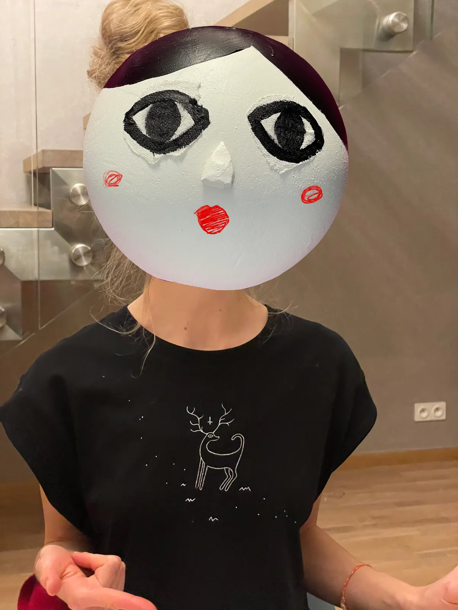
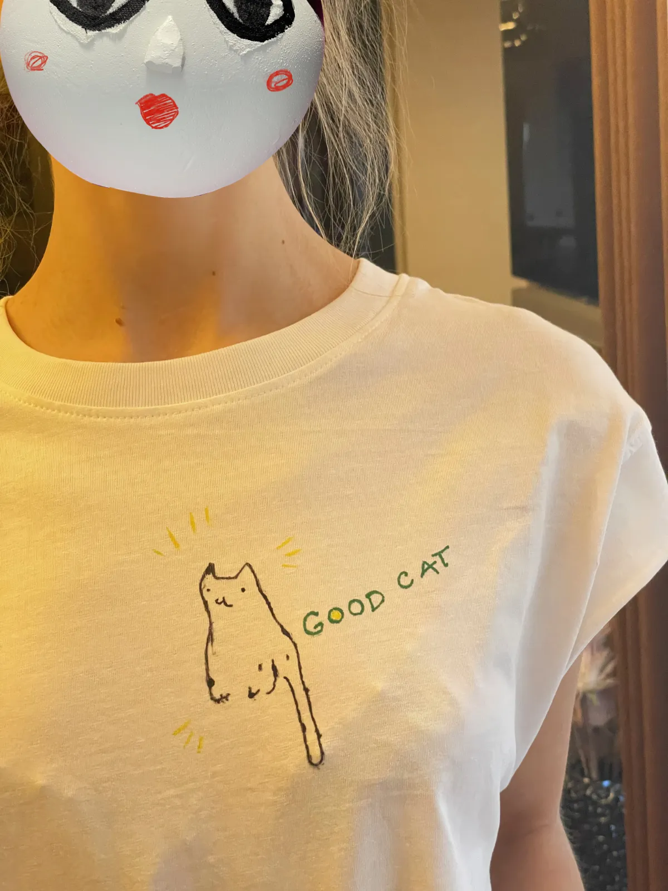
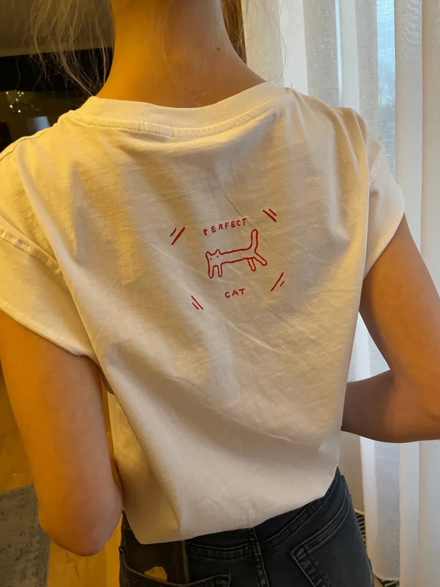
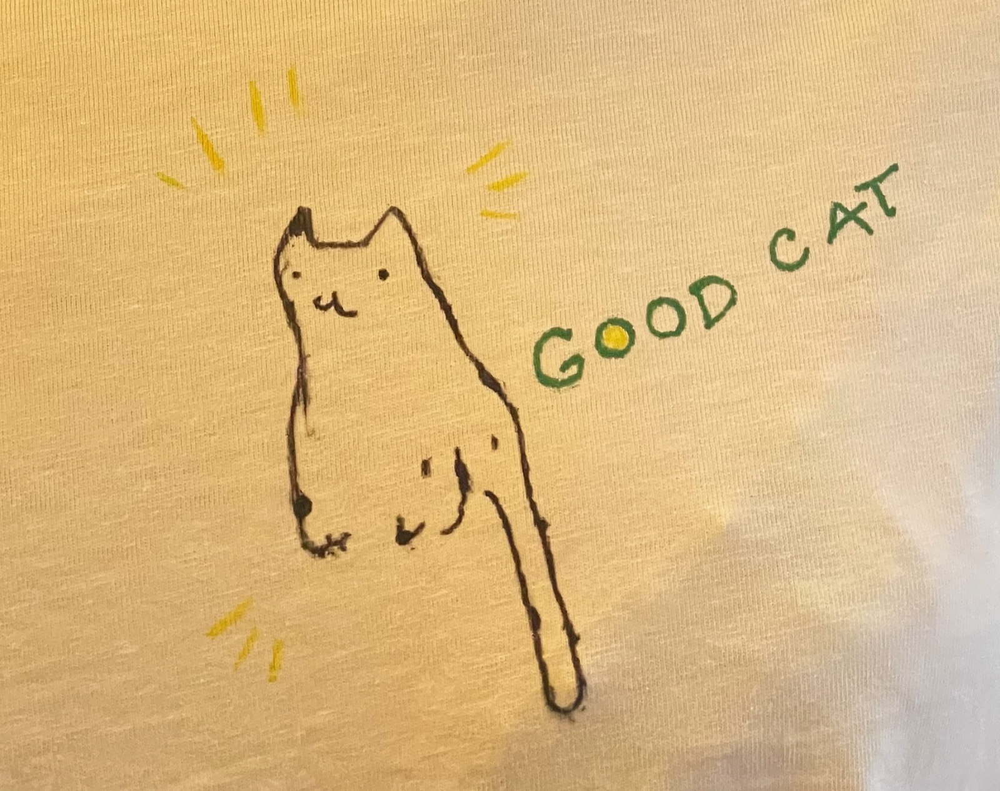
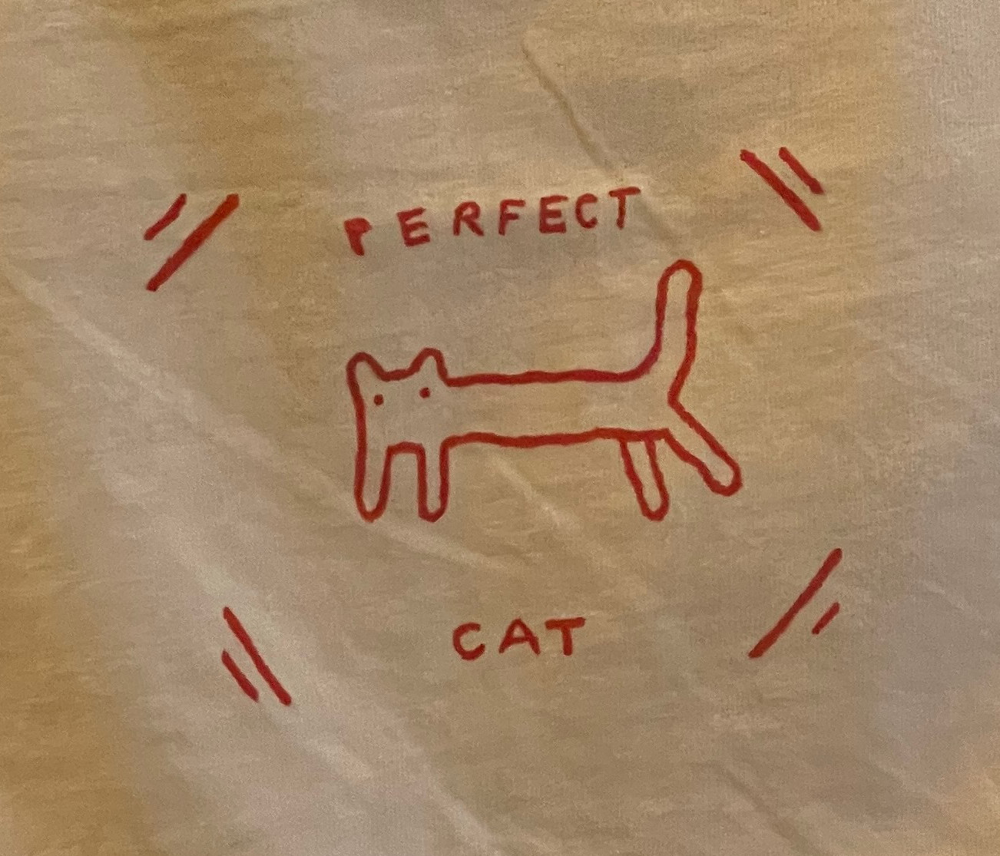

Sometimes I make hand-drawn bootleg band t-shirts for my friends. Read [My Bootleg T-shirts](<../My Bootleg T-shirts>) for context. 

## Update

I based them on some of my older drawings from [potato.horse](https://potato.horse):

1. [Three-pointer](https://www.potato.horse/p/bjdVWG3amRz3MCTCIUsuU)
2. [Good Cat](https://www.potato.horse/p/6RsMfwNnacDcdoOPauBry3)
3. [Perfect Cat](https://www.potato.horse/p/2Qd6JJITi7bLOuVXA4Gw69)

### My Deer

*TIL: White acrylic paint on black fabric seems to handle washing much worse than dark/colour on white.*

### Perfect Cat

*Perfect cat (front)*

*Perfect cat (back)*

#### Details

*TIL: The child-like / the Cure album wannabe cover style was quite hard to transfer from my iPad to fabric. It looks much better after the first wash.*
