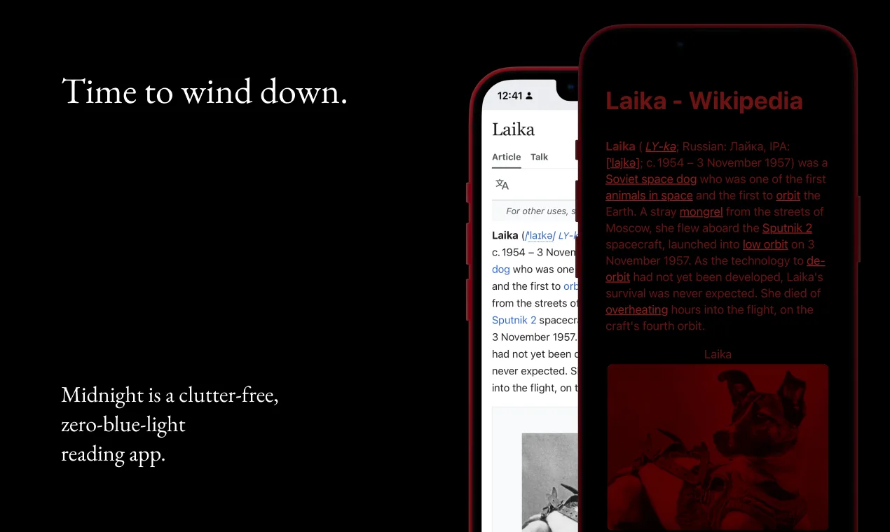
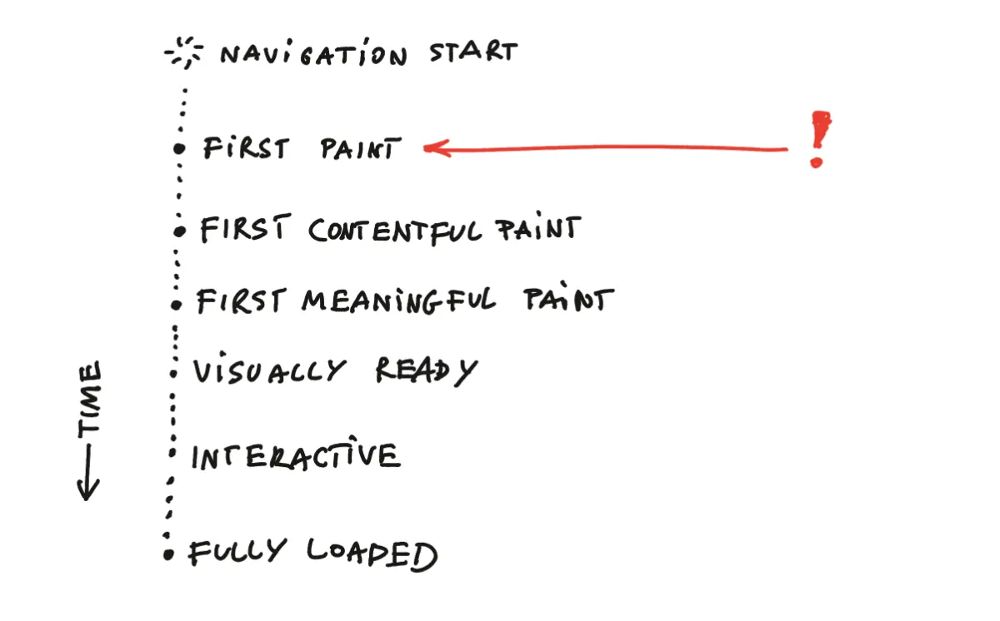
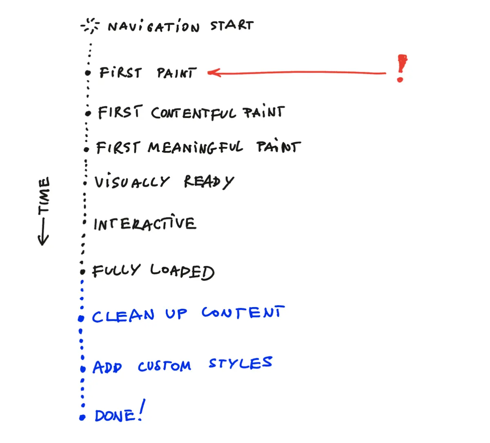
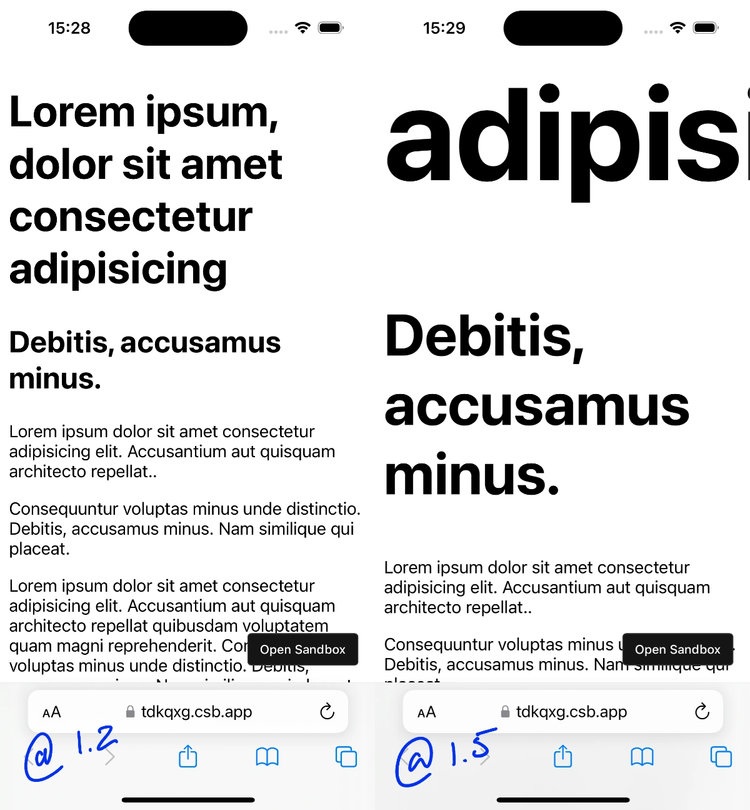
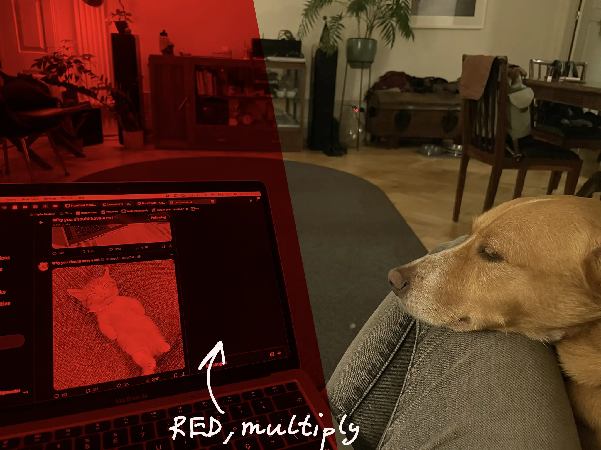
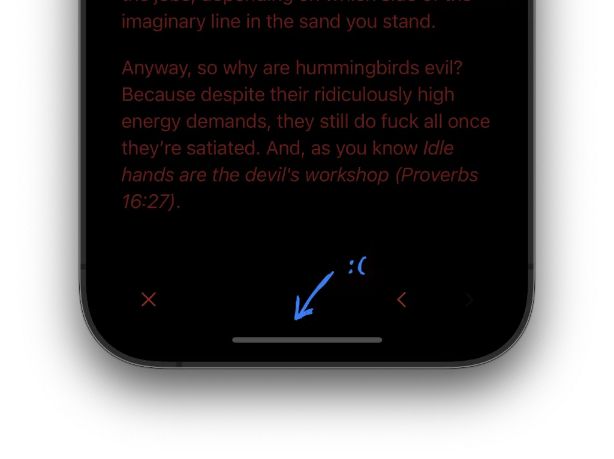

In a way [Midnight](https://midnight.sonnet.io) is much *less* than a browser or a focused reading app since most of my work involves *disabling* those browser features that are either unnecessary or likely to make your reading experience worse.

Many of my favourite tools are [dumbed down versions of their counterparts](<../MISS – Make It Stupid, Simple>). With Midnight I'm taking this approach even farther than usual: reduce the number of photons hitting your eyeballs to only the bare minimum needed for comfortable reading in a dark environment.

So, in the spirit of working with the garage door up, I thought I'd share some of the techniques I'm using to meet this goal, without touching any private Apple APIs:

## Only display a fully processed page

This is more of a general rule, rather than a single technique. A regular browser has a series of optimisations that allow you to see the content (or interact with it) before the page has completely loaded. Here's a simplified sequence of events:



This is useful when you're trying to read a news article and want to quickly gauge if it's interesting just 1 second after clicking on the link vs. having to wait the *minutes* required for all ads and tracking crap to load. The modern web would be almost useless without this approach. But, in our case, it creates the risk that Midnight could flash you with a partially styled white page before we're done with cleanup. 

This can get really annoying, especially when your eyes are already used to a darker environment.

We can (mostly) guarantee that a *processed* page in Midnight will look almost as clean as one rendered in Pocket or Safari's Reader Mode, and not spam the users with all the rude colours above the 625–750nm spectrum. To do this, I hide the page during any transitional stages and define a custom `done` state fired  after all of the cleanup scripts have been successfully executed.



The page lifecycle in Midnight:

```swift
enum WorkState: String {
    case initial
    case working
    case domLoaded // DOMContentLoaded
    case done // all scripts and styles have been processed
    case errorOccurred
}
```

Instead of relying on messaging, we poll a global status value:

```js
// add the end of the clean-up script
window.someLoadingStatusFlag = "complete";
```

```swift
 webView.evaluateJavaScript(
	"window.someLoadingStatusFlag",
	completionHandler: { (result, error) in 
		// ... handle errors etc...
		if parsed == "complete" {
		   self.parent.model.didFinishCustomisation()
		}
	})

```

Nitpick: using the JS Bridge would be a cleaner approach here, but polling turned out to be more robust.

## Readability

Readabilty is the utility library used in Firefox Reader. It's popular, well-maintained and 
just works most of the time.

Readability works *most of the time*, but it's not bullet-proof: some sites (looking at you [potato.horse](https://potato.horse)) were able to render content after Readability and my clean-up scripts kicked in, using synchronous JS placed in  `<head>`, with callbacks scheduled using `setTimeout`.


Note how the background is initially black, but as soon as I scroll, it starts animating. That's because the script listening to scroll events was processed before we cleaned up the DOM.

Side note: Readability can be also used in a bookmarklet (see [Tiny Reader](https://stephango.com/tidy)). One issue with the bookmarklet approach is that a Readability is too long to fit in a URL (max. URL length support varies across browsers), so it needs to be fetched dynamically. Unfortunately, remote resources can be easily blocked via CSP headers in the page content.

To prevent these issues Midnight bundles Readability, custom CSS, and custom JS in a single script added to the WebView as soon as main frame navigation has completed.


```swift
func webView(_ webView: WKWebView, didFinish navigation: WKNavigation!) {
	// Inject clean-up scripts
	webView.evaluateJavaScript(
	   Scripts.shared.bundle, completionHandler: nil
	)
	/* ... */
}
```

Remember that at this stage the page content is still hidden.


## Disable external JS, remove CSS

We can easily disable Javascript using `WKWebPagePreferences`:

```swift
let preferences = WKWebpagePreferences()
preferences.allowsContentJavaScript = false
```

I feel like I got lucky here because `webView.evaluateJavaScript` bypasses that setting, effectively killing all website JS and allowing only for the code sent by me.

Blocking CSS uses a slightly different approach, mainly the `ContentBlockingRules` API used by Safari ad blockers. Here's a sample of the blocking rules used in Midnight:

```json
{
	"trigger": {
		"url-filter": ".*",
		"resource-type": ["style-sheet"]
	},
	"action": {
		"type": "block"
	},
	/* ... */
}
```


## Custom Styles

At this stage the rendered content will look fairly similar to an unstyled HTML page with a white background. It's time for my favourite part: let's play with typography and colours!

Establish a red-based colour palette:

```css
  --base-h: 0deg;
  --base-s: 70%;
  --base-l: 50%;

  --red-100: hsl(var(--base-h) var(--base-s) var(--base-l) / 0.1);
  /* ... */
  --red-900: hsl(var(--base-h) var(--base-s) var(--base-l) / 0.9);
  --red: hsl(var(--base-h) var(--base-s) var(--base-l));

  --bg1: var(--black);
  --text: var(--black);
```

Use fluid typography with a mobile friendly scale:

```css
  --step--2: clamp(0.7813rem, 0.7747rem + 0.0326vw, 0.8rem);
  /* ... */
  --step-0: clamp(1.125rem, 1.0815rem + 0.2174vw, 1.25rem);
  /* ... */
  --step-5: clamp(2.7994rem, 2.4461rem + 1.7663vw, 3.815rem);
```

### Typographic scales on mobile vs. desktop

I'm using a Minor Third (@1.2) scale here, as I'm only targeting phone screens. This means that the largest header will be only 3x the size of the body text. On larger screens you might want to go as large as Perfect Fifth (@1.5), with the largest header being as much as 10x the size of the body text.



FYI [utopia](https://utopia.fyi) has a fluid font scale calculator I use almost daily.

## Custom embed components

Images and Videos are a bit trickier to style. We'll need to change their existing colour palette into shades of red, which can be done by adding a red overlay with multiply blend mode in front of them:



Normally, we could use pseudo-elements to achieve that, but in the case of `` or `<video>` that is not possible as they are [replaced elements](https://developer.mozilla.org/en-US/docs/Web/CSS/Replaced_element).

Instead, we can wrap them into small embed components before adding them to the DOM:

```css
.embed-wrapper {
  position: relative;
  border-radius: 0.5rem;
  overflow: hidden;
}

.embed-wrapper :is(video, img, embed) {
  width: 100%;
  height: auto;
  position: relative;
  
}

.embed-wrapper::after {
  content:  '';
  position: absolute;
  inset: 0;
  background: hsl(0 100% 18%); // ← 🐐
  mix-blend-mode: multiply;  // ← 🐐
}

.embed-wrapper > * {
  display: block;
}
```
*I marked the critical CSS properties with a goat.*

## Other

1\. Place navigation outside of the safe zone.

2\. Disable status bar and as much of iOS Chrome as possible:


3\. The Home Bar cannot be removed, but it still generates less light than a Status Bar since we tend to cover it with our hands when reading:




## Summary

That's all for now! This project is a strange mixture of:

- defensive programming
- applying my ad tech and ad blocker knowledge for good
- hybrid web app development
- UX
- Accessibility

See you tomorrow!

References

[How browsers work  |  Articles  |  web.dev](https://web.dev/articles/howbrowserswork#the_main_flow)
