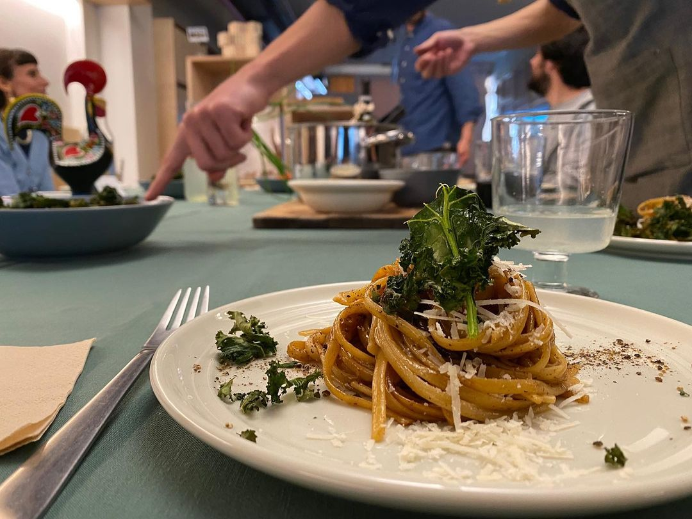

I didn't know anyone in London when I moved there, so I decided to meet new people by cooking for them every two weeks. This is the dish I'd cook for my first-time visitors. 

*Feeding people I don't/didn't know with my cacio e pepe and spicy kale crisps, [credit](https://www.instagram.com/temporada.pt/).*

*Cacio e pepe* means *cheese and pepper*. Adding black garlic changes this dish quite a bit: it feels meatier, less cheesy and the spiciness of pepper pops out a bit more. I've fed it to a bunch of Italians and at least one chef without gaining any mortal enemies, so you should be fine eating it.

For 3-4 people, cooking time: 20-40 minutes

The key to get this dish right is to ensure we get the smooth, silky texture when mixing the starches from pasta water with the cheese. This is a fairly time-sensitive process, so I recommend reading this recipe twice and do as much of the prep work in advance as possible. Good luck!

### Wine pairing

Chianti, Rioja or Primitivo work really well with this dish (peppery/full of tannins is good, sweet, plum jam like not as much). If you live in the UK, check out Campo Viejo Rioja, it's good value and widely available.

## Ingredients:

- **240-320g of dry, 100% semolina pasta: bucatini (traditional), linguine or spaghetti.**
	- Avoid egg pasta. We need something fairly starchy, de Cecco is an easily available, safe choice here.
- **120-170g Pecorino Romano or Parmigiano Reggiano**
	- The more mature, the better. Parmesan works perfectly fine. Pecorino is the traditional choice. A 50/50 mix of pecorino and parmesan is my favourite.
	- Correction from Rafał who moved from 🇬🇧 → 🇵🇹: add São Jorge, just keep the ratio low (<1/5 of all cheese)
- **Peppercorns — ca. 1 tbsp per person + 1 tbsp if you prefer spicier**
- **1tbsp olive oil**
- **(Optional) 1tbps of butter, unsalted**
	- you might want to control the amount of salt, as we’ll be cooking pasta in a small amount of water in a pan
- **Black garlic — 1 large clove (or 2 small ones).** Can be found in large Tesco stores, Whole Foods, online or easily made at home (although it takes ages*).
- **Salt**

## Tools:

- 1 pot or a deep pan (I find it easier to use a 4l pot or something like this)
- 1 pan (wide, ideally 5cm deep)
- A slotted spoon or pasta spoon
- A ladle
- Mortar and pestle (alternatively, a meat tenderiser, a tea towel and a career that leaves you with a sense of existential doom)

## Method:

**Critical steps are in bold**, context and details in regular type.

**Grate the cheese (you might not use all of it).**

**Take the black garlic clove and slice it as finely as possible.** Doing so might prove a bit tricky as black garlic tends to have a slightly chocolatey/liquorice-like texture, so don’t obsess about it too much — it’ll melt during cooking. We’re just trying to speed up this process a bit, as we’ll have to deal with other, time-sensitive tasks simultaneously, later.

**Preheat the pan on high/medium-high heat. Once the pan is ready, toss in the peppercorns. After 1-2 minutes give them a quick toss.**
The point is to increase the temperature evenly and avoid peppercorns burning on one side. We want to: 
- make them release the essential oils and 
- become a tad crunchier and easier to crush.

**After another 1-2 min move the peppercorns to the pestle and crush.** Don't grind them too finely. We don't want dust, but little, slightly crunchy .5mm nuggets of spicy joy.

**Put the pan back on the hob on high heat.** Fill it with water up to 1/2—3/4 height—we need just enough water to cover the pasta, but as little as possible. 
Add salt—we need just enough to make the water taste like seawater (don’t worry, most of it won’t get absorbed).

**Once the water starts boiling, lay down the pasta in the pot, spread it evenly on the surface.** Ensure it’s completely covered so we don’t get those nasty, sticky, dry bits. 

**Cook the pasta for the minimum amount of time specified on the packaging or 1 minute less if preparing this dish for the first time.** This is to avoid overcooking the pasta during the second stage, when we mix everything together.

**Put the 4l pot on the hob and set the heat to medium-high.**

**1-2 minutes before the pasta in the pot is done, add olive oil and peppercorns to the pot.** Leave two, three pinches of crushed peppercorns for decoration.

Now, the important bit:

**Once the pasta is al dente (or ideally, almost al dente), switch off the hob, and start transferring the pasta into the pot. Do. Not. Remove. Pasta. Water.** Try to do it as quickly as possible and occasionally stir the pasta in the pot so it doesn’t stick. It might get a bit messy (at least it does when I do it).

**Now, once all (or most of the…) pasta is in the pot, start stirring it vigorously. Add butter and black garlic. Whilst stirring, start adding the pasta water (1/2–1 ladle to start) and the cheese.** The goal here is to ensure we let all of the ingredients hang out with each other, blend and form a silky, sticky, but not liquid texture. The sauce should not drip from the pasta—if that’s the case, add more cheese, increase the temperature and crank up the stirring speed to 11! If the sauce gets too dry—add more water, then a small amount of cheese.

**Keep stirring, adding cheese and the pasta water.** Make sure the pasta doesn’t get too soft and overcooked!

At this stage pasta should turn slightly brown due to the melting black garlic. Don’t worry too much if it doesn’t—the most important thing is not to overcook the pasta.

**Done, serve the pasta straight from the dish**. The heat of the pot will remove some of the moisture, but the temperature will help keep the pasta moist and juicy for a bit longer.

Decorate with a pinch of pepper and grated cheese.

Enjoy!

[\*] Recipe for black garlic: put a bunch of garlic bulbs in a dehydrator at 60-70ºC for 4-6 weeks. Easy!

