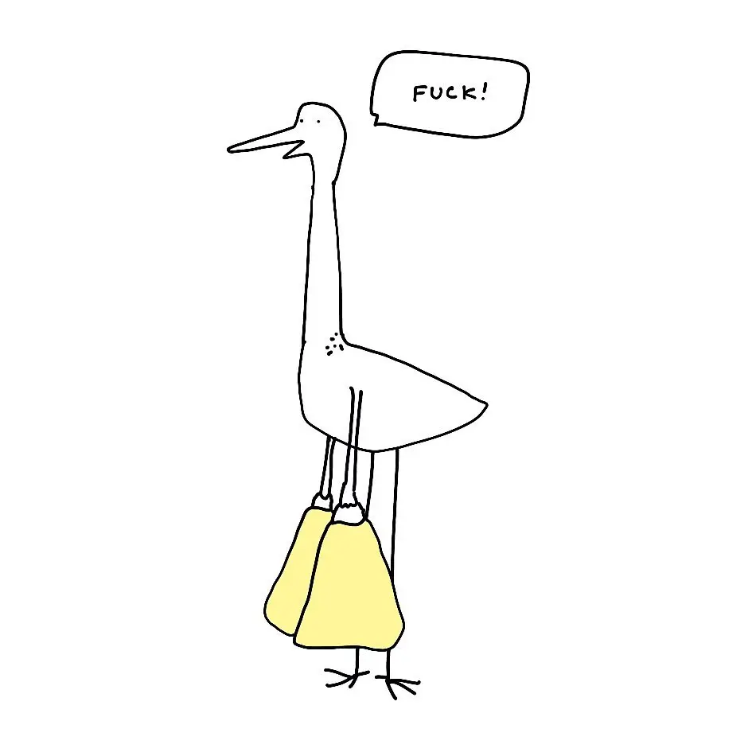
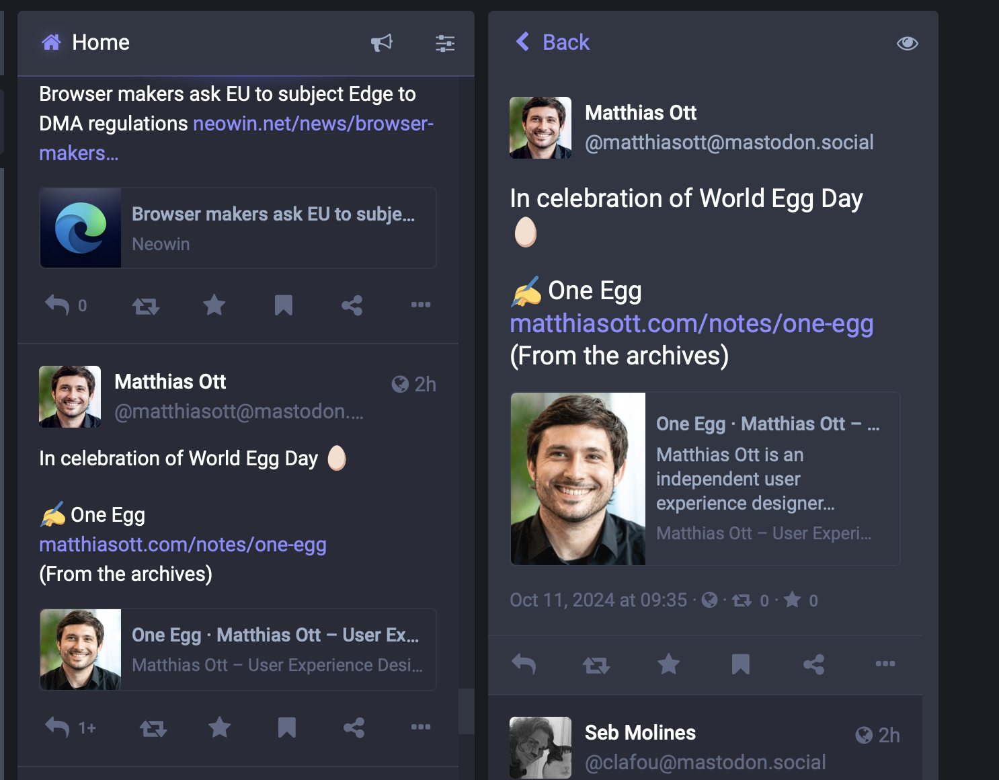
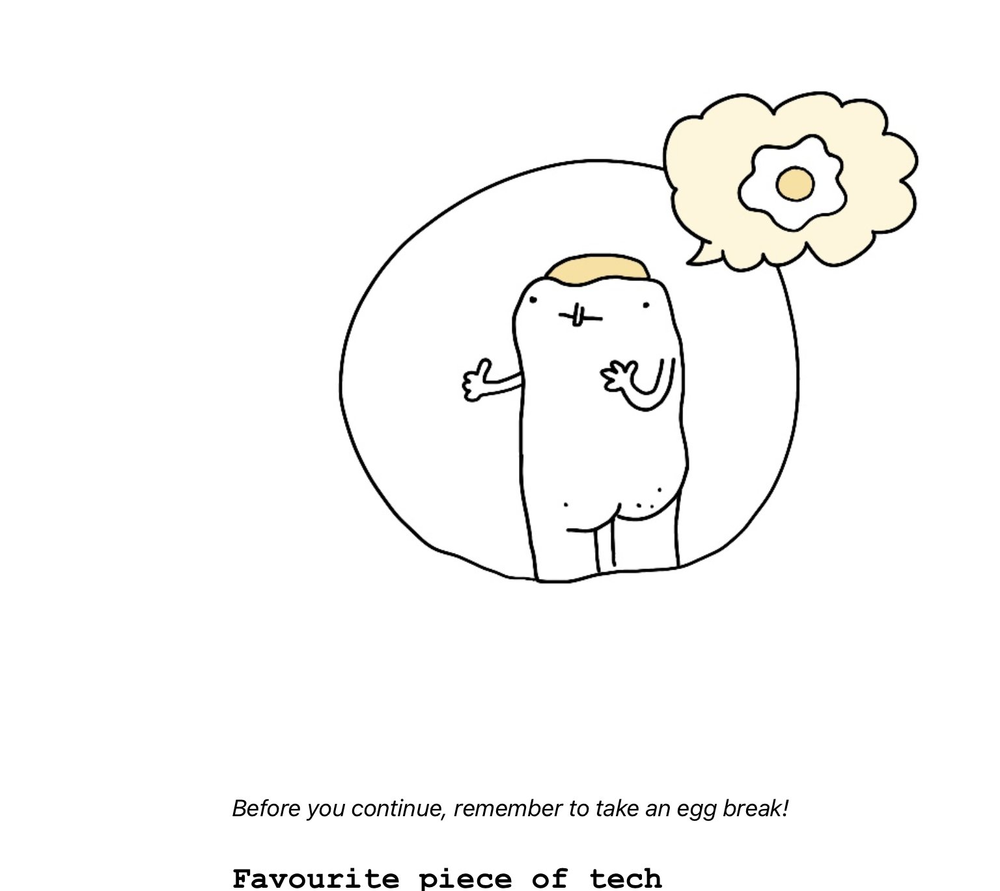
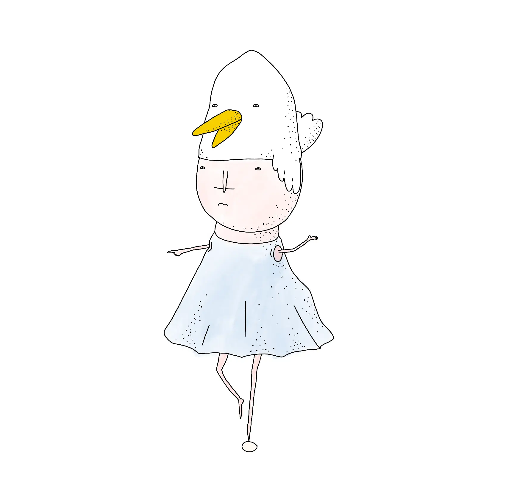
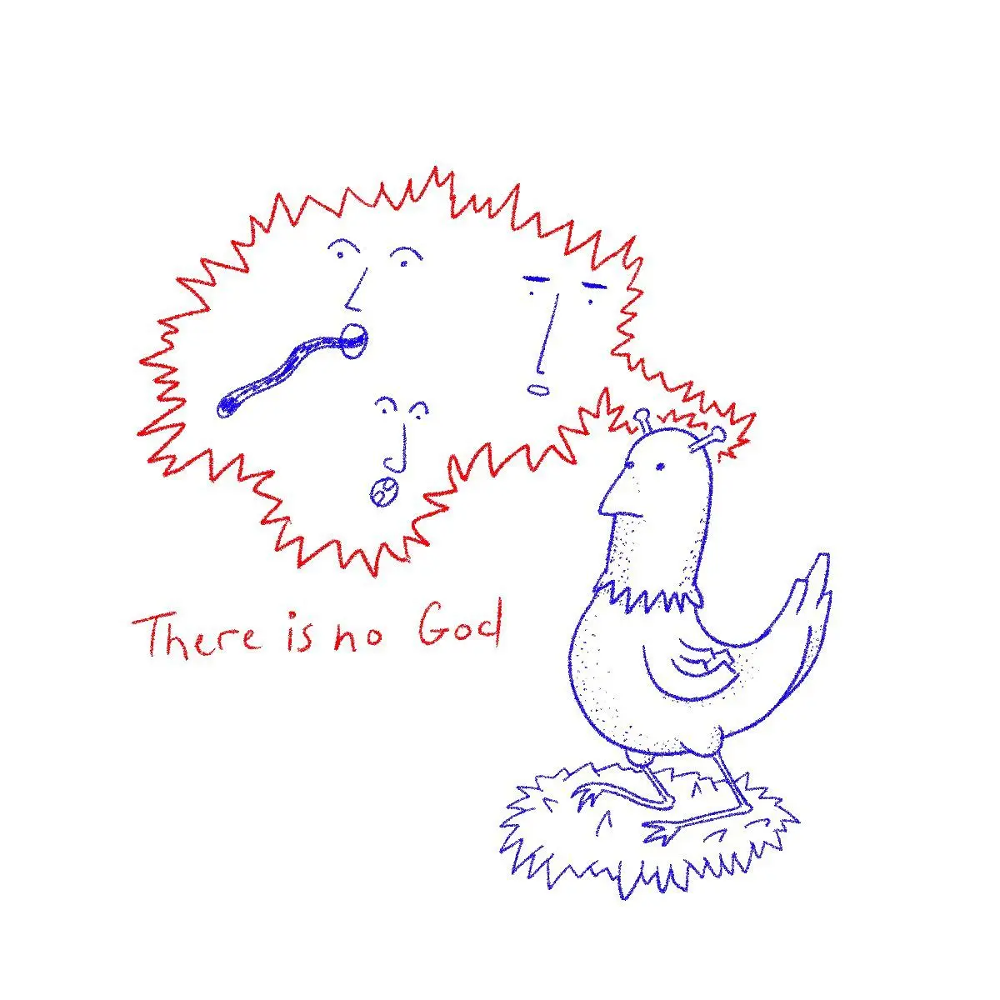

*Original title: [When you realise that you forgot the egg](https://www.potato.horse/p/pPWWg25pNJjoygF2RXObB)*

Hi there! I've been taking things slow this week (no writing, no coding besides client work, [Mango](<../Dog mode>)'s gotta eat). I'm happy I took a break instead  escaping into the more comfortable [nook](<../Programmers have a Pavlovian Engineering Response>) of my brain... with [one small slip](<../Gregglogger>). 

Then this [masterful toot](https://mastodon.cloud/@matthiasott@mastodon.social/113287870699089968) caught my attention: 

Fuck, it's Egg Day! Thank you for the nudge Matthias. Here are some of my egg-inspired works, chosen at random under 3 minutes:

### My first attempt at stop motion animation

<video src="https://res.cloudinary.com/dlve3inen/video/upload/v1728645478/egg-loop_vfsfc8.mp4" muted loop autoplay playsinline controls />

Source: [Mmm... egg](https://www.potato.horse/p/6PaUTTnYWo2YRXqkjP69I3)

### The interlude of my first attempt at a newsletter

Source: [Weekly Notes #6](<../TIL/weekly/46>)

### Vaguely Lynchian [Prima Aprilis](https://en.wikipedia.org/wiki/April_Fools'_Day)

### My first attempt at teaching the egg how to walk

This was a prototype of a [Liero](http://www.liero.be) inspired multiplayer deathmatch game, finding the *last egg rolling* so to speak. 

<video src="https://res.cloudinary.com/dlve3inen/video/upload/v1728645479/eggrigg_zx2knf.mp4" muted loop autoplay playsinline controls />

It would be hard to achieve this level of realism without Inverse Kinematics and procedural animation.

A longer description would deserve separate post. Suffice to say, things didn't go that  smooth as the algorithm I applied was more suitable for arthropods rather than anything with human legs. (imagine a bipedal human sized spider, now compare it to a walking human).

Also, some leggs (typo, but I'm keeping it) were so displeased with my rigging skills, they decided to fly away, just like my dad when he went to buy those cigarettes.

<video src="https://res.cloudinary.com/dlve3inen/video/upload/v1728645479/gravityegg_klndcx.mp4" muted loop autoplay playsinline controls />

> Something I noticed while editing this: so many of these projects are my *firsts*: *first* newsletter, *first* stop motion animation, *first* IK experiment, *first* egg in drag for the *first* of April. [Writing truly *is* thinking](<../Writing is Thinking>)!

### This animated loop from an article on [sonnet.io](https://sonnet.io) (HTML+CSS)

<iframe src="https://egg-alpha.vercel.app" style="aspect-ratio: 1280 / 960; width: 100%;border:none" ></iframe>

**Why I made it:** I needed a looped video on my site and the easiest way to create it was to:

1. animate it in CSS
2. record via QuickTime (I miss Macromedia Flash)

You can find the article and the video [here](https://sonnet.io/posts/sit/). 

### This drawing I share instead of saying *it's a balancing act*

Source: [Balancing Act](https://www.potato.horse/p/6zyIyXMcLbHkhgLEMhZfCQ)

### Finally, Chomsky, geopolitics, egg massage 

An accidental find from the times of the Plague. I suspect it's the least entertaining or informative example here. Please, don't judge the egg, judge me. 

<video src="https://res.cloudinary.com/dlve3inen/video/upload/v1728645478/egg-chomsky_uf25i5.mp4" muted loop autoplay playsinline controls />

That's all for today. Anyway, what's ***your*** favourite egg? [Let me know](mailto:hello@sonnet.io?subject=EGG). 

---

P.S. Thanks for reaching so far, please take this NSFW [True Detective inspired Egg Erotica](https://www.potato.horse/p/4tzv1AotbYmcxGI6JZD4qj) as a token of my gratitude.

And remember, to quote Obvious Plant: *this isn't real, nothing is real.*

