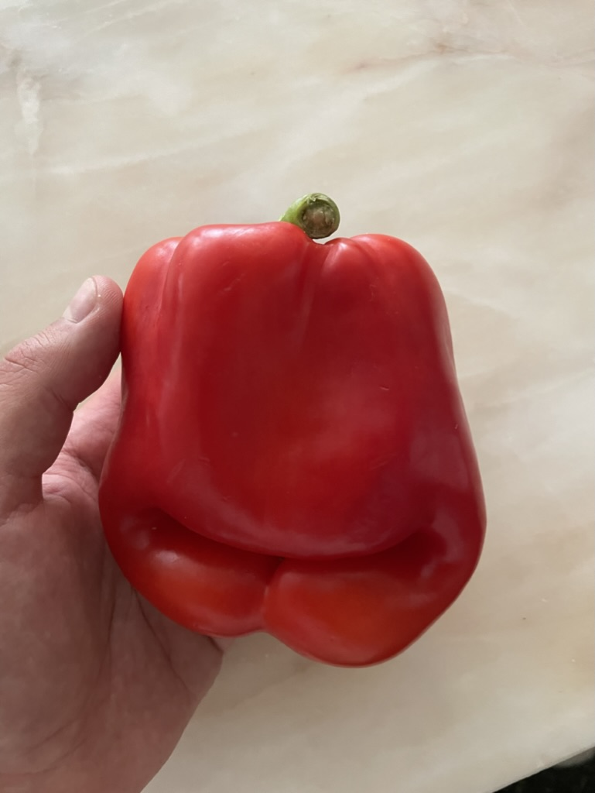

*Attaching this picture in hopes that pepper pareidolia will distract you from the fact that I never take photos of my chillies.*

My mom's a great cook. Having said that, old habits die hard and both Polish and Austrian cuisines seem to draw the veggie/meat line somewhere between chicken and pork.

My mom never liked chilli. Plus, she's a ridiculously busy person. She also lives 3 minutes away from [Wienerwald](https://en.wikipedia.org/wiki/Vienna_Woods), and at the time of writing this recipe (October) mushroom season in central Europe is in its peak.

This is a chilli recipe for my mom. It's quick to make, it shifts the flavour towards the ingredients she grew up with, it's heartwarming and it's not heart-attack-inducing.

Make it for someone you like.

## Recipe 

The recipe itself is pretty standard, with two small additions:

1. dried wild mushrooms for increased umami, a slightly gamey, smoky flavour, and a more complex texture
2. slightly more acidic (tomatoes) and less cumin-forward

## Ingredients (for 4 portions)

^35dc57

- 1 onion
- 1-2 sticks celery 
- 1 carrot
- 1 tbsp oregano
- 1 tsp cumin
- 2 tbsp paprika
- 1tsp cayenne pepper
- salt
- pepper
- can (800 g) black beans (red beans are fine too)
- 1 red bell pepper
- 1-2 tbsp tomato concentrate
- 1 small can of peeled tomatoes (or passata)
- (optional) 100ml of vegetable broth (chicken is fine too)
- (optional) a handful of dried soaked wild mushrooms
	- (optional, fancy) soaking liquid from dried mushrooms, decanted and reduced to 50 ml (a shot glass)
- cilantro or parsley

## Method

1. dice the onion, celery, carrots
2. fry on medium heat in olive oil, till the onion looks barely translucent
3. add paprika and tomato concentrate, stir
	1. increase the heat and deglaze with broth (or water, or white wine to increase acidity)
4. add the peeled tomatoes
5. add the beans, including the liquid from the can
	1. when using tomato passata, use only 1/2 of the liquid from the can
	2. it's not a soup, but keep the consistency slightly too liquid, it'll reduce
6. (optional) add the liquid from the soaked mushrooms
7. stir and cook on low heat for 20-30 minutes
8. chop the bell pepper, and add it to the chilli
9. cook for another 10 minutes

Serve over rice, with sliced avocado or a bit of sour cream on top. Finish with a small amount of roughly chopped cilantro.

If you want to parallelise the recipe, 7. is when you should start preparing the rice.
