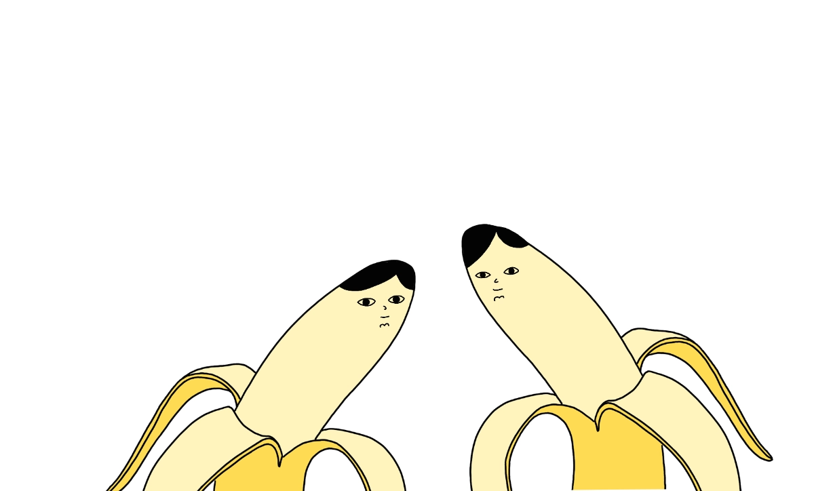

There's an important aspect of communication which to some people (especially the so-called free speech absolutists) is very hard to grasp: communication *is* action. 

We communicate to (non-exhaustive, semi-random list!):

1. share information (duh),
6. coordinate,
4. express how we feel, but also:
5. *make someone* feel a certain way,
6. *make ourselves* feel a certain way (venting),
7. persuade,
8. manipulate,
	1. defined as: similar to persuasion, but concealing the intent. Often neither interlocutor is aware of employing it.

*What* I say and *how* and *why* I say it are equally important. I can use words to give someone the right tools to solve a problem, to empower them, to lift their spirits, to make them feel less alone, or to hurt them.

It's hard, almost impossible to do this with a complete awareness of our own intent and the effect of words on others. Two examples (Vampire Romcom and Homework):

### Vampire Romcom

Your partner is already in bed. Just as you're passing by the window, they say: "is the room too hot or is it just me?" Do you ask them to check the thermometer? Was it a despicable, poorly concealed act of vampiric subterfuge aimed at turning me into a thermostat Renfield? Are they [Ventrue](https://whitewolf.fandom.com/wiki/Ventrue_(VTM)) or [Toreador](https://whitewolf.fandom.com/wiki/Toreador_(VTM))? Or, did they bring this up to your attention, because:

A. they're boiling but the blanket is cosy and impossibly heavy (duh)
B. they know you care about them, so you'll either open the window and feel good because you did something that'll make *them* feel good, or ignore it and move on (and that's fine)
C. it was vampires after all, the last lethal rays of light during sunset made their 300 year old toes itch.

From my own experience it's either a) and b) or a), b), and c). Last night my half-Transylvanian partner asked me to put less garlic in the Romesco sauce, I'm still suspicious. 

My point here is that the question is either a form of manipulation or a way of coordinating action between two people with a mutually positive result (doing nice things feels nice). We all know that intuitively, but tend to forget it when it's convenient.

### Homework

This one's more straightforward. Say, I ask someone to help me choose between two options related to something I care about and/or have a strong personal preference. I find it incredibly hard to do so without anchoring them in the slightest way. My tone of voice, prosody, body language, micro-expressions tell a different story than my words. The lyrics don't match the music.

Words don't exist in a void. Communication always shapes its participants, whether you are:

- a tree
- a cat
- a (bald) ape reenacting the social theatre rehearsed throughout 1000s of generations of evolution (i.e. crafting a strongly worded tweet with your lizard brain.)

Ignoring that is like saying that you can unhear, or unsee, or [unmrrr](https://mrr.sonnet.io). Perhaps you've learned how to reverse entropy (if so, congrats, can I borrow some money?), but definitely you can't unmrrr.

### How I try to get better at this (random, idiosyncratic assortment):

- look people in the eyes,
- listen (to them and to my own body)
	- example: people tend to hypo-ventilate when stressed
	- example: I'm feeling tense, do I really mean what I just said?
- try to be kinder to people when they seem unkind, because people are generally kinder than we think and also as capable of having a bad day as we are.

Thanks for reading this, see you tomorrow!

P.S. This is one of those subjects that sound either obvious and patronising or completely bollocks, depending how you were brought up. Apologies in advance if you're in the former group. Please, have this [bee](https://www.potato.horse/p/4YbE4wRjlaEp4TeKbOILga)

P.P.S. Also, there are historical, biological and cultural reasons why (sometimes) the subject matter of this note is harder to grasp to men. We're often brought up to separate "strong", *logical reasoning* from weak, flimsy *feeling*, from the body. I [wouldn't blame](https://en.wikipedia.org/wiki/Mind–body_dualism) Descartes for toxic [masculinity](<../Brutally simple>), though.

