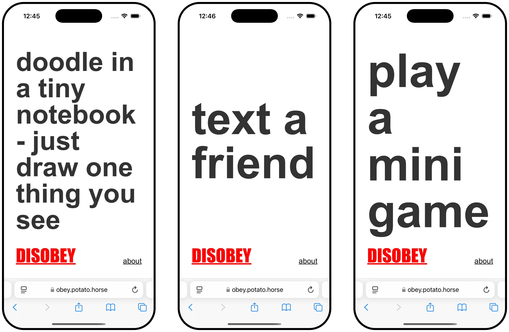
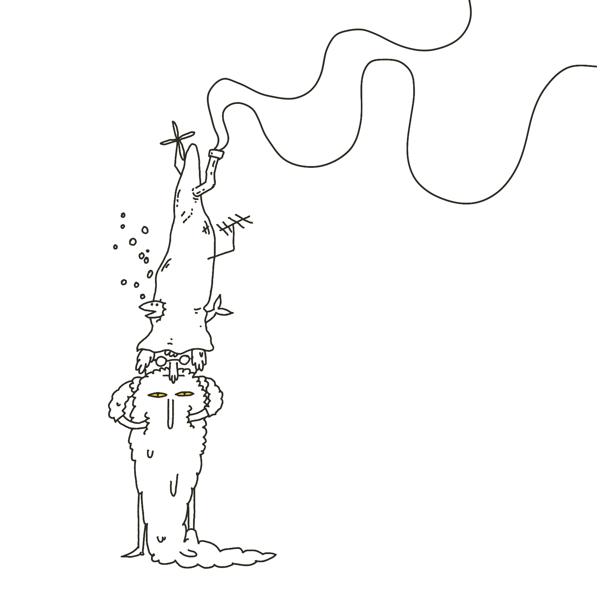
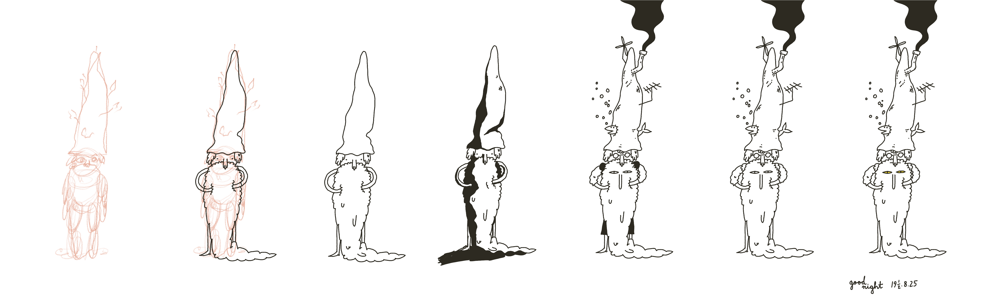

![A simple black and white comic strip featuring six minimalist cartoon cats drawn in a sketchy style. The cats have basic dot eyes and small triangular noses. The comic shows: Top row - A standing cat asking 'WANT SOME?' while holding what appears to be a cigarette, a lying cat responding 'NAH I'M OK' also with a cigarette, and a sitting cat asking 'YOU GUYS ALRIGHT UP HERE?' Bottom row shows three more cats, with the middle cat holding what looks like a cigarette. The drawing style is very basic and doodle-like with simple line art.](cigarette-cats.webp)

Friend, I looooove cigarettes! 

> 🎶 I love nicotine, 
> the Tammy to my Ron, 
> the Rumi to my Shams, 
> the fire of my lungs. 🎶 

I also love having a healthy body and generally not feeling like I've rented an Airbnb in Serge Gainsbourgh's mouth. And, I've gotten pretty good at quitting, I quit all the time, sometimes for a day, sometimes for a year or two. 

So, I made myself a little web app I open when I feel like grabbing a cigarette. It's called OBEY and can be found here: [obey.potato.horse](https://obey.potato.horse) 

### Here's how it works:

1. go to [obey.potato.horse](obey.potato.horse)
2. do what it says
3. feeling rebellious? hit *disobey* 
4. rinse and repeat

You can find the source [here](https://github.com/paprikka/cigarette-triggers). Feel free to fork it and make it yours!

This isn't a new idea of course. I've also talked about something similar ([Mental Health Toolbox (working title)](<../Mental Health Toolbox (working title)>)), then one of my [Say Hi](<../Say Hi>) friends works on a more [sophisticated approach to the subject](https://impulse.training).

> Related: [Projects and apps I built for my own well-being](<../Projects and apps I built for my own well-being>), [Things to support my own well-being – a wishlist](<../Things to support my own well-being – a wishlist>)

## Why I made it

My younger brother quit smoking several years ago, but he still keeps a pack of Marlboro in his drawer. He felt that having this little splinter stuck in his eye every time he thinks about nicotine would help him built up more willpower, more resilience. I'm happy he worked so hard it worked out for him in the end, but he's in a minority. The general consensus is that yolo-ing it and quitting cold turkey usually yields poor results (some research suggesting 3% vs 30% success rate within 6-12 months for raw dogging it vs. therapy + NRT). I fall in the latter 97%. Over the years of quitting and embracing the sweet dark taste of cancer sticks I've learned that there is no point in making my life harder when I quit. 

What works for *me*: 

- preparation, setting a date, 
- understanding the nicotine half life and withdrawal symptoms, 
- understanding my triggers and not downplaying their effect on me,
- trying not to over focus on shame/[guilt](<../guilt>), 
- NRT, 
- understanding the reasons I chose to self-medicate myself with, well, insecticides, and 
- patiently, methodically going through the steps.   

## How I worked on it

First things first: this app could've been a piece of paper. The app doesn't solve the problem. The process, having an excuse to think about something deeply was the important part.  99% of my work was therapy, planning, including spending a couple of afternoons thinking about the triggers.

(come to think of it, this is the [2-2-2 Project Scoping Technique](<../2-2-2 Project Scoping Technique>) applied in reverse: 2 days of pondering, 2 hours of coding)

**Now, the technical part:**

1. I coded the app shell using Claude over 20 or so minutes
2. I added the more custom parts (such as better font-sizing) manually 
3. ~~I cleaned up the code a bit before sharing~~ (no, you didn't)

### Custom font sizing

**Problem: How to make a piece of text fill the available space, vertically and horizontally, and respect word breaks?**

<video  src="https://res.cloudinary.com/dlve3inen/video/upload/v1758627708/obey-recording_pmhhnh.mp4"  width="2516" height="1684"  loop muted playsinline autoplay  style='max-width: 100%; height: auto' ></video>

In short, there's no native, one line CSS or HTML solution to that problem and the classic approach goes like this:

1. start with the biggest possible font 
2. scale it down by X
3. check if the element is larger than its container 
	1. if that's true, go back to 2.

The main difference from my approach vs. what Claude or SO will tell you is using a multiplier for size instead of a fixed value. Doing so should reduce the number of calculations required to fit within the existing container.

This part was purely for fun. Jumping straight into typography could be a perfect way to get myself distracted. That said, it was fun (and useful!) to keep this step as a little reward for myself when I felt stuck.

[I grew up above a carpentry workshop](<../Projects and apps I built for my own well-being>) and almost everything that could've been made of wood in my house, well, was made of wood. The rays of light adorning the paintings in the church in my home town? Physics-defying stained oak. I'm similar to other Pastuszaks in that regard, I love surrounding myself with *my* pretty little toys ([Reactive Hole · sonnet.io](https://sonnet.io/posts/reactive-hole/), [Bird-knife](<../Bird-knife>), [My Bootleg T-shirts](<../My Bootleg T-shirts>), [The Janusz I Live In](<../The Janusz I Live In>), [Projects and apps I built for my own well-being](<../Projects and apps I built for my own well-being>)). Web is my medium. I doodle in HTML/CSS almost as often as with my pens or Procreate and have been doing it since I was ten. I had six personal sites before we had internet.

## Why "OBEY" 

- As I was sketching it the typography reminded me of [They Live](https://www.imdb.com/title/tt0096256/?ref_=fn_all_ttl_1)
- Luna found it funny 

## How did it go?

I quit roughly a month ago and over the past three weeks I used OBEY around a dozen times, perhaps a bit more. I noticed that instead of opening my phone, I just pick up a thing to do from the list committed to my *Thought Sponge Memory Storage*™. I don't think there's anything that surprising about this observation. 

Again, writing, coding, and testing/playing forced me to think and plan. The time spent on it was the biggest value. This little web app could've been a piece of paper, but that doesn't diminish its value. 

The risk with DIY projects like this is that they can be a huge distraction. After all, instead of doing the scary thing, you can always choose the difficult but familiar thing and thus fulfil the immediate emotional need. It keeps you busy for a few hours, but the next morning you might wake up and realise you're still in the same place, with the path somehow being even longer and windier.

The other side of the coin: is it fun? Does it also help me improve something that's been bothering me for such a long time?  Looking back, I feel mostly happy that I have an excuse to play with my toys, that I have the skills to use them with ease to do something good and wholesome in the meantime.

Take mainstream self help literature as an example. Most of it is cringeworthy pseudoscience or two A4 pages of CBT worksheets, diluted into two hundred pages of pep talk. Survivorship bias aside, I think the reason it helps some people is this: it forces them to sit on their asses for a few hours and actually go through the process of thinking about it deeply. Instead of memorising a checklist, they're forced to do go through the process of thinking, feeling, introspecting.

[Perfectionism is fight or flight](<../Perfectionism is fight or flight>). With practice (and luck), sometimes we can learn to distinguish between using work to avoid thinking about/feeling something vs. using creative work and play as a tool. 

Letting [curiosity](<../Be kind, be curious>) speak louder than guilt helped me this time.

That's all for today, thanks for reading!
