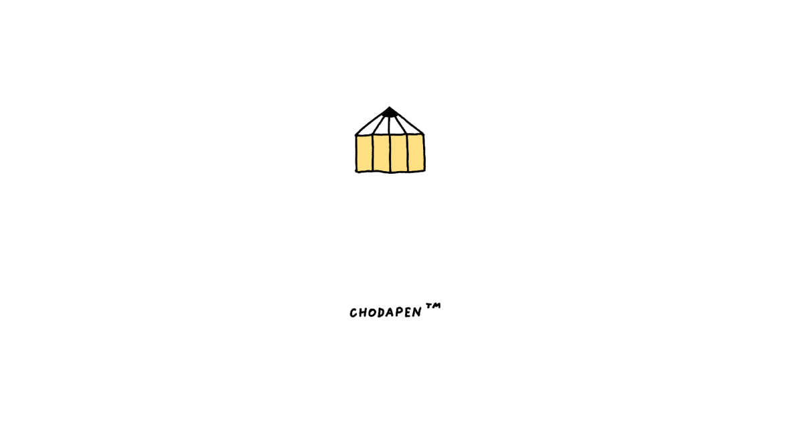
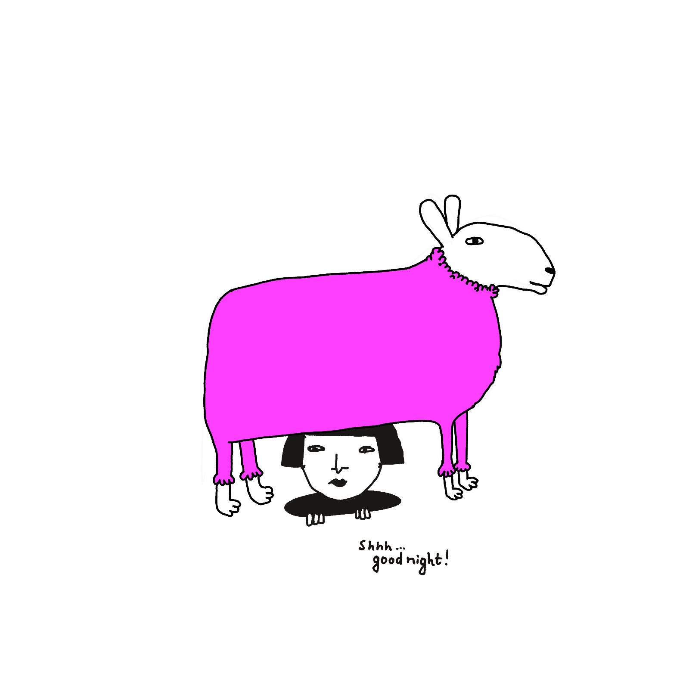

This is a follow-up to [default apps](<../default apps 2023>) from December 2023. 

## Defaults

Having reviewed the note, I realised that the changes are more interesting than the list itself, so for the sake of visual clarity I've pulled it into a separate page.

**You can find the complete list here [here](<../Default Apps 2025>).** 

## What changed 

The point still stands that most of my apps still fall into the categories of *Indie*, *Walled Garden* and *Idiosyncratic/DYI/DUI* (designed under influence (of boredom)):

 

**Cursor became my main code editor.** Many tend to overestimate how useful LLMs are for complex problem-solving work, especially when the (code) spaghetti sauce is dripping all over the place, but for quick repetitive edits, scaffolding or just sketching ideas – it works surprisingly well! Most importantly, it saves me time, but **it doesn't get in my way**. 

**I'm using [Ensō](https://enso.sonnet.io) and [Sit.](https://sit.sonnet.io) every single day.**  Over the past 5 years I've written 2 million words just in [Stream of Consciousness Morning Notes](<../Stream of Consciousness Morning Notes>), and it's hard for me to imagine starting my day without writing. (Related: [Projects and apps I built for my own well-being](<../Projects and apps I built for my own well-being>), [MISS – Make It Stupid, Simple](<../MISS – Make It Stupid, Simple>))

**I don't use Penpot that much any more.** I'm quite comfortable with sketching things in plain CSS + HTML. This is not a point against Penpot specifically – I still do prefer it over Figma ([Alternatives to Adobe](<../Alternatives to Adobe>)). But, my clients use Figma, and I like being able to pay rent.

**I stopped using Neovim almost completely**, but I kept the keyboard bindings and I'm pretty comfortable with modal editing now. My wrists feel better as well.

I approached learning vim as a fun, somewhat pointless distraction ([Let your dog take you on a walk](<../Let your dog take you on a walk>)). And honestly, I'm really happy I did that because incidentally I still learned a fair bit. I'm just not able to use a text editor that cannot support more than one font size at the same time. Still, although I won't miss the UX, I will miss the *aesthetic*:

**Apple Podcast UI was too annoying to use, so I gave in and switched to Overcast.** I'm happy with it. There's isn't much more to say. It does what I paid for. Imagine all software were like this.

**On Kindle:** I've had one since 2009, but I'm much more likely to both start reading and finish a book when it's an actual physical object I'm holding in my hand. 

*I drew this a day before reading [The Hole](https://en.wikipedia.org/wiki/The_Hole_(novel)) by Hiroko Oyamada, one of my favourite books of 2024*

**I'm still using the same utilities (Mail, Calendar).** It's a marriage of convenience at this stage. Switching away from these tools a bit of a pain. Regarding the alternatives: every tool I tested is either stuck in the early 2000s or tries to be several different things at once. I prefer the former. My solution to the problem - taking deep breaths, repeatedly chanting *panta rhei* whilst slapping myself in the face with Enchiridion. One day there will be no email, and we will be no more. It'll be so quiet. 

## Meta

> I think it'll be fun to make another list like this next year and compare with this one.
> - me, 13 months ago ([Default Apps 2023](<../Default Apps 2023>))

Was it? Honestly, not really, not in the way I expected.

Having [said/thought/written](<../Writing is Thinking>) all of the above, I'm not sure if this format makes much sense. It feels outdated, and somewhat awkward. 

Many of the tools I'd use in the past can be replaced by generating small disposable programs or asking a machine a question. Then, [the way I find and organise information has become more polarised](<../the way I find and organise information has become more polarised>) (for the lack of a better phrase). Finally, more of my life is analog and my online social graph – more branched, but the branches are, longer, narrower and [weirdly](<../beautifully weird>) shaped. For me, meeting random people via [video calls](<../Say Hi>) replaced a big part of social media.

That's all for today, thanks for reading!

---

P.S. I chose this subject because I felt stuck in a rut. It felt like an easy one to tackle: although I do write almost daily, sharing has become a bit harder, my language somewhat more awkward. So, I'm trying to follow the advice I give to others: [Share your unfinished, scrappy work](<../Share your unfinished, scrappy work>), and most certainly [Half-ass it](<../Half-ass it>)!

P.P.S. [Personal Without Being Parasocial](<../Personal Without Being Parasocial>)
