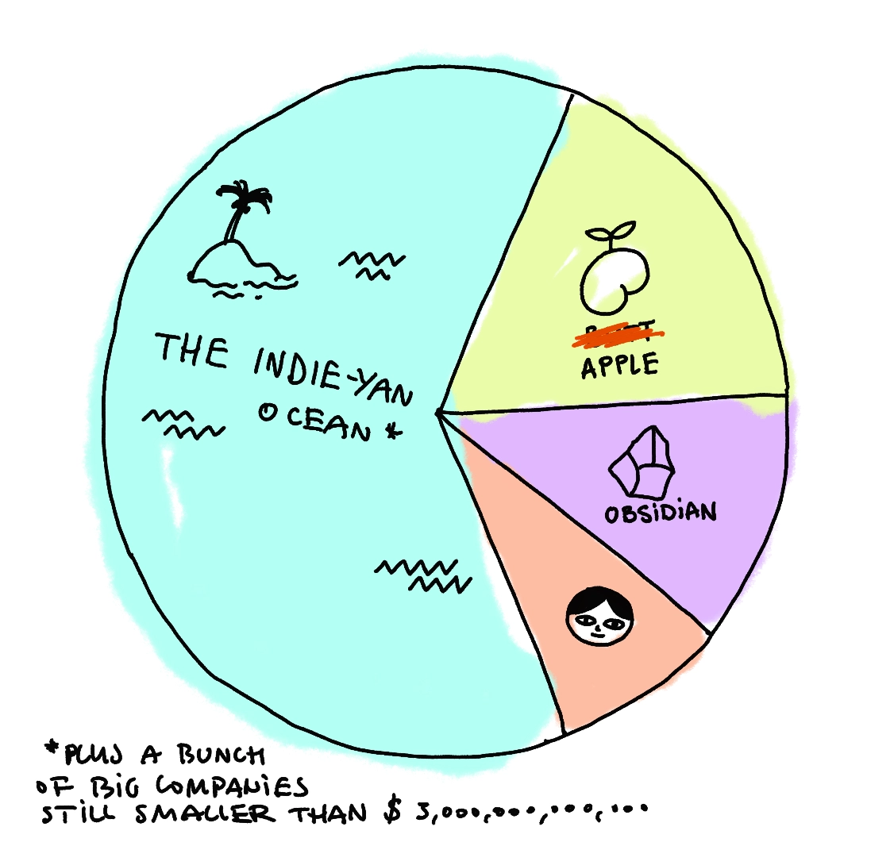

This little exercise was inspired by [Chris Coyer](https://chriscoyier.net/2023/11/25/default-apps-2023/), who was inspired by [Matt C](https://mattcool.tech/posts/default-apps-2023/)... who was inspired by [Tracy Durnell](https://tracydurnell.com) and the [HomeBrew Website Club](https://events.indieweb.org). I think it'll be fun to make another list like this next year and compare with this one.

Also, I've attached a template <span style="color: red">below</span> in case you wan to do this yourself.


## Defaults

📨 Mail Client: Apple Mail
📮 Mail Server: Google :(
📝 Notes: [Obsidian](https://obsidian.md) and Apple Notes/[Concepts](https://concepts.app/en/) when I think in pictures
✅ To-Do: Obsidian (tasks), Apple Calendar (timeboxing), Be Focused Pro (🍅 timer, so I don't lose track of time and take breaks)
📷 Photo Shooting: iPhone 12 Pro, Fujifilm XT-2, [Yashica Mat 124g](https://www.35mmc.com/28/06/2019/yashica-mat-124g-and-its-auxiliary-lenses-review-by-aivaras/)
🎨 Photo Editing: Capture One, Photos, Affinity
🎧 Audio Editing: Audacity
🎥 Screencasting, streaming: OBS
🏗️ UX (wireframing, prototyping): Concepts, Figma, and Penpot
📹 Video Editing: Davinci Resolve
🎮 Game engine: HTML + pixi.js replaced Unity this year, toying with Godot
✍🏼 Journaling: [Ensō](https://enso.sonnet.io)
🧘🏽 Meditation: [Sit.](https://sit.sonnet.io)
🎨 Drawing: Procreate, Concepts
📆 Calendar: Apple Calendar, Calendly
📁 Cloud File Storage: iCloud Drive, Google Drive
📖 RSS: Feedly
🙍🏻‍♂️ Contacts: MacOS Contacts
🌐 Browser: Safari (and I'm happy with it!), Firefox, Chrome only as a dev tool (rarely and I'm very happy about this)
💬 Chat: Signal, Telegram, Discord, iMessage
🔖 Bookmarks: Caffeine. Every Friday I get a coffee near my house, then sift through my bookmarks furiously as if they were a pile of non-matching socks who need to find a soul mate (sock-mate?) *now*. Once finished, I add them to my [newsletter](https://listen.potato.horse).
📑 Read It Later: Safari Reader
📜 Word Processing: Obsidian, Pages
📈 Spreadsheets: Google Sheets, Numbers, Jupyter Notebooks/Quokka
📊 Presentations: Keynote (almost no need for that this year)
🛒 Shopping Lists: Apple Notes, Obsidian
🍴 Meal Planning: N/A (Obsidian for managing recipes, like this [Chilli for Your Mom](<../Chilli for Your Mom>))
💰 Budgeting and Personal Finance: Wallet by Budgetbakers, very irregularly
📰 News: RSS **once every 1-2 weeks**
🎵 Music: Spotify, Soundcloud, [musicForProgramming();](https://musicforprogramming.net/latest/), YouTube
🎤 Podcasts: Apple Podcasts (call it a marriage of convenience)
📚 Reading: Apple Books, Kindle if forced to
🧑‍💻 Code Editor: VS Code, vim, Xcode
🖥️ Terminal: iTerm2
🕹️ Games: PS4, Switch, Itch.io, Steam for new stuff


### Stuff that doesn't fit above: 

- [Rectangle](https://rectangleapp.com) — quickly arrange windows on the screen without touching the mouse (actually useful and takes almost no time to learn)
- GrandPerspective — because I should've bought a bigger SSD, and Docker is a hungry beast
- [Raycast](https://www.raycast.com) — app launcher/Spotlight alternative (ignore the plugins, download for a faster search experience)
- UTM — where [Bob](https://www.youtube.com/watch?v=utjh8R-yedk) [lives](https://www.youtube.com/watch?v=R3tIgaJ1j7w)
- Transmission — someone installed it on my computer, I don't know what it does, but I'm afraid to remove it.
- [Fork](https://git-fork.com) — Git GUI
- VLC — once my grandfather threw an old potato at it and it played it back in 4K, in 1946!
- Anki — a flashcards tool for spaced repetition learning

## Observations:

Most of my apps come into these categories:



Generally I prefer having multiple, smaller tools communicating with each other via well-defined interfaces (think: an app as a single atomic verb vs. a computer program as a noun/environment). Obsidian is an exception here, perhaps because it operates on text files as a primitive, making interoperability and portability trivial.

**I don't recall a single moment when I missed Adobe.** The [Alternatives to Adobe](<../Alternatives to Adobe>) might be cheaper or significantly less evil but most importantly: they have much better UX. And that's despite 20 years of Photoshop muscle memory, which are hard to fight.

Compared to the last year, Obsidian moved from a note taking/knowledge management tool to a multi-tool I use with most of my research, planning, writing and [publishing](<../Abusing and reviewing Obsidian Publish>). Main reason: I don't use many plugins and markdown is easily portable, so I'm not  worried about vendor lock-in. I used VS Code this way before, so the switch came naturally.

Initially I felt like the original list felt a little bit... dated? 1/3 of the tools I use live on my phone or tablet. Who cares about your mail client, in 2023? But then I realised that I mistook *unused* for *boring*. Email *is* boring. Apple Mail is even more boring as it feels like someone stopped developing it a decade ago. And that's actually good. 

### Template

```markdown
📨 Mail Client:
📮 Mail Server:
📝 Notes:
✅ To-Do:
📷 Photo Shooting:
🎨 Photo Editing:
🎧 Audio Editing:
🏗️ UX (wireframing, prototyping):
📹 Video Editing:
🎮 Game engine:
✍🏼 Journaling:
🧘🏽 Meditation:
🎨 Drawing:
📆 Calendar:
📁 Cloud File Storage:
📖 RSS:
🙍🏻‍♂️ Contacts:
🌐 Browser:
💬 Chat:
🔖 Bookmarks:
📑 Read It Later:
📜 Word Processing:
📈 Spreadsheets:
📊 Presentations:
🛒 Shopping Lists:
🍴 Meal Planning:
💰 Budgeting and Personal Finance:
📰 News:
🎵 Music
🎤 Podcasts:
📚 Reading:
🧑‍💻 Code Editor:
🖥️ Terminal:
🕹️ Games:
```


