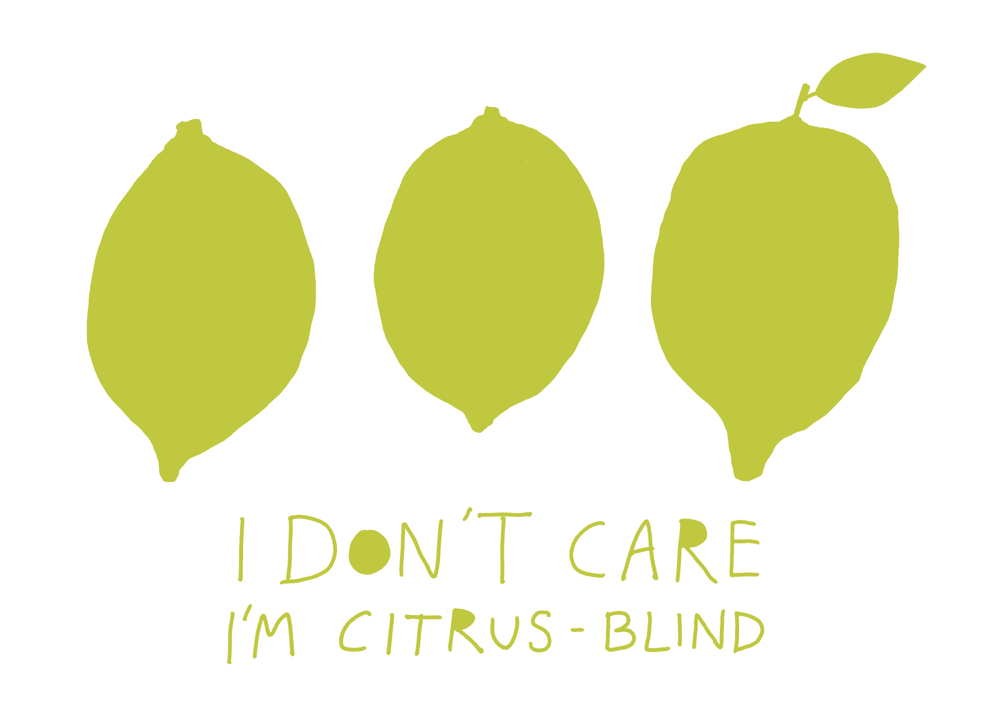

Dear [Rafałku](<../Rafałku>), if you have something to say, say it, don't dilute the information with long intros or disclaimers.

### Why

- it's a waste of time for every party involved

Long... 🐍

Long disclaimers are the equivalent of your relationship with that one neighbour you see every day but never say hi to them, because you forgot to do it once and now it feels a bit awkward and weirdly, unnecessarily scary. Christ, get over this, Dante was younger than you when he was hanging out with Virgil (Midway upon the journey of his life he found himself within a forest dark, for he had strayed from the right path). Dude, I see what you're doing here! Oh come on!

### Why do I do this (or why do I have to fight the urge to do this):

- because the note I wrote seems too short
	- (because I'm worried it'll turn out too short)
- because I'm worried that the note I wrote (or am writing) will sound stupid
- because I'm worried that I don't have much to say or that I'll realise I don't have much to say once I'm done with writing 
- because I haven't been writing for some time. Inertia only exacerbates the reasons above.

In short, it's fear. Focussing too much on disclaimers/padding is a form of procrastination and avoidance. Hide the insecurity behind a wall of words. The issue here is that not everyone reading this has a sledgehammer and a taste for afternoon cardio. I want people to know how grateful I feel for everyone who decides to spend their time here. [I don't take it for granted](<../111>). 

### Valid reasons to add notes with longer intros:

To wrap the [information in a story](<../Projects and apps I built for my own well-being>), because [Stories Help Us Learn, Teach and Remember](<../Stories Help Us Learn, Teach and Remember>).

This is my little shed, not the [Cable TV Web](<../Cable TV Web>). I can do as I please. I try to keep it clean and organised, but fluff and mess are perfectly fine, as long as *it's my conscious choice*, my fluffing fluff.

When the subject itself seems loaded or controversial, people are likely to come with strong assumptions and I can't find a better way of conveying what I have to say because I lack the skills.

Sometimes this is a trap: there's no need to please every audience and end up with the lowest common denominator of what to say and how to say it.

Sometimes it's a signal: perhaps the controversy comes from my own biases, lack of knowledge or prejudice, like a racist starting whatever they have to shit out of their mouth with *I'm not racist but...*

### How I approach this:

**Keep myself in check.** I track my work using pomodoro, so when I notice that I haven't written anything that *directly connects to the title of the note* in the past 25 minutes, I ask myself these questions:

Is this valuable to the person reading this? Is it useful or at least entertaining?

Am I staying on topic?  

Do I still want to write this? Writing is thinking. I learn and organise my thoughts through writing. Sometimes I realise that the topic seemed interesting, but as soon as the initial excitement wears off, there isn't much left. Padding my words just hides that.

**Cut, paste, replant.** Sometimes a disclaimer or a long intro is more interesting than what I originally set off to write. In this case I move it to a separate note and work on that in a focussed manner. Just working on a different file makes me feel lighter. I'd say that more than ½ of the content here was done this way.

**Just remove the disclaimer and learn to live with the discomfort** (related [Kill your darlings, their bones are the best fertiliser](<../Kill your darlings, their bones are the best fertiliser>)). Learning to cull and curate is a skill that takes a tonne of practice. 99/100 times I don't even remember the things I jettisoned. But I do remember the days spent in [Dog mode](<../Dog mode>).

Remind myself that it's ok to leave these notes a bit messy, a bit too wordy [Share your unfinished, scrappy work](<../Share your unfinished, scrappy work>). Every project I try to make perfect is several missed opportunities to make something flawed, but valuable, even if the value comes from the routine.

---

Bonus: reasons why *commercially-oriented* sites do this:

- to squeeze more ads one the page
- to prevent Google from scraping their content and serving it before you see it (nowadays, a lost cause, you'll only piss off the users)

You might find a thread connecting these two issues, let me give you a hint: it's an 11-letter word that starts with A and it rhymes with [Rich People Begging for Money](<../Advertising>).
