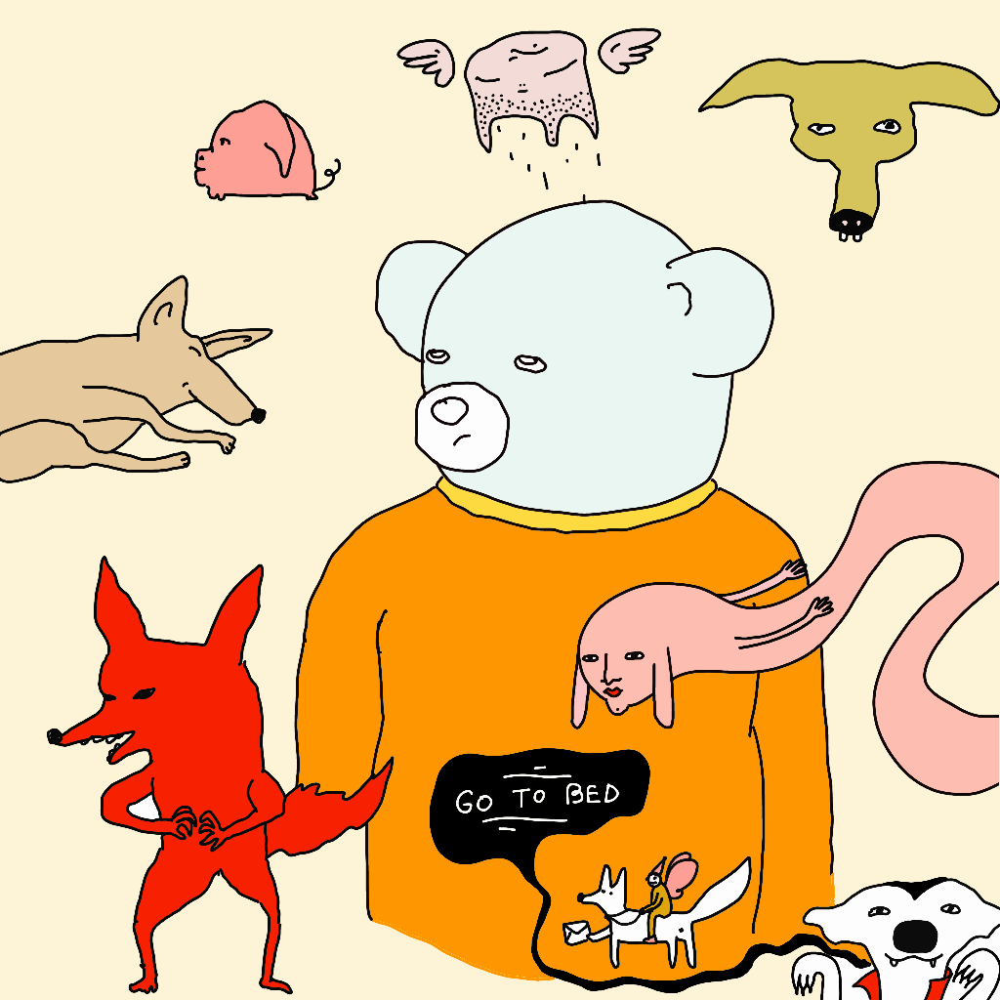
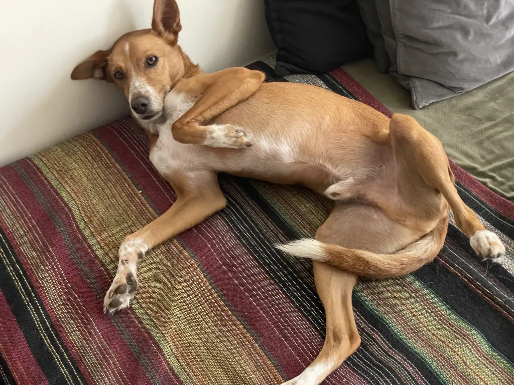
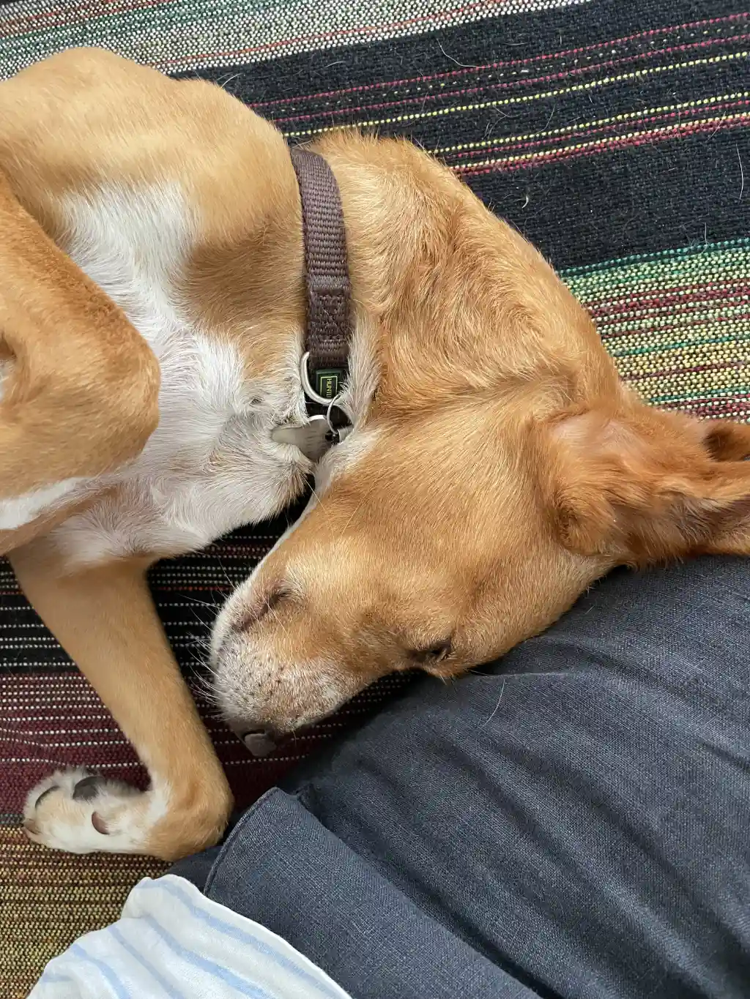

Dog mode happens when after a long and successful week (in your opinion at least), instead of feeling tired, you end up overstimulated, unfocused, hyper.

Common symptoms include: idea diarrhoea, euphoria, a muffled cover or the Doom 3 OST projected from your kundalini chakra towards your head, making it impossible to sit on your ass.

Dog mode feels like a superpower. It feels like opening up the console in Quake and typing a cheat code that lets me trigger god mode. But, in reality when in dog mode, I end up more like my dog Mango.

Mango is a Podengo, a traditional Portuguese hunting breed. They're what's called a _primitive_ breed, a bit closer to a wolf in their behaviour than a Labrador (good boys, easy to bribe) or Border Collie (good boys, also best students in class). They're relatively hard to train, they're smart, loyal and have a very strong prey drive.

At home, Mango is the cuddliest, laziest, most loving creature on earth. He'll climb on the couch and rest his snout on my feet when I read or play Outer Worlds. When I’m sitting on a [zafu](https://en.wikipedia.org/wiki/Zafu), meditating, he'll approach me as quiet as a church mouse, and get just close enough to lean against my body. Just enough so I can feel his warmth, but not enough for me to need to move. He also loves to sleep.

Sometimes we joke it all feels suspiciously human and we must be living with a tiny, nude middle-aged man. He lives rent free in our flat, dressed in a dog suit. Yes, I wanted you to have this picture in your head. And no, I'm not sorry. Dogs install a virus in your brain that makes you say stuff like this and think, “that's cute”.

Mango seeing "prey", however, is a completely different story. His posture changes, closer to a cross between a fox, a hunting dog and an a dude from East London (pre-_Great Gentrification_) yelling across the street: “wha' you say about me sista, wanna come outside?”

_Also known as Sir Chadwick_

What's prey? Anything: a dog on on the other side of the street, a cat, an _imaginary_ cat, the garbage truck, a leaf, a shadow, a butterfly. If he sees it, he will chase it. He will neither hear nor see me. The bald apes who feed him and have a bizarre fixation on collecting and bagging his poop simply do not exist. There's nothing more important thing in the world than the word: _chase!_

Then, 5 seconds later, he'll find another reason to live: _a dog on on the other side of the street, a cat, an imaginary cat, the garbage truck, [...]_, rinse and repeat. This dog lives in a constant 11-dimensional DMT trip, but the mechanical elves are just rats dressed in hats made of bacon.

### How to deal with this

First, understand the reasons we care: he might run away and hurt himself.

**Then, remember that his behaviour is not something we or _he_ can _directly_ control.** This is partially to do with his breed (primitive, highly individualistic) and his history as a rescue who spent most of his formative dog-years roaming through small Portuguese villages (roll 1d10 for a random character trait, possibly goat- or cat-related).

**Understand where the behaviour comes from.**

Dogs have very short attention spans. Find better things to win their attention. Then, stretch that muscle. Snacks and training helps. Speaking of snacks...

**Dogs are hedonists.** Don't punish, offer more pleasure. Initially, do it even when it feels counterintuitive. Reward good behaviours, with plenty of snacks and attention.

**Start small.** Teach him to look at you first, then lure to come closer, then train recall, then sitting, then... if you're lucky enough: _leave it!_ _find!_. _Leave it_ doesn't work for Mango, but _Find!_ means we're running a LARP set in the realm of Sapkowski's novels, with Mango as the Witcher protagonist.

**Be patient.** Don't be afraid to take a step back. He regresses a bit after a few days at the pet sitter's or when we have guests in the house. We try to avoid that, but our families are spread across the entire continent and we don't have many chances to see them. Sometimes we have to retrain him, say, by rewarding him more for the easier behaviours, such as coming to us when sitting becomes too much of a chore.

Channel the behaviour. Give him a toy when he barks at the garbage truck or hide a snack so he can exercise this thought sponge(tte).

Back to humans.

The past week was quite hectic for me. When that happens I don't get tired and apathetic, but anxious, overstimulated, unfocused, hyper. It's counterintuitive: one of the reasons I did all of this stuff is to feel better, more grounded. Now I am, sort of. I feel tricked!

Perhaps you'll find this familiar. Like Mango, when I'm in this frame of mind I have dozens of competing ideas and keep jumping between them. I almost wish I could have 4-dimensional conversations about them. It **feels great**, but I learned to recognise that what follows next is feeling burned out. I end up drafting several long articles, often nested within each other, but then they become too big to finish. [This is not uncommon](https://addyosmani.com/blog/write-learn/). For the next few days I don't get anything done. I get dark, I'm more likely to reach for depressants or stimulants, especially nicotine. This is not sustainable.

There's no point in punishing myself for that. It's more useful to try to understand that state and use it to my advantage. For instance, my ability to think creatively is heightened during that time and I'm much more confident, I care less about being judged, or anything that could go wrong, every idea is enticing, every problem seems like an invitation to play. A friend I met via my [Say Hi](https://sonnet.io/posts/hi) calls, recently diagnosed with ADHD, said that sometimes it feels like a superpower: everything is possible! I don't have ADHD, but the description stuck with me. It clicked.

### Dog mode treatment:

> the key is that humans are predictably irrational
> – Dan Ariely

Know your own flaws, and you can set up systems to help you account for them.

Read the description of Mango again, but this time with human actors as the canine characters.

First, **don't yell at a barking dog.** Don't punish yourself.

**Don't try to work even harder.** Mango does get tired, but he doesn't know it. More fun stuff means upgrading the dog mode to _goblin_ mode. But, coming back home and giving him a blanket and water puts him straight to sleep.

Channel the energy somewhere. Churning out 5 more articles in a day is not going to make the 4 you wrote this week any better. Try to get physically tired, meet a friend, play Outer Worlds, go for a walk, **cook**. Don't know how? I'll be posting recipes here soon.

**Embrace the power of the dog mode**: write down the crazy ideas, read them to a friend over a beer, so they can laugh with or at you (good friends will do both). Next week, look at them again, pick the good parts, and kill your darlings (ideally follow up with a Viking funeral, you'll feel more focused).

In other words: separate divergent and convergent thinking. Dog mode is divergent thinking taken to the extreme, but any creative endeavour needs a culling stage. Both neuroscience and any experienced designer will confirm.

**Ultimately, there's no treatment.** There's only understanding, and working with the grain, not against it. And there's love.

The dog that just pissed on the carpet or found a 100% rat biltong pizza under a car still loves you and you still love him back. Be patient.

