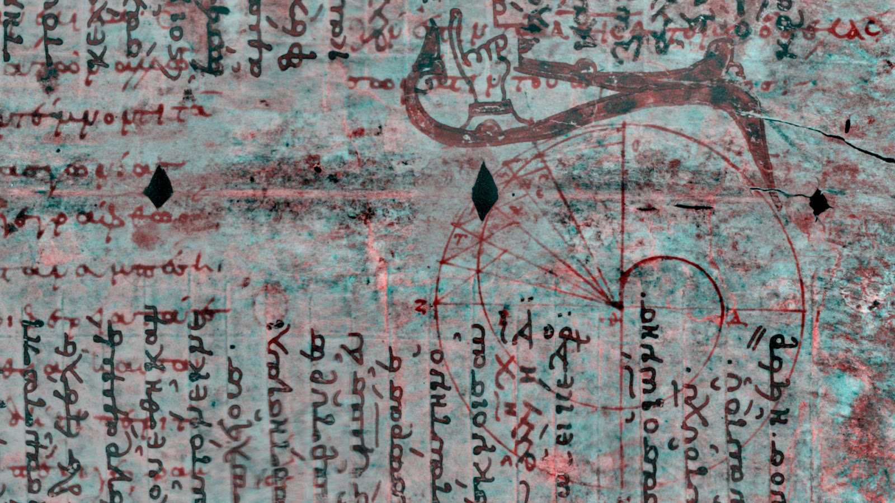
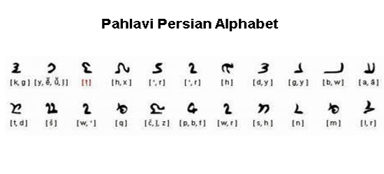
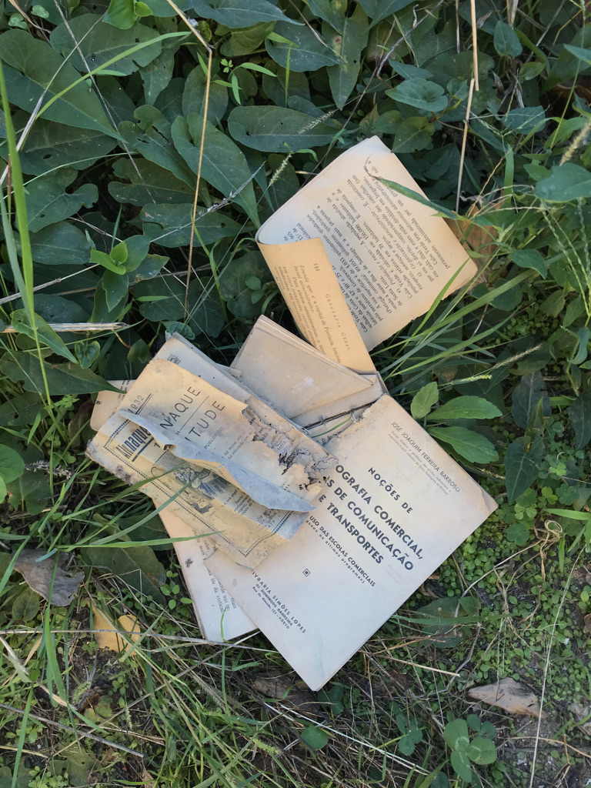
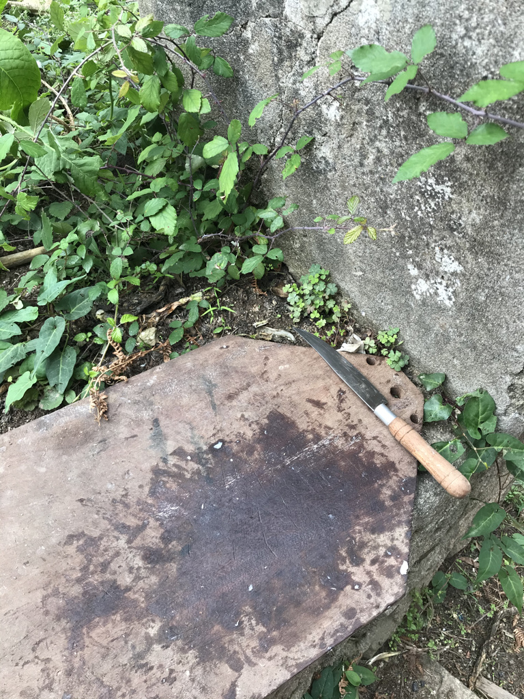
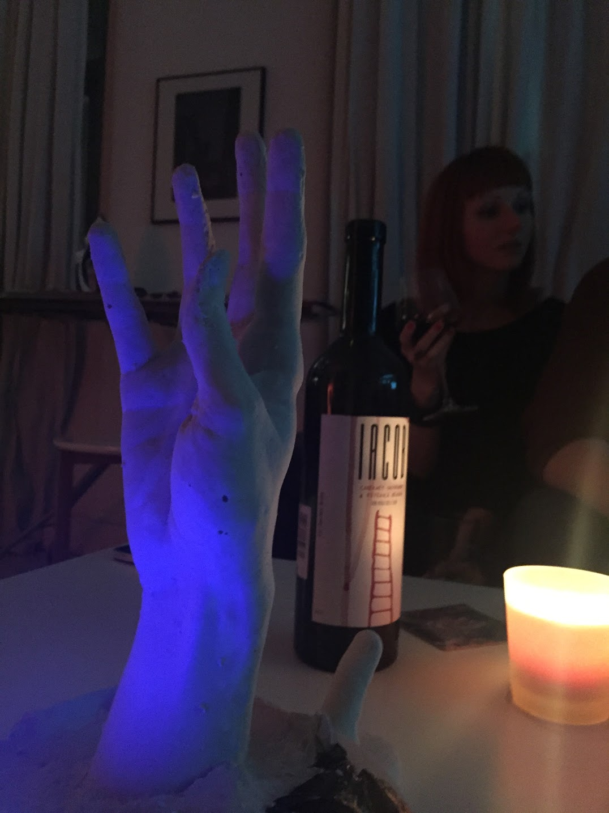
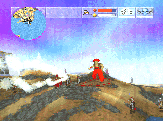

## Palimpsests

This note discusses the palimpsests I encounter every day. 

Palimpsests are reused manuscript pages where the previous content was removed, either by scraping or washing off the ink. I think they're a beautiful example of non-intentional, async communication.

## Why am I talking about this

I've been coding since I was 9 years old, so getting a CS degree felt like a natural next step, but computer science was the [last thing I wanted to study](<../Why I Didn't Study Computer Science>). Don't get me wrong, I still wanted to keep *working* with software but I wanted to *study* linguistics instead. Nowadays, I rarely get a chance to speak Persian and my skills are deteriorating, but I've never regretted that choice: my world feels bigger than it would've otherwise (YMMV).

The end result was that I have spent 100s of hours working with manuscripts, mainly written in Middle Persian (or Avestan, a much older language). This also means that I'd become pretty good at absorbing and *forgetting* new languages very quickly. There's a significant skill overlap between coding, translating manuscripts and speaking with ghosts.

One of my favourite things when dealing partially destroyed texts was that every word or stroke told more than one story. For instance, Middle Persian used a version of the Aramaic alphabet (for a variety of fascinating reasons) and was full of ambiguity: one character could become 6 different letters when transcribed, and even more if we take into account possible misspellings, or traces of different writing if the author reused the parchment.

Honestly, seeing the traces, shadows of people who breathed the same air as I am, but lived in a world where the map was shuffled (from our present, you can say a bit chauvinist, perspective) makes it much harder to feel lonely.

This is why still I enjoy photographing cemeteries, sneaking into abandoned buildings, sneaking into abandoned internet forums, or [reading old code I don't understand](https://bluesyncline.gitlab.io/furby/index.html).

## Examples

This list is *very* selective and idiosyncratic (another way of me saying *half-assed*). Fill the gaps with your examples!

### Async:

- Our dog Mango "reading his newspaper" every time we walk him.
- The smell of my partner's perfume after she has left the flat.
- Notebooks, books and invoices from 1920s left in an abandoned mansion in Vila Nova de Gaia
  
- Same place, wine bottles and fingerprints:
  .jpg)
- Same place, but 2 years later when someone turned one of the rooms into a chicken pen:
  
- Same place, overgrown, but with lilies still growing in the bushes, which once were a garden big enough to require a hired person to maintain it. I couldn't find the picture of the garden, but here's Luna with a stolen lily 
  .jpg)
- Old newspapers and gelatinised bottles of wine left in an abandoned house my brothers and I broke into when I was 10.
- Toilet Graffitis™ (my next band name)
- **Black fire pits in the caves in Sassi, Matera.** The town has existed for ca. 2000 years, but the caves on the other side of the canyon, for almost 10000 years! I imagine that those fire pits haven't changed at all since then (definitely not true).
- This cast of my friend's hand.
  
- **A warm toilet seat.**
- **The carpet** in the coffee shop near my house, probably resold several times. It looks cheap, a dog scratched it.
- **Online guestbooks**
- **Demos of old DOS games** my brothers and I collected as kids from flea markets in Vienna. We didn't have internet, so almost every Sunday we'd go to Liesing and spend our pocket money on scratched game magazine CDs.
  
- **Visiting an old Minecraft house** we built during the pandemic while we still lived in London. Our best friends lived just a few bus stops away, but we couldn't see them in person, so we played almost every day and just hung out there. Luna and I built a little house with chickens, a flower patch and sheep, joking that this would be our house post-apocalypse. We stopped playing regularly after moving out from the UK. Then, a couple of years later, I opened the game and tore up. Time stopped in that place, but we (obviously) moved on and it's hard for me to even compare my life now to who I was then. It sounds silly, I know, but the crafting supplies were still in the same place, the blue sheep were still blue. But I had to "re-read" that place, as if it was another abandoned house we visited. I'll find a better way to describe it eventually.
- **Code like [this](https://bluesyncline.gitlab.io/furby/index.html)**

## Immediate

- Little chirps in [Journey](<../Journey>)
- Little stars and chirps in  [Sit., together (toy)](https://nothing-together.sonnet.io) (more info [here](<../Sit., (together) devlog 002 – Space Kalimba>) [and here](<../Sit., (together)>))

## Ideas for experiments

- Recording all interactions in [Sit., together (toy)](https://nothing-together.sonnet.io) so I can replay them (like a mini-universe with its own stars, black holes and galaxies, a melody of spheres!)
- A "palimpsest" website which contains only a white 1000x1000px rectangle. Every time a new person visits the page, they get to choose a single colour. Then a pixel in that colour is added to the rectangle, starting with the bottom-left corner (0,0). Once the rectangle is filled, we put another rectangle on top of the old one, start from scratch in (0,0) but this time the selected colours will blend with the rectangle underneath.
  

Thanks for reading, see you tomorrow!
