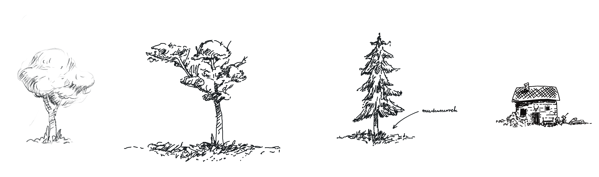

Hey there. We're getting very close to the release of a new [Ensō](https://enso.sonnet.io), and I'm at the stage where I need to stop coding and start talking about it. **Why invest so much time in working on something for other people if we don't give them a chance to decide for themselves if it's valuable?** 

As any cryptozoologist will tell you: *the procrastination ogre feeds on time — the longer we wait, the bigger it gets*. Thinking aloud about themes sounds like a decent warmup before tackling more complex copywriting tasks, so let's go through this [together](<../Work With the Garage Door Up>).

Related: [Share your unfinished, scrappy work](<../Share your unfinished, scrappy work>), [Writing is Thinking](<../Writing is Thinking>), [New Enso - first public beta](<../New Enso - first public beta>), [How People Use Ensō](<../How People Use Ensō>)

**Ensō supports 6 themes:**

<video  src="https://res.cloudinary.com/dlve3inen/video/upload/v1757675044/enso-theme-picker-header-12-09-25_mxzq1m.mp4" poster="https://res.cloudinary.com/dlve3inen/video/upload/so_1/v1757675044/enso-theme-picker-header-12-09-25_mxzq1m.webp" width="2516" height="1684"  loop controls muted playsinline autoplay  style='max-width: 100%; height: auto' ></video>

1. Light
2. Sepia
3. Black and White/e-Paper
4. Dark
5. OLED
6. Midnight

Each theme has been designed with a specific use case/*why* in mind. Some of the *whys* are more obvious than others; some just fall under the category of *familiar = good*. Let's get those out of the way before we move on to my [favourite example](<#h-6-midnight>).

### 1.,2. Light and "Sepia"

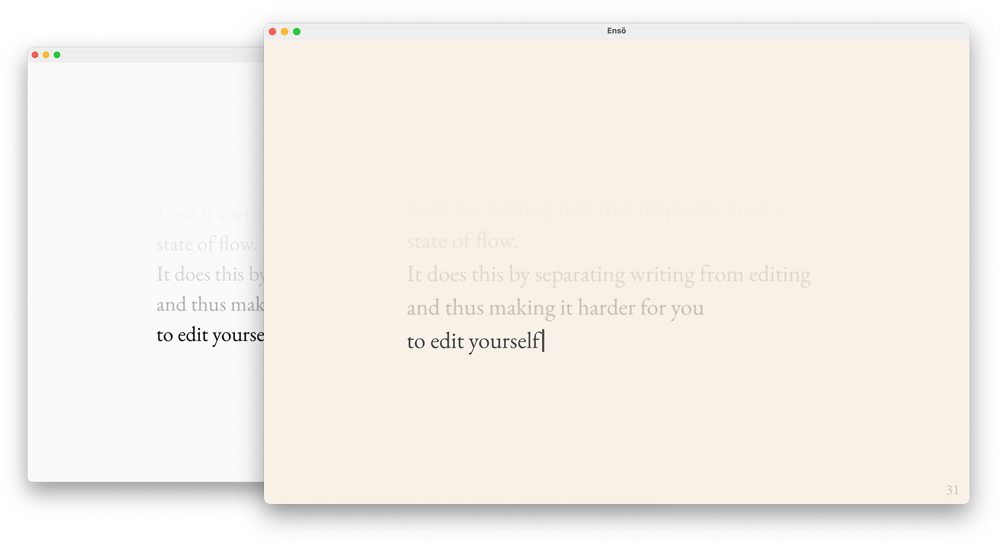

#### Why?

- [x] User preference, familiarity. Some users preferred Sepia over the default Black and White theme. Some users preferred the default Light theme over Sepia. 
- [x] Works well in well-lit environments
- [x] (personal opinion) Sepia looks slightly better than the Black and White/e-Paper
- [x] Sepia should look better with semi-transparent GUIs (e.g. the upcoming, moist macOS 26)

### 3. Black and White / e-Paper

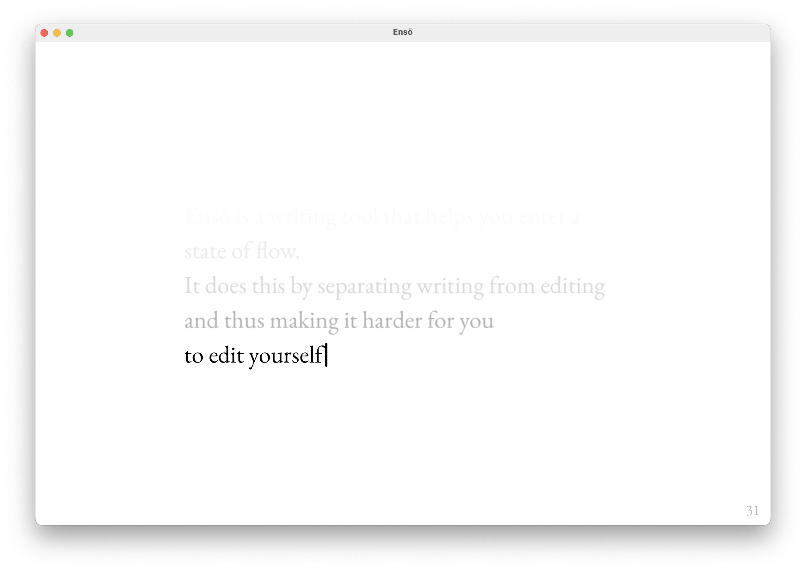
#### Why?

- [x] User preference, familiarity
- [x] Works even better in direct sunlight 
- [x] Better support for e-Paper displays

I'm working on a hardware side project involving an Ensō-ish UX. More on [that](<../Writer's Log Intro>) next year. Although latency is still an issue with e-Paper displays, [the future looks fun](https://spectrum.ieee.org/e-paper-display-modos). Also, many code editors or PKM tools like Obsidian already adopt e-Paper friendly colour palettes/UI styles and I find them often more visually appealing. OK, I really want to talk about this now, but we'll get to that later, when I have more to show you.

> [!NOTE]
> PS. Are you using an e-Paper (or e-Paper-ish...) display? [Say hi](https://sonnet.io/posts/hi)! (also, if you're on the beta, you can now set the caret to *hidden*)

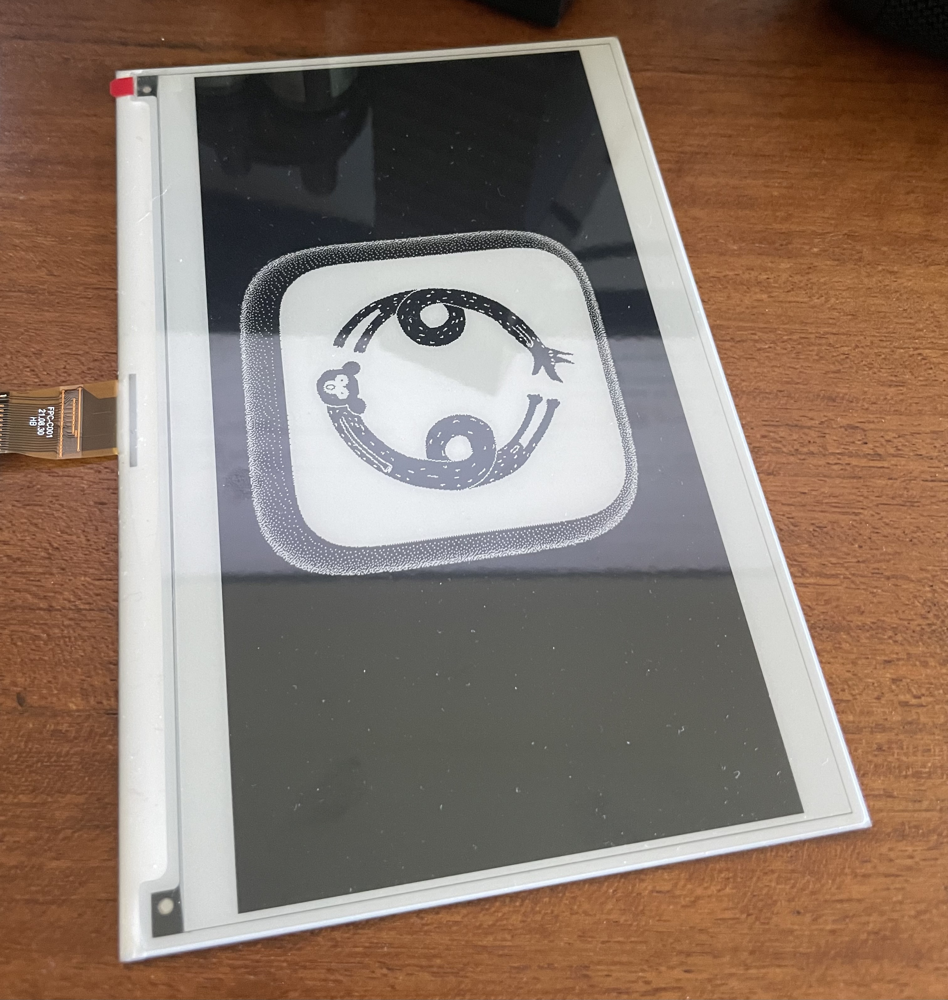

### 4. Dark

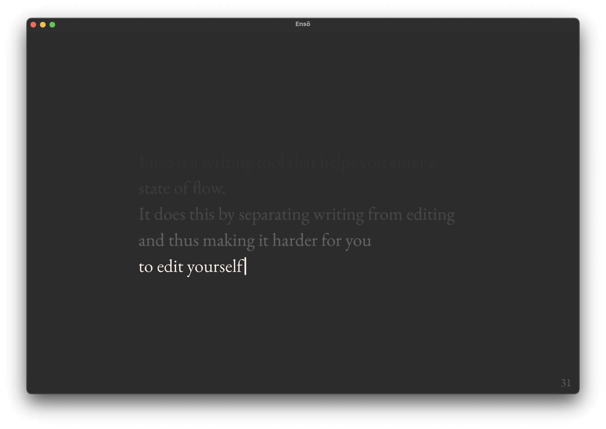
#### Why?

- [x] (again) User preference, familiarity! Some users prefer a dark theme that doesn't stand out from the rest of the OS GUI; greys feel more gentle than perfect black.

This is the main reason we have both Dark and OLED as separate options. 

#### Details

- the colour palette was made to match the default OS colour palette (Sequoia or older). How well it looks still depends on the OS accent colour, which shifts the greys by a small margin. Unfortunately unlocking more control would require me to use private APIs and get the build rejected from the AppStore. I will revisit this in a few months.

### OLED

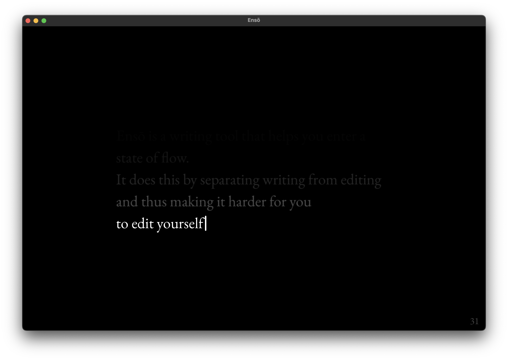

- [x] Looks great on OLED screens. I've tested this with MBP, iPad Pro M4 and phones with OLED displays. More on that below. 
- [x] Works well in dark environments and reduces the amount of emitted light significantly compared to Dark, even on *slightly* lower-end LCD screens, e.g. MBA M1.

### 6. Midnight

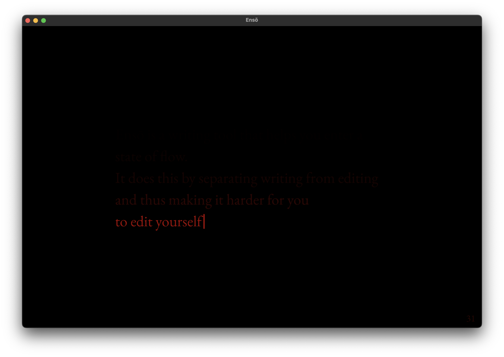

#### Why?

- [x] Comfortable writing in **very** dark conditions. At 20% brightness the screen doesn't seem to be emitting light and the text feels almost like e-Paper.
- [x] Designed to generate the lowest possible amount of light while maintaining legibility, hence the red tint

#### Use cases/target audience

- Insomniacs 
- Writing late at night and trying to avoid exposure to blue light
- Avoiding illuminating an entire room when writing in a shared space (e.g. while sharing a couch)

#### How it's gone so far and why I find this theme particularly interesting

**Since I launched the beta, several users have said they use Midnight mode and are happy with it!**

I use Midnight when I happen to wake up in the middle of the night and can't go back to sleep. I spent 2 decades dealing with [insomnia](<../Insomnia, Control>) (I'm good now), and one of the things I've learned is to leave the bed the moment I start ruminating. Instead: get a cup of tea, look out the window, doodle, or just stare at my dog (weirdly contorted and mumbling in Aramaic, yet still cute). We are creatures of habit. The last thing I need in that moment is to nurture the association between insomnia and my bed.

I usually spend that time writing my [Stream of Consciousness Morning Notes](<../Stream of Consciousness Morning Notes>), which is an added bonus: it feels like I can make up for some of the lost time. It makes me feel less rushed/stressed about the next morning.

## How I worked on this

- user research (user interviews, [Ensō beta](<../New Enso - first public beta>) feedback)
- dogfeeding (I've been testing most of these themes over the past 6 years and you'll find these exact colour choices in some of my other  projects)
- experiments with low light text editors and web browsers: [Obsidian for Vampires](<../Obsidian for Vampires>), [Midnight Ramen](<../Midnight Ramen>).

#### How did I test the themes?

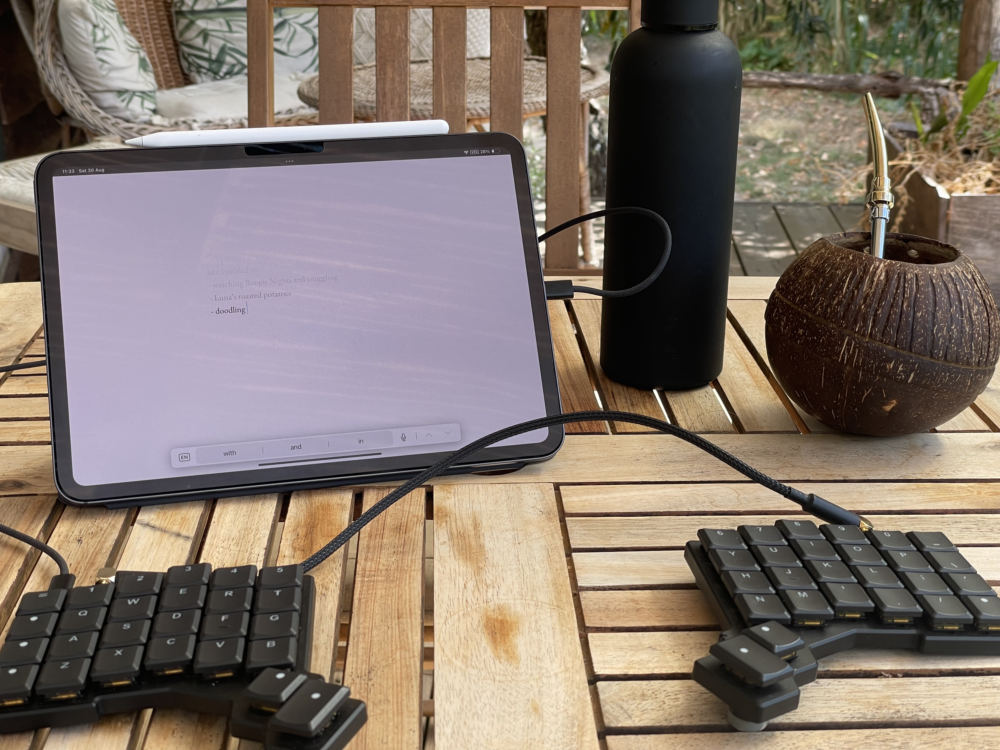

Using the web version of Ensō with my iPad. Also, I made that coconut cup!

1. Through ca. 1500 words per day of regular use on average (7000 words during the longest outdoor writing session)
2. In varying light conditions
	1. indoor vs. outdoor
	2. direct sunlight
	3. indirect sunlight (e.g. writing under a tree or on a porch)
	4. outdoor on a cloudy day
	5. darker or well-lit coffeeshops across town (related [Coffeeshop Mode](<../Coffeeshop Mode>))
	6. indoor low-light (warm floor lighting or cold light coming from the street)
	7. indoor pitch black (my living room)

Regarding 2., I don't need to go out of my way to test it. I use Ensō all the time and move around a fair bit, which makes it much easier.

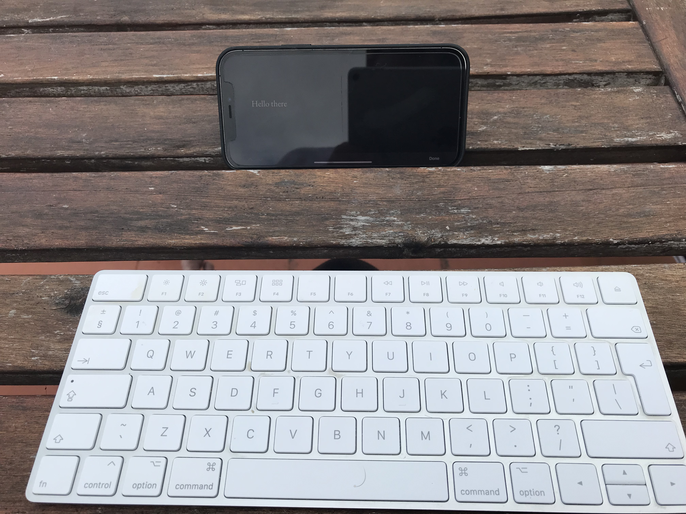

Summer 2021. I accidentally wiped my iPad by travelling with the keyboard in my backpack, so I switched to using Ensō with my phone.  We've gone a long way since then!

### What I've learned

#### It's really, really hard to have a compact, intuitive UI for *more than two* themes *controlled via OS appearance*. 

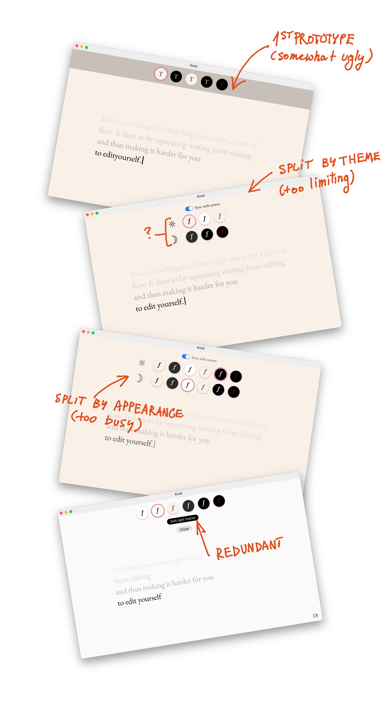

This is a weird one, as it might be a bit hard to explain if you've never approached *this specific problem*. It's also one of the annoying problems where the user will see if something doesn't work well, but if everything is in place – they won't notice a thing.

Here's what I want:

1. theme changes that require *maximum* 3 interactions (from opening the picker to getting back to writing)
2. an easy way to associate themes with OS appearance (light, dark, automatic)
3. more than one theme per appearance

Now, things are easy if we choose only **two** items from the list above. But they get a bit wonky if we want to do all three. How to keep clear affordances for users at a single glance, without making them feel like they're about to fill a visa application just to change the background to dark? 

There's a tonne of UX patterns to learn from, again, *if* we stick to two items from the list. So, following [MISS](<../MISS – Make It Stupid, Simple>) I came up with a dumber solution and I'm pretty happy with it: the selected theme is tied to the current OS appearance. 

<video src="https://res.cloudinary.com/dlve3inen/video/upload/v1757675086/enso-themes-older-examples_bcwsuh.mp4" loop controls muted playsinline autoplay  width="2430" height="1558" style='max-width: 100%; height: auto'></video>

Say, I set the Sepia theme in the morning when my Mac is set to light appearance, then use Ensō again in the evening and set it to dark. From now on Ensō will associate each theme with an OS appearance. 

#### Polished theme support would require separate opacity curves for each theme

You might've noticed that in the Midnight theme the lines seems to fade more abruptly. One of the reasons behind it is that we perceive red as darker than other colours ([Obsidian for Vampires](<../Obsidian for Vampires>)). 

In order to improve this I'll need to adjust the text line opacity curve ([Natural Gradients in CSS](<../Natural Gradients in CSS>)) on a per-theme basis, making the curve for red less sharp. I've already made some improvements here, but this feels like a pleasant, iterative update. It can wait, Mr. [Dog mode](<../Dog mode>).

Additionally, the end result varied a lot across display types, even with them being limited to just Apple (for now).

For now, we can keep it with the manual tweaks I tested on a bunch of screens. This is not an issue most people would notice. But, if someone wants to sponsor adding a gamma slider to Ensō, sure, [let's talk](https://ko-fi.com/rafalpast).

#### A significant number of beta users are on older versions of macOS, which doesn't support P3 colour space. 

Yes, I can see the OS versions on TestFlight, but I noticed the issue thanks to user feedback.

#### People are already using Midnight! 

And it made me very, very happy. It's such a seemingly small change, but it seems so useful.

### What I learned while writing this note

- I'm happy with the theme choice, but might cut the default light theme.
- I've kept the more interesting subjects (Midnight, UX, what I've learned) at the end, making the reader wait.
- More of the theme designs are based on familiarity than I would like to admit. There's nothing inherently wrong with that. On the contrary, I think that's valuable. But how should I talk about this when I add themes to [Ensō website](https://sonnet.io) before the release? 
- I was hoping to come up with some concise, punchy quotes I could put on the Ensō website under the *themes* section. That didn't happen, but the way I think about them is more structured. Mainly, I can see what 
- Shit, I've put so much work into this thing just since the [recent beta](<../New Enso - first public beta>)! ([Writing is remembering](<../Writing is remembering>))

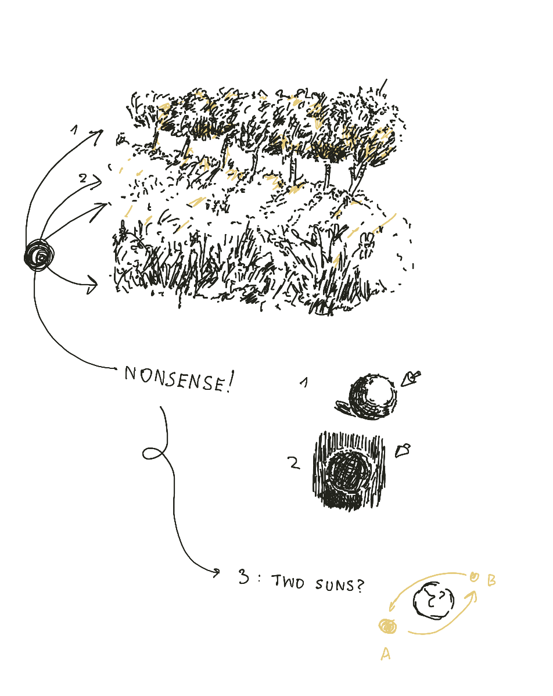

*Things I've learned by studying my less weird drawings: I have a deeply ingrained belief that there are two suns (or, I keep forgetting how to place the shadows)*

### Next

The next steps are not technical. The next step is to say what I said here, but in a more concise manner on the [Ensō website](https://sonnet.io).

Then and only then I will:

- Consider removing Light and Sepia themes (yes, an unusual choice, since the site will already be up, but it's also easier than getting distracted *now*).
- Park adding custom user themes for the foreseeable future. There isn't enough interest and this is one of the features that are waaaay easier to add than to remove once people get used to them.

Thanks for reading!

