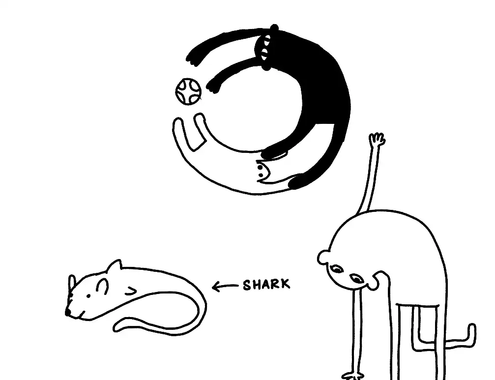

Ovid's [Metamorphoses](https://en.wikipedia.org/wiki/Metamorphoses#CITEREFGalinsky1975):
> *Daphne turns into a laurel tree, Narcissus into a flower, and Arachne into a spider*

[Everything is Alive](https://www.everythingisalive.com)

#article-idea 
