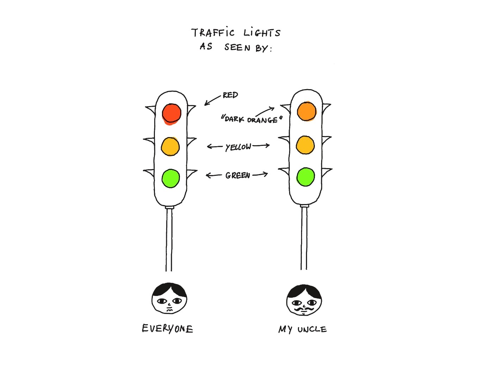

*My uncle suffered from traffic-induced colour blindness. Every time he crossed on the red light, he'd say that it was, in fact, dark-orange.*

Perhaps you're familiar with [FAQs: why we don’t have them (GDS)](https://gds.blog.gov.uk/2013/07/25/faqs-why-we-dont-have-them/).

When I read it for the first time I used to avoid FAQs like fire. But a decade has passed, I grew my first moustache (at the ripe old age of 34) and, as with everything else, **I**'ve grown to realise that the reality is much more nuanced. Who would've thought! I'm not arguing with GDS here, I'm arguing with my younger self.

Dear Rafał, next time you consider using an FAQ on your site, don't discard the idea instantly, but look at it this way:

> FAQs are a) cheap to **make** b) expensive (or slow) to **use**.

FAQs are cheaper to put together because the alternative (leading the user to the right place) takes much more effort on *your* side. With FAQs it is the *user* who has to do the work of searching for the right *question* before they can find the answer. 

Searching for the right question means coming up with a right *query* or *coming up with the way another person might've understood/expressed that problem* earlier. It means putting oneself in someone else's shoes, which looks eerily similar to a typical problem of a UX expert or an editor! This is not an easy job.

> I you're an engineer, think of it from this perspective: how much of your work is defining the problem vs. implementing the solution? The task we're putting on the user here might sound different (and much easier), but it's of a similar shape.

Additionally, **FAQs lead to more duplication:** people sharing the same problem might phrase their questions in slightly different or orthogonal ways. Those questions will generate different answers tacking the same problem at its core.

Now, HMRC/GDS can afford the UX/content structure work to come up with better alternatives (or: they can't afford *not* to do this). But most of us are simple mortals, and not Byzantine bureaucracies. How about smaller businesses or indie developers like Jordi Brun and his [MacGPT](https://www.macgpt.com)? 

In this case FAQs make more sense as:

- This feels like a pragmatic tradeoff. He's a one-person shop and his resources are much more limited.
- The FAQ format actually makes sense given the overall information hierarchy of his site:
	1. Problem statement + call to action
	2. Main use-cases
	3. Less common use-cases, incl. power users (people using Open AI API keys)

FAQs are not necessarily bad but similar to messy, untested code: it's a tradeoff. Pick your battles. PICK YOUR BATTLES MR PASTUSZAK.

###  *A Thing of a Bygone Era*

One entry from the comment section that stood out to me:

I can't decide if this statement was a bit premature or too far in the future as we seem to have gone the full circle. Although we *do* have the right tech, the quality of search results is abysmal, due to [SEO spam](https://danluu.com/seo-spam/) and the fact that most of the search engines are storefronts.

## Alternatives/potentially better approaches:

It's not all doom and gloom. The tradeoff can be cheaper and less painful from the user perspective using:

- LLM chat with RAG (or a product like formless.ai, e.g. this [404 page](https://formless.ai/404)) 
- semantic search powered by embeddings (tangentially related: [Braggoscope](https://www.braggoscope.com), simonw TIL search)

Neither of these solutions is perfect and I'm pretty sure there are a ton of SaaS businesses trying to solve this problem (Notion, every small chatbot/KB startup under the sun). 

But, if you know of a drop-in library / OSS service dealing with this – [let me know](mailto:hello@sonnet.io).

See you tomorrow!

