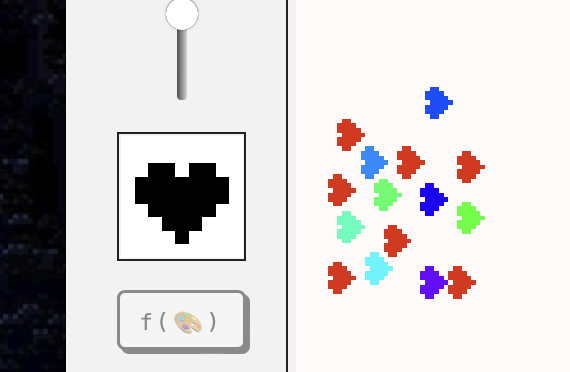
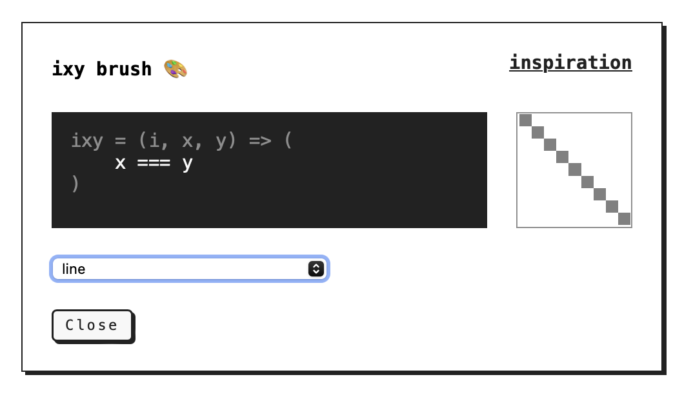
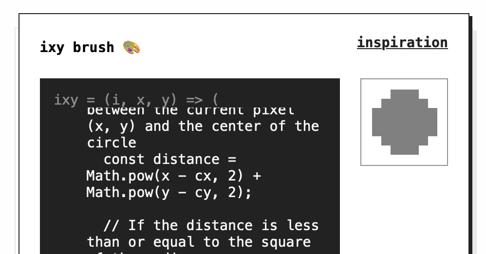
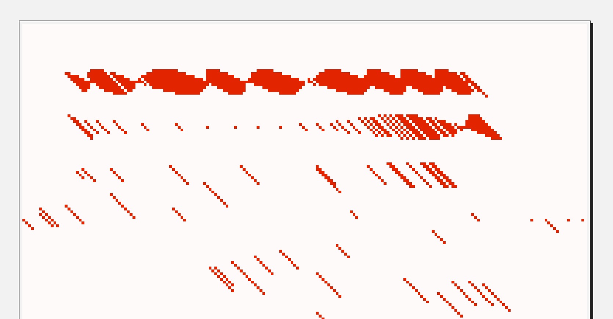

[Embed](<../Rosie's Poem>){data-embed data-target="#^6dcdc7"}

One of the unexpected discoveries from playing with [Fig](<../Fig>) was how much fun I had designing, messing with (and breaking!) brushes. I thought I'd share how they work, how they *don't work* and why I will keep many of the bugs collected during my escapade in pixel land.


First, we have three types of brushes in Fig:

1. normal → draw a (slightly noisy) rectangle
2. drawable → draw the shape of the brush on a 9x9 matrix
3. code → control your brush [tixy.land](https://tixy.land) style!

<video src='https://res.cloudinary.com/dlve3inen/video/upload/v1714758595/fig-brushes_dpkfwb.mp4' controls muted autoplay poster='https://res.cloudinary.com/dlve3inen/image/upload/v1714758192/fig-brushes_kaod6d.png' playsinline />


### Regular

Regular brushes are just rectangles with occasional holes, Edam cheese style (or Gouda, depending on how fast you draw):

<video playsinline autoplay loop muted src='https://res.cloudinary.com/dlve3inen/video/upload/v1715083360/fig-norm-brush_codffb.mp4'/>


### Drawn brushes

Draw the shape of your brush on a tiny 9x9 grid based editor. That's all!


*No, **I** didn't mix x and y coords, you're sideways! (and [Jonathan is a school](https://youtu.be/jK60Jpe0ito?t=52).)*

The original reason I added that little editor was to have a simple debugging/prototyping tool. What I particularly like about it:

- it's surprisingly quick and easy to use
- doodling a quick brush then immediately using it feels a bit like mixing colours in a physical palette

I suspect this might not be as interesting to others as it has been to me. I still remember the feeling of excitement when I tried the brush editor in Paint Shop Pro.

The UX was fun to handle as well, partially because it's more complex than it seems on the surface. Some things to consider:

- the editor will be used with: fingers, mouse and a stylus
- how to reduce the number of clicks/taps required to edit the brush?
- how to make the interaction obvious or make it easy to learn?
	- see [how to build a graphics editor that is **not capable** of keeping pixels on the screen](<../Fig>)

(This is also one of the reasons I enjoy typography: when it works, it becomes almost invisible.)

#### Some of the interactions I tested:

- Every pixel is a button! Click to toggle the pixel (too slow)
- Have an erase and draw mode (add/remove pixels from the brush), control via the `touchmove` event
	- too slow and error prone
	- also, weird
- draw with `pointerdown`/`pointermove`, but choose edit/erase mode depending on where you started
	- if I start drawing on a black pixel → remove brush pixels
	- if I start drawing on an empty pixel → draw brush pixels

<video playsinline autoplay loop muted src='https://res.cloudinary.com/dlve3inen/video/upload/v1715083359/fig-draw-brushes-clicks_eqz2y0.mov'/>

### Code brushes

Feels like this entire project has been a 4-week long stream of consciousness. The code brush is an extension of the regular drawable brush but it's controlled via a tixy.land inspired JS snippet:

```
(i: int, x: int, y: int) → boolean
```

Let's break this down:

- `i` is the number of the current iteration, increased each frame
- `x` and `y` are the grid coords



We run `ixy` for each pixel of the brush grid, for each iteration. Every time the function returns `true` we draw a pixel, otherwise we leave it empty.

<video playsinline autoplay loop muted src='https://res.cloudinary.com/dlve3inen/video/upload/v1715083361/fig-code-brush-tutorial-random_janugd.mov'/>

Since `i` can be used as a poor man's replacement for *time*, we can use `ixy` to create animated brushes:

<video playsinline autoplay loop muted src='https://res.cloudinary.com/dlve3inen/video/upload/v1715083360/fig-code-brush-tutorial-animation_okbkip.mov'/>

We can create looped/cyclical animations by using trigonometry, e.g. `Math.sin`.

<video playsinline autoplay loop muted src='https://res.cloudinary.com/dlve3inen/video/upload/v1715083726/fig-oscillation_sjxpoq.mov'/>

I'm often impressed by the work of people who are capable of writing complex shader code. I like to think of this brush editor as a simple, me-sized shader toy. Having said that, let's see if we can hack or break it!

### Prototyping new brushes using ~~aye aye~~ AI

tixy.land caps the number of code characters at 32. We don't have this limitation, but to create more complex behaviours we'll still need:

1. a place to store variables, e.g. computed temporary state
2. someone with a better knowledge of maths than yours truly
3. someone who will bother to write the code

1\. can be solved with IIFEs (immediately-invoked function expressions):

```
(() => { ... })()

// can be used as:

const ixy = (i, x, y) => (
	() => {
		// use i, x, y here
		let someComputedPropertyUsingXandY = ...
		return someOtherComputedProperty
	}
)()
```

2\. can be offloaded to Claude!

I'm using some basic prompt vibing™ tricks here: chain of thought prompting, providing examples.

> None of this song and dance is **really** needed, as providing two examples seemed to be enough to give me useful results: [thread on Xitter](https://twitter.com/rafalpast/status/1771604982598435149/photo/1).


#### Here's the prompt:
(see [My default Coding Assistant System prompt](<../My default Coding Assistant System prompt>) for context)

```
implement the function animate (time, x, y) => void

the function:
- operates on a grid of 9x9 pixels
- returns either true or false for each pixel
- is implemented in Javascript

Example implementations:

- random spray/noise: `return Math.random < 1`
- diagonal line: `return x === y`
Now: implement the body of this function that will render a circle (9x9):

- wrap the result in an IIFE and pass these arguments to it: (i, x, y)
```

Result:




## The woods are lovely dark and deep, so these are the bugs I'd like to keep:



Procreate is a wonderful piece of software. The faster, messier my brush strokes are, the better they look (thanks for their stabilisation and motion filtering algos). Every line is smooth, dynamic, drawn by a (hand-held) hand. This is useful and valuable as it allows more people to express themselves in ways that were previously impossible or very difficult. I used Procreate and MS Paint as a reference when looking for UX patterns.

> (Yes, nothing can replace patience and discipline when it comes to drawing. I know that because I have low supplies of either.)

Fig doesn't even draw lines, which results in a bunch of small glitches. Every frame (however often it happens, usually between 30 and 60 fps) we sample the brush and drop it on the screen. This means that in order to draw strokes you'll need to draw more slowly. This means that if you draw really fast you can simulate brush spacing. And, finally, this also means that the brush dynamics will vary slightly between devices, just like it does when I switch from my pastel paper to vellum (or a crappy notebook.)

I tried to fix it and it looked too pretty. I'm keeping it.

That's all for today, see you tomorrow!
