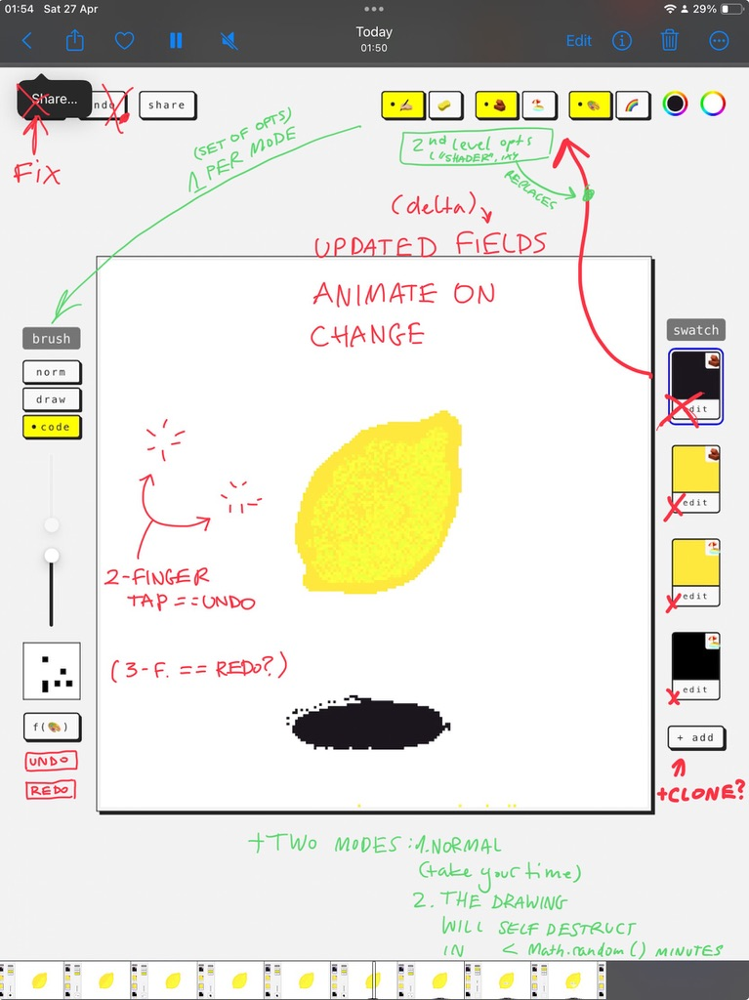
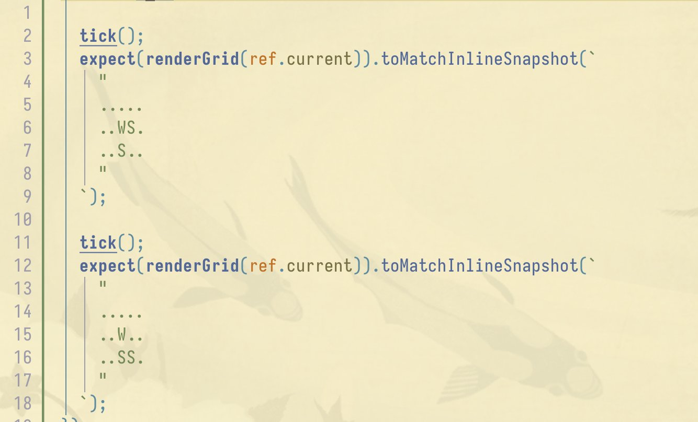
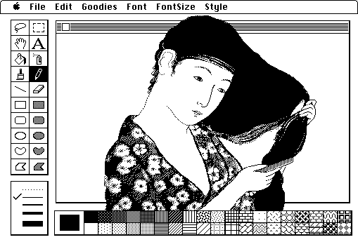

[First Fig Digression](<../First Fig Digression>)

## What

Fig is a drawing app that helps you focus on the _process_ of drawing without obsessing with the end result.

**Check it out [here](https://fig.sonnet.io).**
(works best with desktop and iPad)

<marquee style='font-family: comic sans, Comic Sans MS'> or catch <a href='https://fig.sonnet.io?overachiever' target='_blank'>this link!</a> you marquee chasing maverick!</marquee>

Here's how it works: in Fig, every pixel has a lifespan. Over time, all the pixels die and parts of your drawing will fade away.

Want to know how to build a graphics editor that is [not capable](<../MISS – Make It Stupid, Simple>) of keeping pixels on the screen? Here is what I focussed on:

- finding ways to make impermanence enjoyable
  - set the right expectations from the beginning (turns out things disappearing from the screen isn't a very peaceful and meditative experience)
  - quick or messy drawings still feel and look enjoyable
- playfulness ^af5286
  - make it accessible, make it feel like a toy
  - drawing itself (i.e. literally dragging the finger/pen on the screen) should _feel_ fun
- balancing flexibility and a recognisable aesthetic
- the tool is the medium, so make it highly customisable, even hackable
  - inspiration: game engines, my dad (a carpenter) making his own tools, [Galician Carpentry](<../Projects and apps I built for my own well-being>)

### What Fig is _not_

Fig is not a [sandbox simulation app](<../Sandboxes, Games, and Play>) (e.g. [sandspiel.club](https://sandspiel.club)). It's a toy, but its primary use is _doodling_. In fact, I avoided researching sandboxes while I worked on Fig because they are just so much fun to play with and hack (cue: [💧 Top 9 Ways To Make Water](https://www.youtube.com/watch?v=2qfjJ-0ZeVM&t=316s)). ^e375d3

## Features

### Pixel lifespan

Every pixel will die after anywhere between 1-240s. You can control the lifespan of each brush stroke separately, or that of the entire drawing. It's up to you.

<video src='https://res.cloudinary.com/dlve3inen/video/upload/v1714758193/fig-lifespan_bbwrwo.mp4' loop muted autoplay playsinline />

This does affect undo: if you bring it back to life, you'll get to watch it fade away immediately. I'm sorry — although necromancy is allowed, it is ineffective.

### Custom brushes

There are three types of brushes:

1. normal → draw a (slightly noisy) rectangle
2. drawable → draw the shape of the brush on a 9x9 matrix
3. code → control your brush [tixy.land](https://tixy.land) style!

<video src='https://res.cloudinary.com/dlve3inen/video/upload/v1714758595/fig-brushes_dpkfwb.mp4' controls muted autoplay poster='https://res.cloudinary.com/dlve3inen/image/upload/v1714758192/fig-brushes_kaod6d.png' playsinline />

**I've had so much fun with 2. and 3. so expect a more detailed write-up soon!**

### Materials and fills

#### Materials

Materials are simple: there's a wall and sand. Wall stays in the same place. Sand falls.

<video data-rate="2" src='https://res.cloudinary.com/dlve3inen/video/upload/v1714758200/fig-wall-vs-sand_senjoq.mp4' controls autoplay muted playsinline />

There's no bucket fill, just a bucket of sand you can pour _into_ a shape:

<video src='https://res.cloudinary.com/dlve3inen/video/upload/v1714758319/trimmed_sporij.mov' loop muted autoplay playsinline/>

I played with sand instead of a standard flood fill because:

- using sand is a bit harder than using a bucket fill ([Constraints mean focus and the freedom to break them.](<../Constraints mean focus and the freedom to break them.>))
- it just _feels_ fun to use! (also, I wish I could come up with a sound effect for it)

Under the hood, I'm using simple cellular automata and it's really tempting to make these rules more clever. But, I want to make sure that the process of drawing is itself fun and accessible (remember #What Fig is not).

#### Fills

You can select a single colour or a rainbow-like gradient. And if you change the material, the pixels shimmer a little bit:

<video src='https://res.cloudinary.com/dlve3inen/video/upload/v1714758814/fig-shimmer_j04py5.mp4' loop autoplay muted playsinline/>

## Why I made it

[Second Fig Digression](<../Second Fig Digression>)

I wanted to make a new toy, and [a fig tree died](<../Second Fig Digression>). Also, [Coding Train](https://www.youtube.com/watch?v=L4u7Zy_b868&t=966s) released a new video about cellular automata at the beginning of this year.

## How I made it

I built a quick and dirty prototype and kept using it almost every evening before falling asleep. I didn't force myself to stick to a routine: I played with it [when I felt like it](https://x.com/rafalpast/status/1771256689175445633). Dogfeeding is useful, but the _felt like it_ part even more so: most of the ideas implemented in the app come from those evening doodling sessions.

Related: [2-2-2 Project Scoping Technique](<../2-2-2 Project Scoping Technique>), [Share your unfinished, scrappy work](<../Share your unfinished, scrappy work>)

### Tech

I'll try to keep this moderately low on tech, but feel free to [message me](mailto:hello@sonnet.io) if you're curious about the details. Here's a rough technical timeline:

1. Spike in p5.js
2. Move to React + Typescript when managing UI state in p5.js gets too messy
3. Add tests when I realise that I spend too much time debugging and catching missing grains of sand in the simulation
   1. refactor, improve performance once we've had a test coverage

*Testing with ASCII art*

Balancing prototyping and technical improvements is [inherently risky and annoying in hindsight](<../inherently risky and annoying in hindsight>). I'm somewhat less annoyed about this one, but I'm not yet sure why.

## How I use Fig

I play _in_ and _with_ it:

1. I doodle almost every evening
2. I treat it as a platform for testing smaller toy ideas

1\. is pretty self-explanatory. It's fun and the results border on trip visuals, but I've noticed that recently using Fig in the evening has replaced my regular drawing sessions. The result is that I have fewer drawings to share. That's probably not a good thing _for me_, but also a fairly isolated problem.

<video muted controls  playsinline src='https://res.cloudinary.com/dlve3inen/video/upload/v1714760659/mango-fig_qbxl4c.mov'/>

2\. is more interesting, because I'm starting to see how I could break and remix some of parts of Fig into different projects. This brings us to:

## Next steps

^8c282a

### Smaller improvements:

- make it mobile friendly. I'm using Fig on my computer and tablet. It works really well with iPad + Apple Pencil, but the UI on mobile is too cluttered.
- hide the lifespan. When you start the app you're presented with 2 modes:
  - default: start drawing and control the lifespan of each brush stroke
  - flow: you don't control the lifespan and you don't know how long the pixels will live for (I'm particularly excited about this one)
- control the animated gradient fill colours

### Ideas to explore:

#### A simple 3 colour pixel art editor inspired by this drawing:

_by [Susan Kare](http://kare.com)_ ([context](https://www.behance.net/gallery/25434317/MacPaint-Ukiyo-e))

#### SSS

A programmable SSS (Simple Silly Shader) graphics editor where both brushes and fill can be controlled using a simple JS snippet.

#### A rhythm-based game

I'm particularly excited about this one, but I'm still looking for a concise way of putting it into words. If you play with the code brushes in Fig, you'll notice that some of them oscillate:

<video muted loop autoplay  playsinline src='https://res.cloudinary.com/dlve3inen/video/upload/v1714764734/fig-oscillation_fpwuvc.mov' />

Now, imagine that this oscillation is synced with music (i.e. the shape and size of the brush follows the beat). Your goal is to trace the lines of a drawing while matching their stroke shape and size. The only way to match it perfectly is to draw in time with the music. In other words - by dancing with your fingers!

That's all for today. See you tomorrow!
