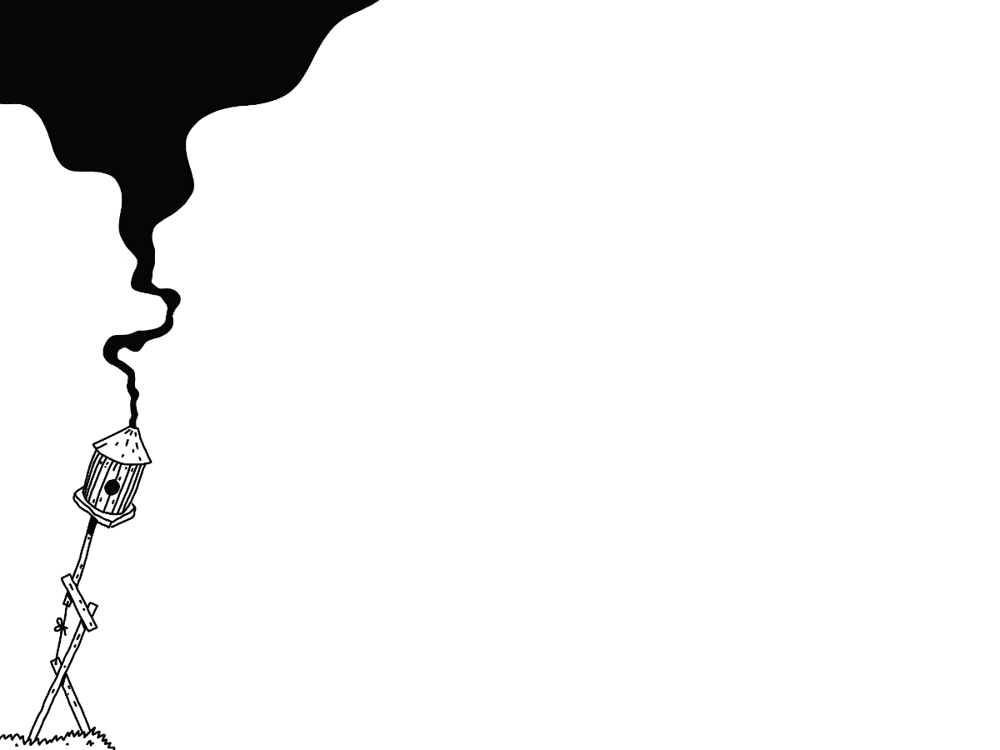

The world is big enough.

## My tribes in the past:

**When I was 10,** it was the kids we used to build houses in the forest with.
**When I was 13,** it was my friends from another town. I'd cycle there to burn CDs with SOAD or Tool.
**When I was 16,** it was the kids living in my dorm, playing tabletop RPGs.
**When I was 18,** it was a coterie of Vampires, we'd meet every two weeks and pretend that we were plotting against each other.
**When I was 22,** it was a theatre troupe living deep in the Polish-German woods.
**When I was 25,** there was no tribe, but I still had friends.
**When I was 27,** there was no tribe, but I found love.
**When I was 33,** it was a small group of curious people, trying to make the world kinder through coding, design, or making things with their hands. I approached them from a distance, still getting closer. Still in the woods.

I'm 35 now. I have two tribes. One is a little boat with Luna and Mango. There's another boat nearby; it's full of socialist-anarchists. They cook so well, I'm becoming a socialist-anarchist myself.

Find your tribe. Keep looking.
