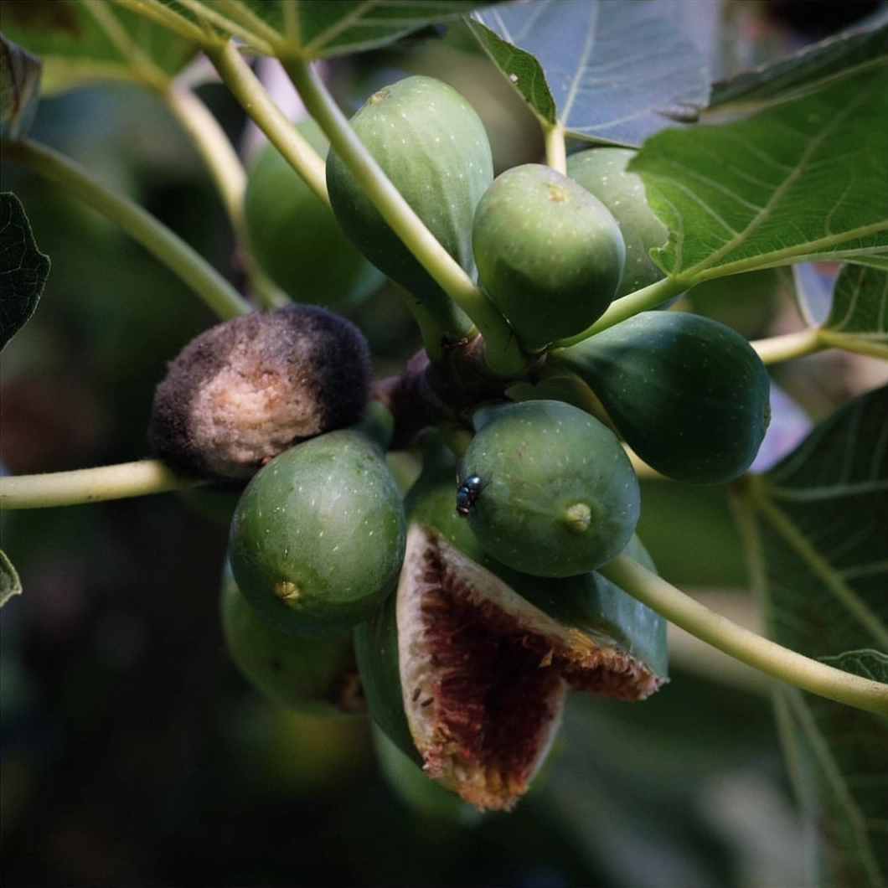

This is the fig tree in my garden. Given that I grew up in a place where winters are cold and snowy -- that is, a place where the only [palm tree](https://en.wikipedia.org/wiki/Greetings_from_Jerusalem_Avenue) I can think of is a man-made one that many of my compatriots know by its given name... I'm easily impressed by fig trees, especially old ones. 

How old? No one knows for sure, but our best guess is a bit more than a century.

Just like [Julia](<../Julia>) (my great grandma, who had to pray for the health of Franz Josef in primary school, and lived through 3 national anthems) the tree predates my landlords and whoever lived here before them. I think it's fair to say that this is her garden and we're her guests.
