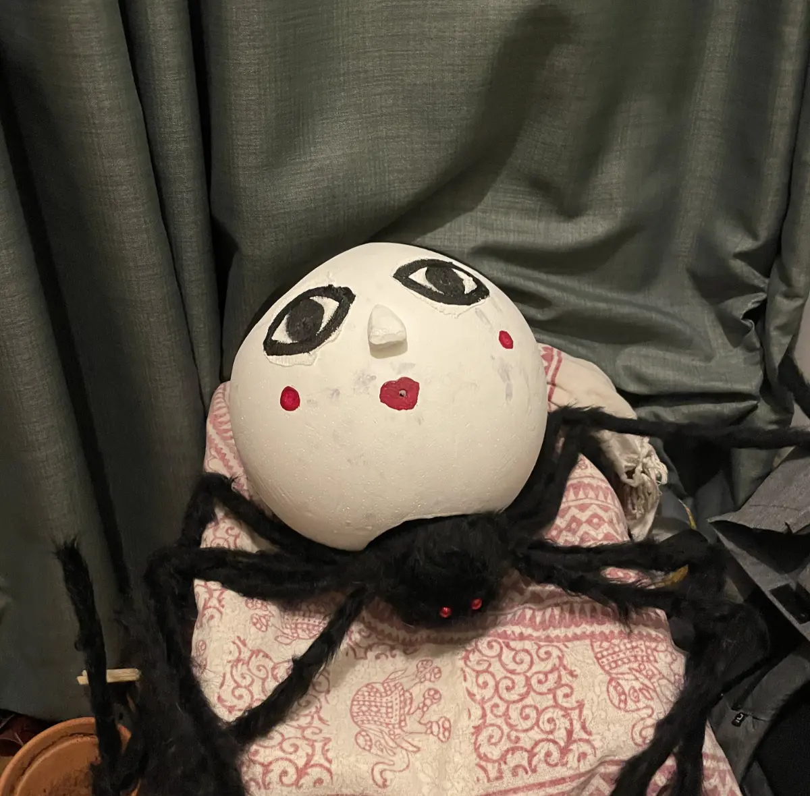
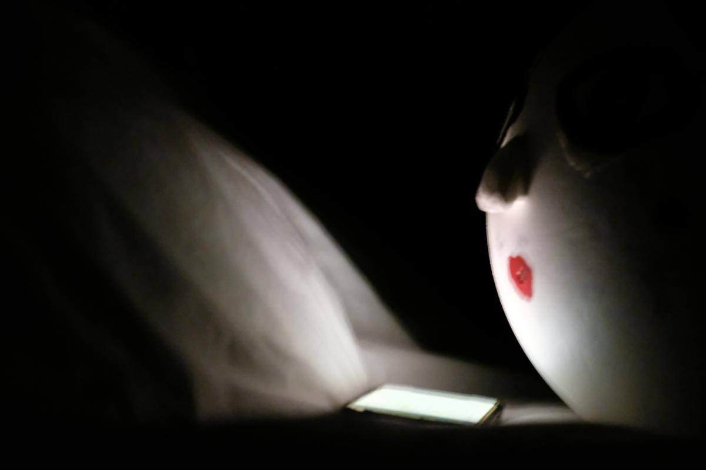
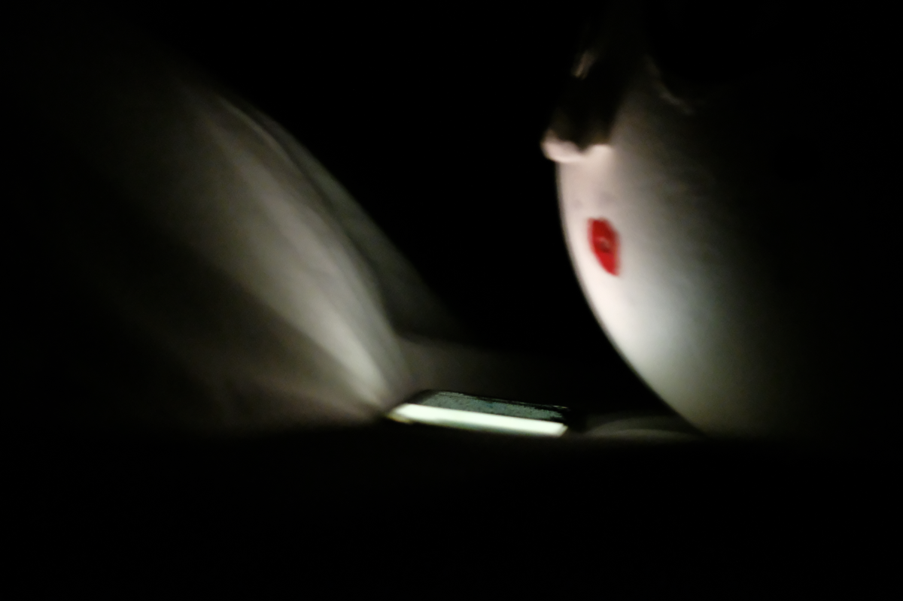
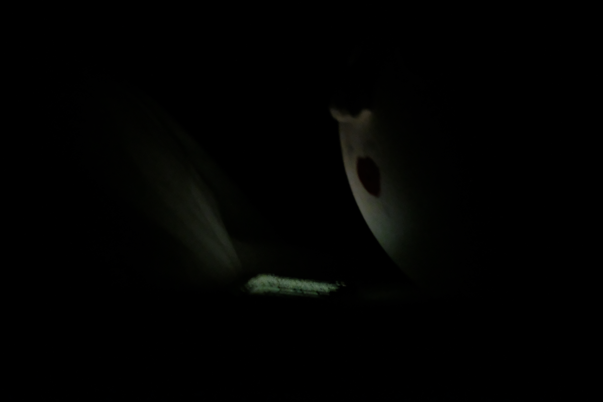
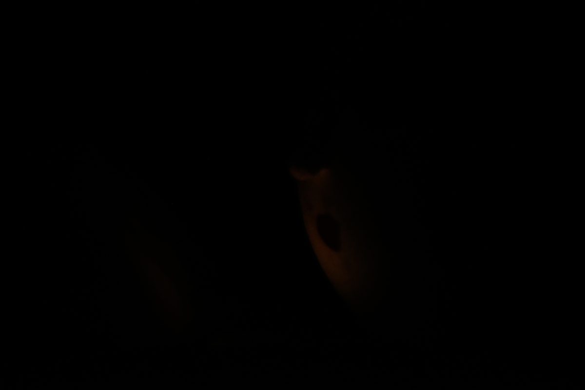
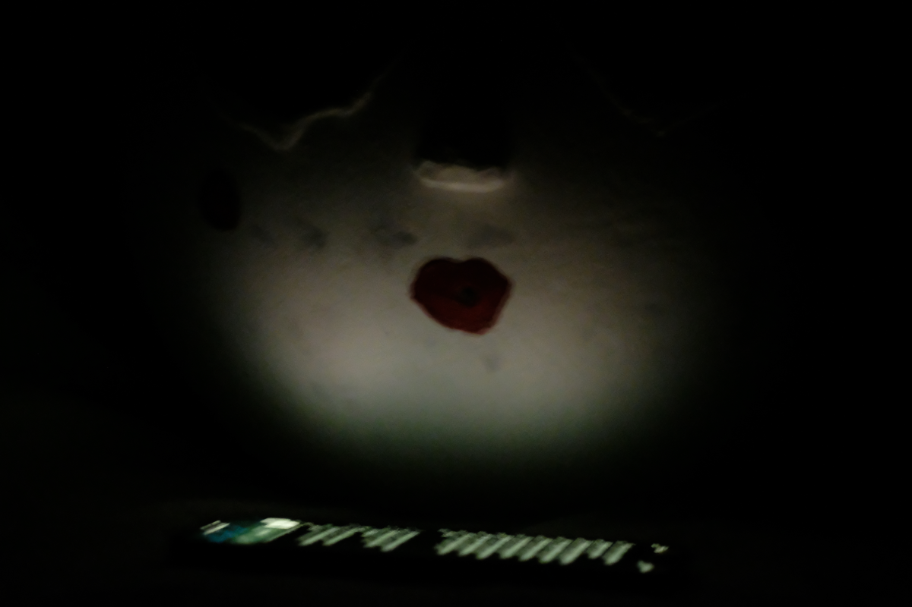
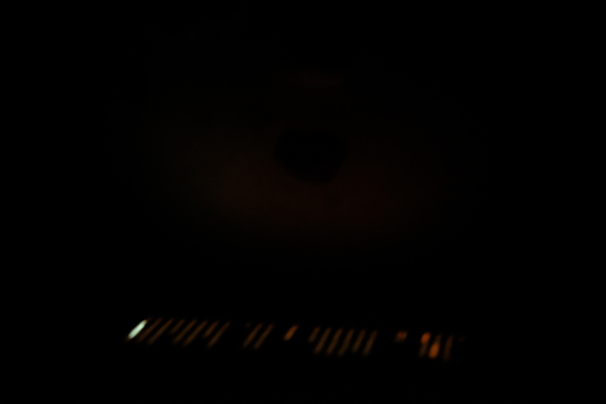

How dark can this possibly get? Today I had a chance to revisit the question some of us asked ourselves the first time we smoked clove cigarettes and swung our bodies like seaweed, listening to Einstürzende Neubauten.

During the past few weeks I've been playing with the idea of a reading app that lets me read in the dark without lighting up the whole room. Check [Obsidian for Vampires](<../Obsidian for Vampires>) for a very basic theoretical introduction to the problem, plus a simple CSS style allowing you to customise Obsidian, then visit [Night Rider](<../Night Rider>) for some more low-level questions regarding design and implementation of such an app.

## Current status

> [!tip] Update 
> 
> OK, Mr Tim Apple accepted by build and the app is available on TestFlight. **[Give it a go](https://testflight.apple.com/join/jn7XlV3M) and let me know what you think!**

**We have a working proof of concept.** I built a simple iOS app that allows me to share links and read them with the lowest possible amount of light. 

It's quite simple:

1. read/browse as you normally do
2. tap *share* → *Night Reader*,
3. read.

You can find a quick demo below. If you have a phone with an OLED screen, dim it all the way down and play the video in fullscreen mode to get the idea how this could look on your phone. Just make sure no other UI is visible.

*I split the video into chapters, including a canine cameo.*

## But how dark is *dark*?

I wish I could show you! I can't give you a link to the app (yet), since it needs to be reviewed before the public beta. The good news is that I don't give up that easily and I hired Janusz ([How to draw a Janusz](<../How to draw a Janusz>), [The Janusz I Live In](<../The Janusz I Live In>)) to help me with a quick photoshoot. 

*Janusz was enjoying his nap in the storage when I found him. Since he turned into half man-half spider (or Spider-Janusz if you will) his stamina has suffered but his affinity for cold and dark places has increased *

I took the pictures below in complete darkness, using an iPhone 12 Pro (OLED) screen set to the lowest possible brightness. Also, with the following camera settings:

- Camera: Fujifilm X-T2
- Lens: 60.0 mm f/2.4
- ISO: 12 800
- Exposed for 1 second

The results are **exaggerated and brighter than what you'd see with your own eyes**.
I used [this article](https://sonnet.io/posts/emotive-conjugation/) for testing purposes.

   

*From left to right: Safari (regular), Reader Mode (picture and text), Reader Mode (text), Night Reader(text).*

Reader vs. Night Reader:

 

## Implementation

Check [Obsidian for Vampires](<../Obsidian for Vampires>) and [Night Rider](<../Night Rider>) for context.

**The app has three main components:**

The **Sharing Extension** allows you to share the links from other apps (mainly Safari).

The **Native (Swift UI) app** accepts the link and renders it in a simplified Web View. It also makes sure that you only see the content once it's cleaned up and in goth mode, to avoid flicker.

The **WebView** client lives in the browser and cleans each page using [readability](https://github.com/mozilla/readability) and a bunch of custom DOM transformations. An example here would be rendering the images monochromatically in shades of red, which would be very hard to achieve in pure CSS (images and videos are self-closing tags, they don't accept children *including pseudo-elements*.)

A part of me really wants to dither all images to make them look like [Return of the Obra Dinn](https://store.steampowered.com/app/653530/Return_of_the_Obra_Dinn/)  or [Jason Grossman's website](http://xeny.net)but in black and red.

##  ~~TIL~~ TIR (today I remembered)

Most of the things I learned in the past two days deal with the (new!) difficulties and quirks of SwiftUI. Complaining felt like the easy way out. But, one of my goals here is to [spark your curiosity](<../111>). This project was a reminder for me to appreciate how easy it is to experiment and play with the web platform, so I sketched a quick note about it [here](<../Web and Feedback Loops>).

## Next steps

1. share a Testflight beta
2. add a product page
3. sell

I'll be able to reuse the lessons (and code) from points 2. and 3. with my [tool for group meditation](<../Sit., (together)>).

## Summary

Finally, it's *Reader* not *Rider*. Yes, I liked *Knight Rider* as a kid. Also, *I might've* organised a bunch of birthday parties for David Haselhoff at which he (understandably) never showed up. And, I *might* own a poster signed by him, acquired because of sheer luck and a cheeky pint on [Knightrider Street](https://en.wikipedia.org/wiki/Knightrider_Street). I guarantee that if such a poster existed, in all certainty it would **not** have ended up in a tiny shrine, surrounded by ponies, a place of occasional, yet fervent worship.

