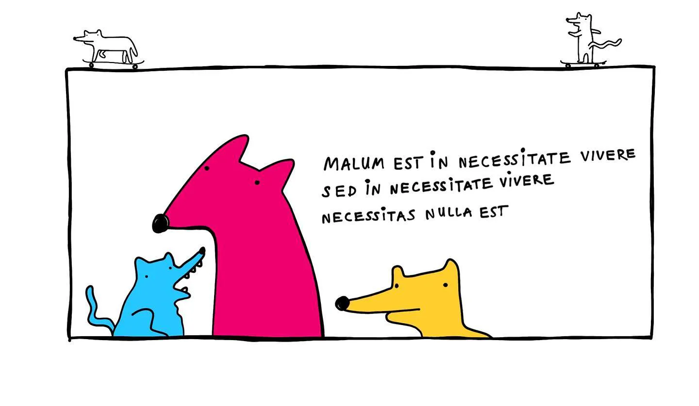

I love making toys. I learn and rest through building seemingly useless things. Building "useless" projects for me is also a way to vent, explore, or just get out of my own head ([Why make toys, why play?](<../Why make toys, why play?>)). 

Inspired by this [post by nicole@web](https://ntietz.com/blog/write-more-useless-software/) and my promise to [write here instead of commenting on social media](<../Instead or writing a comment, write a post and link it>), I prepared a short list of useless toy projects I've built over the past few years. It's not complete, but this site is called *untested* for a reason.

I love writing useless software! Here's some useless software I wrote this year:

## [The Uncolouring Book](https://lines.potato.horse)

Add strokes to colours to give them meanings.

## [MeatGPT](https://meat-gpt.sonnet.io)

"Prime answers to rare questions."

The success of the site was to a large part driven by terrible AI site catalogues, and their hallucinated ideas of what Meat-GPT is about.

Irony deficency is not a joke. Remember to get tested regularly.

## [The (Medieval) Times](https://tidings.potato.horse) (a.k.a. Medieval Content Farm)

Your biased and hallucinated news source curated by a team of talented writers. Every day they scour the internet for the most interesting and relevant events of the realm. They're so good, the thing just writes itself.

Please read the [Why](https://tidings.potato.horse/about) section for more (serious) context.

## [🧈 Butter · an adblocker for humans, by humans!](https://butter.sonnet.io)

## [Mrr](https://mrr.sonnet.io)

Are you ready to Mrrr?
## [Mrrr (physically accurate)](https://mrrr.vercel.app)

Are you ready to Mrrr, Newton?

## [Sketch: Music for 18 Musicians](https://18-musicians.vercel.app/)

Interactive Album cover for 18 Musicians by Steve Reich, performed by Eric Hall (check the site for credits). 

## [Reactive Hole](https://reactive-hole.vercel.app/)

A browser-based P2P file sharing app.

## [🎈 Happy times](https://balloons-tau.vercel.app/)

A balloon appears on the screen every time a new person is born.
A mix between the Web Animations API and hand-drawn animations.

## [Return to Castle KittenStein™](https://photos.google.com/share/AF1QipNvmuU36hIiBmWuWYEbyXQstq6b2kZadtZJbmifOEu80IEQ_6HNsKXIsrmVrGLXaQ?key=OUNNUXdMVFExeDFhVFViYjhXcVA0c3JWbElFS2VB)

A purely browser-based augmented reality (dance!) game where you get a chance to fight an evil army of kittens with bananas, glowsticks and body paint.
## [Rainbotron](https://500px.com/photo/151829029/aaron-by-rafal-pastuszak)

An art installation/impromptu photo studio made from old furniture salvaged in Brick Lane. WebSockets meets Spotify meets your grandma's wardrobe.

## [My Bootleg T-shirts](<../My Bootleg T-shirts>)

Sometimes I make hand-drawn bootleg band t-shirts for my friends. King Gizzard and the Gizzard Gizzard is one of our favourite bands.

## [Bird-knife](<../Bird-knife>)

Note that some of the entries here, like MeatGPT or Medieval Content Farm, are just substitutes for blog posts or essays, over-engineered as I found it easier to express myself through playing with code, rather than cleaning up a 5000 word article.

Btw, [here's a longer list](https://sonnet.io./projects) (including some accidentally useful stuff).

Make more toys! 

## References

[My Personal Projects on Sonnet.io](https://sonnet.io/projects)
[Projects and apps I built for my own well-being#^35cfc4](<../Projects and apps I built for my own well-being>)

