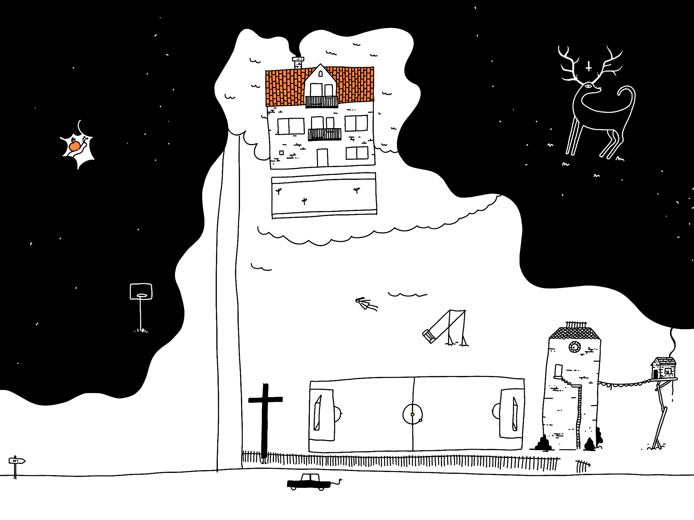
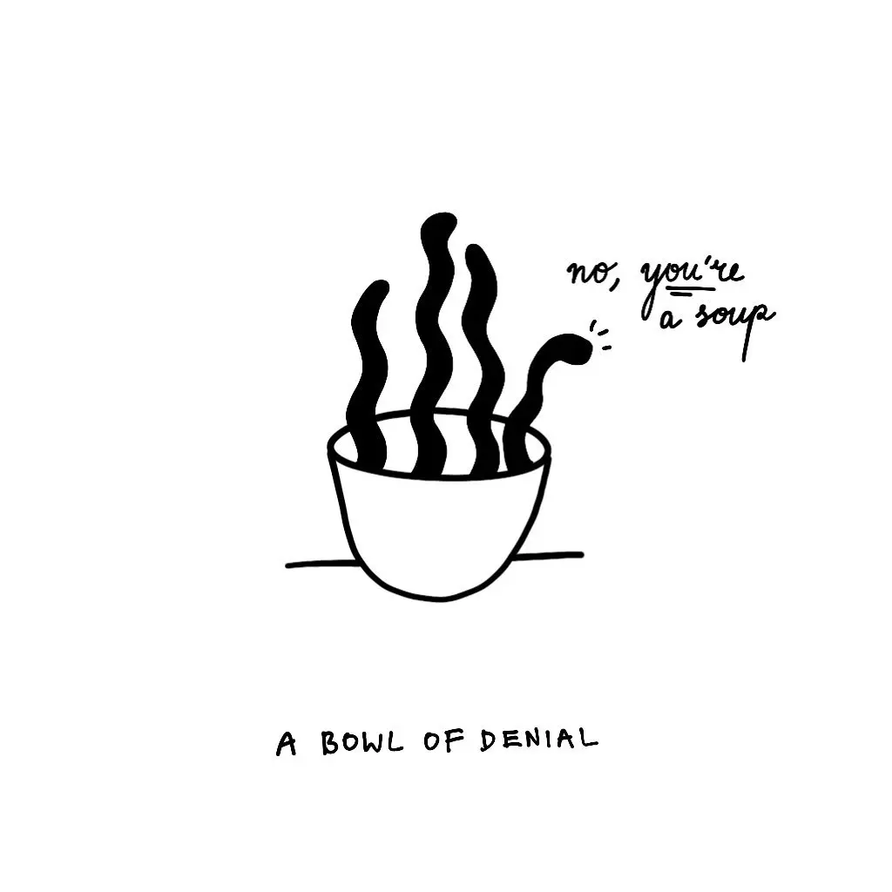

**In art: *Fear of [empty space](https://en.wikipedia.org/wiki/Horror_vacui_(art))***

My (mostly incorrect, but practical when I need it) [Working Definition](<../Operational Definition>):

Imagine drawing a starlit sky. You start placing the dots randomly, perhaps clustering them into groups. Then suddenly, something feels off. You start planting stars in the parts that feel too empty. The sky is out of balance, it might fall on its side. 

After a while, the sky doesn't feel empty any more, but it also doesn't feel as good or interesting as it used to. Now it's a bowl of oatmeal. Random, but devoid of rhythm and hierarchy, unique, but same. It can't topple, but it has neither structure nor form. Plus, the oatmeal is room temperature.

@me: Also, compare **ك** and **ک**. #fleeting