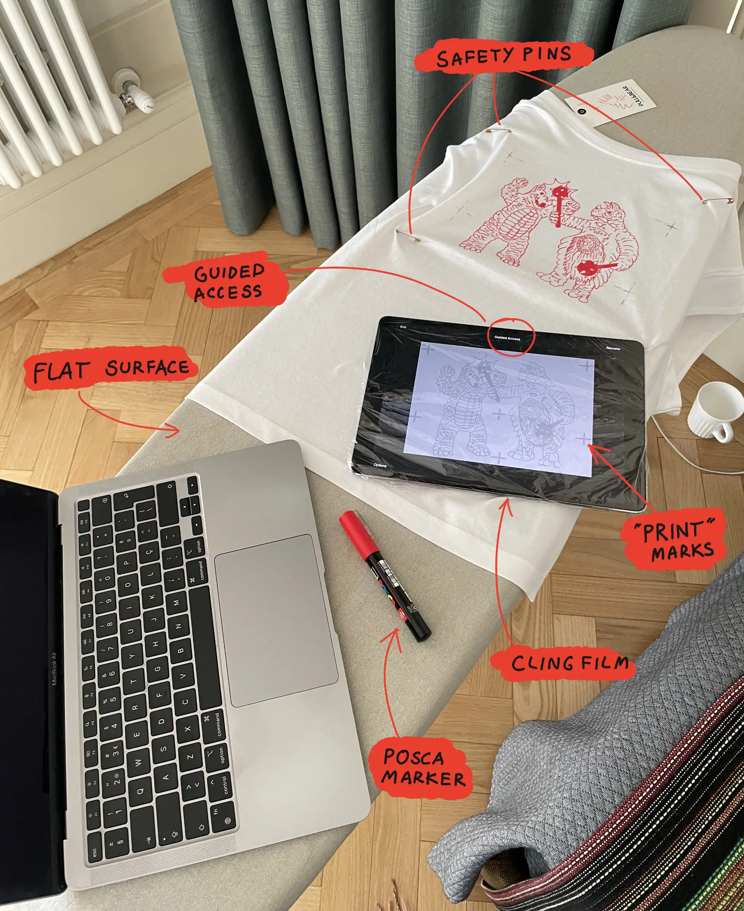
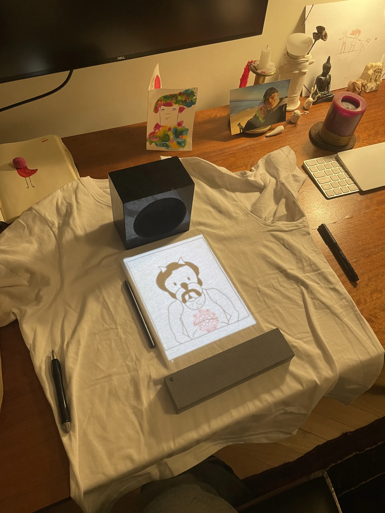
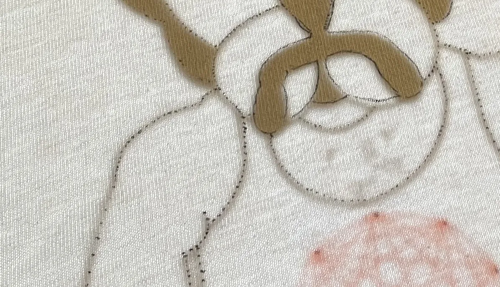
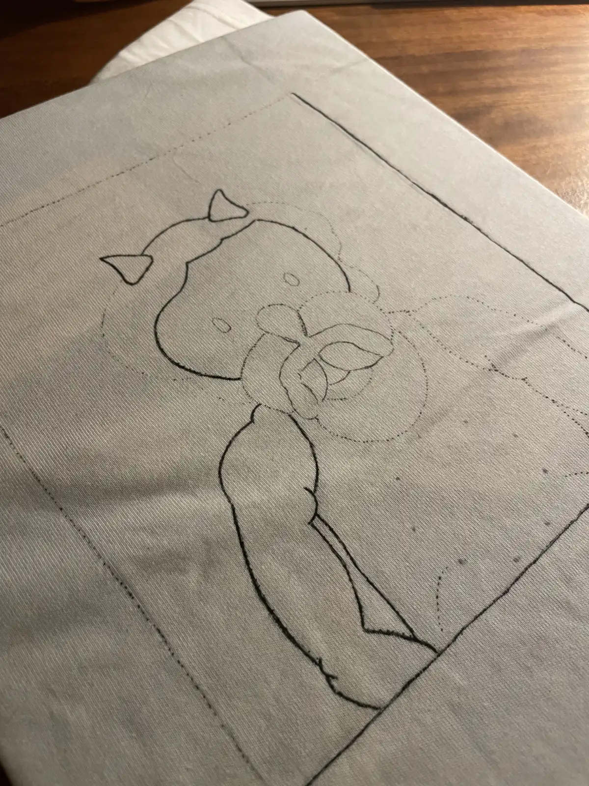

[Sometimes I make hand-drawn bootleg band t-shirts for my friends](<../My Bootleg T-shirts>). This is how.

This process is messy, anything-but-optimal, possibly slightly deranged, but also immensely fun and meditative. If you want to learn how to do it properly, ask someone who knows what they're doing.

**Duration:** 1-3h

# What you'll need:

- [Posca](https://poscausa.com) markers
- a soft pencil (or a fabric pencil)
- safety pins
- a cotton t-shirt (relatively okay-*ish* quality, dense fibre)
- iPad
- (optional) cling film
- (optional) an ironing board

# How to

## 1\. Pick the right subject

A good base image:

- doesn't have too much detail
- is flat, doesn't have any gradients
- uses simple, ideally thick lines
- doesn't aim for realism

*A good base image*
## 2\. Prepare the working space

You'll need a flat space, large enough to fit the t-shirt and your tools. I'm lucky to have  a decent drawing desk in my study, but I often use an ironing board for this instead. The plus of an ironing board is that it makes it easier to stretch the fabric a little bit while drawing.

## 3\. Select right size in Procreate

I trace drawings from my iPad (10.5 inch, 2nd gen) so generally my designs are not bigger than 10-20 cm. 

I like to add markings, similar to *crop marks* or *registration marks* used in print. This helps me re-align the drawing with the fabric if something slips or if I need to use my tablet in the meantime.

## 4\. Enable guided access

Guided access disables most of the touch interactions, ensures the tablet doesn't take a nap while you're drawing and allows you to lock brightness at the highest level. Effectively it turns your tablet into a light tracing box.

## 5\. Wrap iPad in cling film to protect it from evil (and marker stains)

This is optional, as you should be able to remove the iPad from underneath the fabric once you're done with tracing. I often move straight from tracing to drawing with markers, so I prefer giving it some protection.

## 6\. Mount and stretch the fabric

Acrylic markers are a pain to wash off and the last thing you want to deal with are creases during drawing. Stretching the fabric will not only make that much less likely, but will also help you achieve more detail and more intense colours once the fibres are relaxed and more tight.

Use safety pins or heavy rectangular objects like this overpriced mortar and pestle I'm expecting to fall on my head and separate my soul from my body one day:

## 6\. Trace the initial sketch

Trace the sketch, by gently *pulling* the pencil. The softer the pencil, the better. You can also leave dotted marks with a fine point marker if it's of the same colour as the lines you'll draw in the next step. I'm using a Sakura Pigma brush pen like [this one](https://kawaiipenshop.com/products/sakura-pigma-brush-pen) (I didn't buy it from that site).

## 7\. Draw the thing

Again, draw by gently pulling the Posca marker. Take your time, enjoy a nicely rolled leaf of Satan's lettuce and play some music. Here's a good playlist: [1](https://www.youtube.com/watch?v=tSv04ylc6To), [2](https://www.youtube.com/watch?v=q4xKvHANqjk&t=2816s&pp=ygUKa2hydWFuZ2Jpbg%3D%3D), [3](https://www.youtube.com/watch?v=d8eVBS7c_hU)

## 8\. Wash

Wash by hand or in a washing machine on the lowest, gentlest possible setting. Don't freak out if you're washing it by hand and the colours start to bleed. Just carry on, be patient and [be gentle](https://youtu.be/YoR8h8y5m0g?t=105) young grasshopper.

That's all for today, see you tomorrow! 
