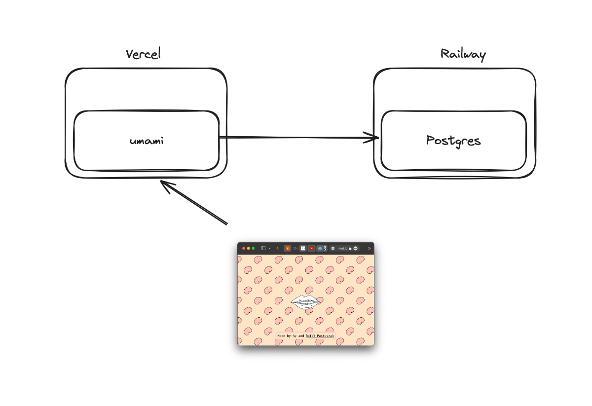
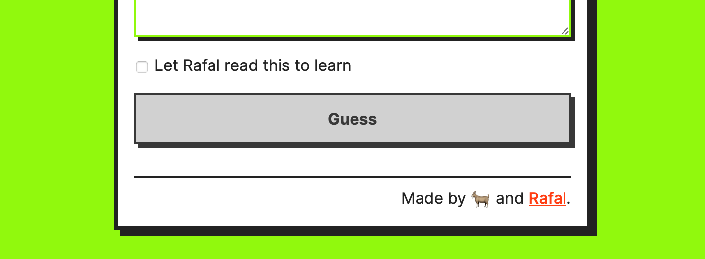

We'll start with *how* and move on to *why*. I think *why* is more interesting than *how*.

*(last update: 2024-01-16)*
## Scope 

Most of the 50 or so little projects I built don't rely on analytics. I have a self-hosted [umami.is](https://umami.is) instance running on Vercel with a Postgres db running on Railway. It handles 25 sites, with projects such as:
- my [blog](https://sonnet.io)
- my [important meeting notes](https://potato.horse) 
- things I sell, like [midnight](https://midnight.sonnet.io)
- some apps/experiments (e.g. [Sit.](https://sit.sonnet.io))
- some smaller, weirder experiments like the [Uncolouring Book](https://lines.potato.horse), [Meat GPT](https://meat-gpt.sonnet.io)
- a [variety](https://mrr.sonnet.io) of succulent [Mrrs](https://mrrr.vercel.app)

My railway usage is low enough not to exceed the monthly free usage tier ($5, I wouldn't mind paying.) Setting up a self-hosted umami instance is pretty simple. Learn more [here](https://umami.is/docs/install).



Untested doesn't use analytics at all. Similarly, Ensō (the web app) fires a single *hello* event so I can get a rough number of page impressions for a given day.

```ts
 export const trackVisits = () =>
    fetch('/api/hello', { credentials: 'omit'}).catch()
```

```ts
	// api/hello.ts
    const db = await getDB()
    db.collection('visits').insertOne({
        at: new Date(),
        host: req.headers.host ?? 'unknown',
        ua: req.headers['user-agent'] ?? 'unknown',
    }).catch(error => console.error(error))

    res.status(200).send('oh hi mark')
```

The code tries to strip any unnecessary information and, looking at this now, I can see that I *can* make it even dumber. 

#### I believe we should keep more of this stuff public because:

- Analytics are for you as much as they're for me ([Kind software](<../Kind software>)).
- I approach any form of data collection with distrust and I think you should too.

Long time ago, I used to have run a public DIY analytics service so my users could see exactly what and how I collected, but it was too much hassle to maintain and people didn't seem to care that much. I even called it palantir to keep things angsty and edgy. But nothing, nada.

## Why and what to collect

<span id="^47718f" class="link-marker">^47718f</span>

I use analytics to solve user problems. Every metric should reflect that. Anything more than that is a [burden](<../Data Is the New Oil>): to the user, to my problem solving ability (focus) and to my own mental health. So, I try to collect as little as possible.

#### Metrics I care about

- \# of visits
- \# of sessions (without persistence, I don't care about cookies or unique *users*)
- frequently visited pages
- browser
- referer
- country

I'm trying to be strict with collecting only the metrics that can answer relevant questions. I also don't collect any "open" user input data in my tracking events (e.g. Meat GPT chat "queries"). The [Tip of the Tongue](https://tip.potato.horse) is an exception here as I allow users to opt-**in** to sharing their queries.

 

### Custom events

I collect custom events (`CTA:hero:click`, `sit:session:interrupted`). This is to:

- detect UX pitfalls, e.g. why did the ratio of `sit:session:prep` to `sit:session:start` drop so suddenly?
- detect bugs and regressions, e.g. audio playback errors if Apple decides to make things spicy by breaking a PWA or Audio feature (monitoring for cheap bastards™)
- measure feature usage, especially for experiments, but also to remove the stuff I don't need ([Kill your darlings, their bones are the best fertiliser](<../Kill your darlings, their bones are the best fertiliser>))

### Admin UX

I'm happy for things to be a bit clunky if I can just get stuff done and answer the right questions. A bit of friction is good for me as it makes it harder to obsess about unnecessary details, yak-shave or check the stats too often. 


## Wishlist

It would be useful to have an overview of all tracked sites, esp. to quickly spot any unexpected spikes, perhaps track a blog that mentions my work. 

*For now*, I'm happy with it as it is. It's good enough, because it has just the right amount of friction to let me focus on work.

In future, instead of moving to a different approach I'll design something that would work for my specific needs and tests it with a bunch of people to see if I can make it sustainable.

## Alternatives

- [fathom](https://usefathom.com)
- [plausible](https://plausible.io)
- [goatcounter](https://www.goatcounter.com)

