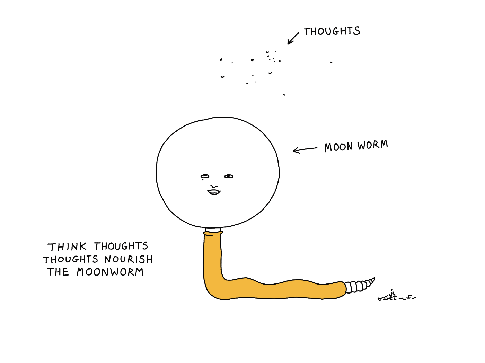

Remember, [This is not writing or productivity advice](<../This is not writing or productivity advice>). It's also not note taking advice ([Better note taking is not the problem, it's better thinking](<../Better note taking is not the problem, it's better thinking>)). 

## Short version

1. Write [Fleeting Notes](<../Fleeting Notes>)
2. Review and prune ([Kill your darlings, their bones are the best fertiliser](<../Kill your darlings, their bones are the best fertiliser>))
3. Pick a note
	1. Write
	2. Get bored, disillusioned or pleasantly distracted
	3. Back to 3.
4. Add OG metadata
5. Optimise images ([How to optimise images for Obsidian Publish](<../How to optimise images for Obsidian Publish>))
6. Publish a draft
7. Apply edits (from [Luna](https://www.lunifer.net))
8. Publish to [index](<../index>)
9. Share social links

I'm OK with steps 1.–3. ([Muddle Your Way To Success](<../Muddle Your Way To Success>)), but 4.–9. (except editing) should be done by a machine, not me. Hence the [Abusing and reviewing Obsidian Publish](<../Abusing and reviewing Obsidian Publish>) I'm wrapping up at the moment.

## Longer version

**1\. Every time I stumble upon something that tickles my thought-sponge, I add it to my [Fleeting Notes](<../Fleeting Notes>) (\#fleeting).** If I feel that a note sounds like a good writing prompt I tag it as an \#article-idea. I try not to overthink it.

**2\. Review and prune daily.** I go through each of my \#fleeting notes and try to rephrase them so they sound more clear. Again, perfect is the enemy of good: if something sounds boring the day after I wrote it down, I remove it or give it a stay of execution for a day. **[Kill your darlings, their bones are the best fertiliser](<../Kill your darlings, their bones are the best fertiliser>)**. I want to get better at this.

**3\. Pick something that feels exciting and write about it.** Sometimes I expand on the note that piqued my interest, translate it from Rafalspeak into English and give it more detail. Then, another time I realise that there's a bigger picture connecting the idea with others, e.g. [Kind software](<../Kind software>) started with some notes on [Projects and apps I built for my own well-being](<../Projects and apps I built for my own well-being>) and [Be kind, be curious](<../Be kind, be curious>). 

I try to do this in the morning as writing in the morning is harder.

**4\. Write.** Write for 2-5 hours, depending on how much time and energy I have. Less than 1.5 h is the goal. Writing is fun and it can easily take over my schedule. I have a job to find, Mango needs to eat!

**5\. Get bored**. Realise that the idea is not that interesting/deep or that there's another new thing you just came up with and it's already [story-shaped](<../Stories Help Us Learn, Teach and Remember>)! Writing is thinking.

**Back to 3.** Sometimes I end up writing 2-3 notes at the same time. This can be a sign of [Dog mode](<../Dog mode>)

### Publishing:

1. Add covers and OG metadata using [Frontmatter](https://frontmatter.codes/docs/markdown)
2. Optimise images ([How to optimise images for Obsidian Publish](<../How to optimise images for Obsidian Publish>))
3. Publish a draft to a super-secret-and-secure drafts page (btw, the more coherent articles are edited by [Luna](https://www.lunifer.net))
4. Add to the [index](<../index>) page
5. Hit *Publish*
6. Share on social media: Mastodon, Twitter, LinkedIn
7. (Every Friday) copy to [ConvertKit](https://convertkit.com) and format for the newsletter. This step is surprisingly easy (*easy* is not the word we hear often when talking about email HTML)

### Related

[My writing practice](<../My writing practice>) (evergreen)
