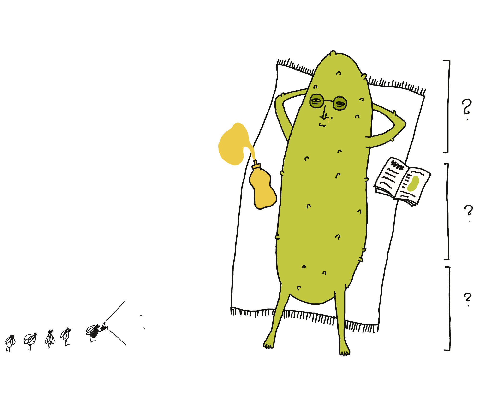
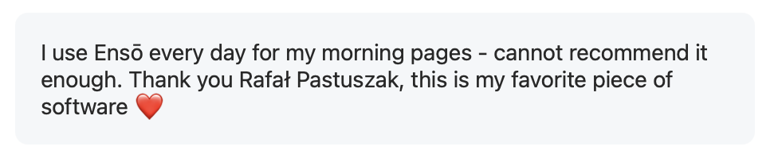
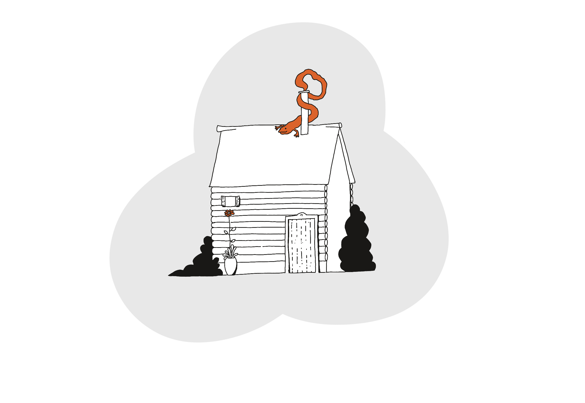
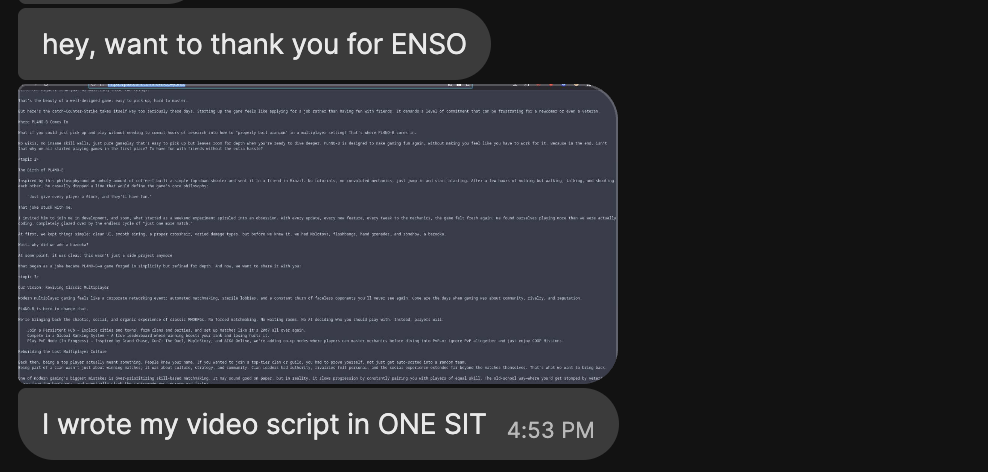
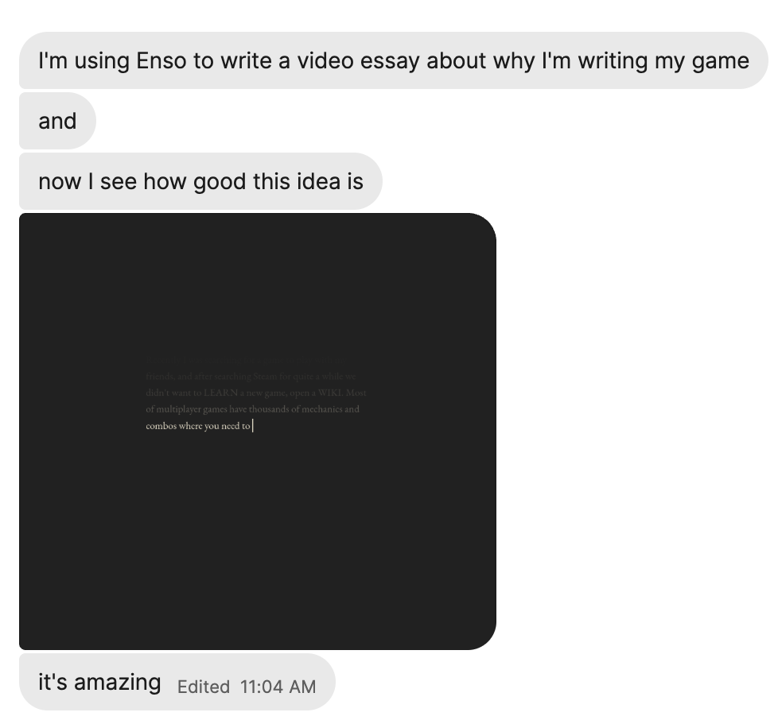

I was going to share a different note today but found it hard to focus on writing instead of working on Ensō ([How to Balance Making vs. Sharing - working title](<../How to Balance Making vs. Sharing - working title>)), so I thought we could work on something together instead. By working together I mainly mean getting *my* shit together, or rather — getting all of my notes into one place so I could use them in the future and stop repeating myself. So, grab your favourite shovel and let's dig in!

Related: [How I collect feedback for Ensō](<../How I collect feedback for Ensō>)

First, this post is not about testimonials (although I do need to get organised about this as well: [Ensō - testimonials](<../Ensō - testimonials>)), or how happy or dissatisfied people are with the tool. It's a list of use cases I'm trying to organise ([How to turn ideas into objects?](<../How to turn ideas into objects?>)), describe in more detail, and share with people who might find Ensō helpful. 

We're working with the [garage door up](<../Work With the Garage Door Up>), and I've kept you standing outside for 3 paragraphs already. OK, come in. Nah you can keep your shoes on. I'm not sure why, but yeah, sure, you can step on that.

## How people use Ensō

The list is non-exhaustive, *how* ≠ *why*, and the use-cases do overlap a fair bit. But, perfect is the enemy of published, so let's go!

## Top-level

In short, coming up with broad categories for how people use Ensō feels like an exercise doomed to fail.

It *feels* like the main use-cases fall into these three categories:

- **Mental Health** (journaling, expressive writing, therapy "homework", meditation)
- **Neurospiciness** (sketching blog posts or articles, thinking through a problem, note taking, writing with eyes closed)
- **Drafting/Unclenching™ ... poetry!** (script writing, writing a poem per day, sketching blog posts, squirrels)

**But, I don't feel happy with this classification yet.** The categories overlap and feel too broad, perpendicular to each other. After a third or fourth rewrite I realised that this is because these are not categories, but *lenses* through which I design new features. I can apply only one of them at a time, or stack them together to build a more nuanced picture.

Why? Because, drawing a line between *mental health and neurodiversity* or *neurodiversity and experiencing difficulty (or surprising ease) when drafting* is based on a broken premise. It's illogical. 

This needs to ferment in my head for a bit longer, and it's possible I'll drop the classification completely. 

## Examples

### Journaling

Journaling is the most common use case. Some people use Ensō for their morning pages (often mentioning The Artist's Way), some like to review/think through their day in the evening.

I fall into the former group ([Stream of Consciousness Morning Notes](<../Stream of Consciousness Morning Notes>)) and also use it to plan/revisit every [New Week](<../New Week>).

### Expressive Writing 

It’s a creative writing technique that allows us to process and understand emotions in a safe way. It involves writing continuously, in a stream-of-consciousness style about one's deepest thoughts or feelings about an emotionally charged or even traumatic event. 

Read more here: [Expressive Writing](<../Expressive Writing>).

### Therapy related homework

I decided to separate it from Expressive Writing because many of the uses of Ensō related to mental health involve other tools, mainly from CBT, such as thought records, letter writing, values clarification ([ACT](<../ACT>)), and "future self" letters.

Disclaimer: Ensō is not therapy, it's a notebook ([Ensō - Analogy Brain Dump](<../Ensō - Analogy Brain Dump>)). 

To ensure that I don't spread misinformation or create unrealistic expectations I share most of my articles touching on mental health with licensed professionals.

### Thinking out loud (in writing) 

Examples: talking to a rubber ducky ([possible project idea?](<../Online Rubber Ducky>)), thinking through a problem by having a dialog with oneself (the ducky talks back). I like the latter especially, for two reasons:

1. I do that too.
2. I believe it lets me harness my inner critic and use their help instead of fighting them. Come to think of it, this is a common technique used in therapy and perhaps deserves a longer note. ([Don't Yell at a Barking Dog](<../Dog mode>))

I'm separating this from Therapy Related Homework because this use is not necessarily *therapeutic* in its aim.

Related: [Writing is Thinking](<../Writing is Thinking>)

### Writing with eyes closed

Several users described writing like this in Ensō, a few of them figuratively and one in the literal sense of the word. 

One of the inspirations for Ensō was an interview with a blogger who would dim their screen as much as possible while writing. They could see just enough to know what they were doing, but not enough to actually go back and edit.

Unfortunately I can't recall their name, but I found even more examples of people like this, including Hank Green or Adam Savage. After watching [this video](https://youtu.be/GFIZvwSPevE?t=110) with Savage, and without overthinking it too much, I sent him a link to Ensō. I'm pretty sure his response just got lost in my spam folder.

PS. Do you know someone who writes like this? I'd love to [get to know them](https://sonnet.io/posts/hi)!

### Meditation 

Writing, especially with constraints (on length, editing, pace, form) can be a meditative process.

Meditation often encourages us to observe our thoughts as they pass by instead of engaging with them. When the only way to move is forward, you can give up control and observe yourself thinking/writing.

### Writing a musical based on a German legend, to be followed by a novel about squirrels 

> Hi {redacted} 
> How’s the musical and what kind of squirrels we are talking about?

One of the best things about working on tools for [beautifully weird](<../beautifully weird>) people is that I get to send emails that start like this.

One of the [HN comments](https://news.ycombinator.com/item?id=44423400)  on the [new version of Ensō](<../New Enso - first public beta>) mentions script writing as a use case for which I'd need to add monospaced fonts. I find it surprising and somewhat funny that they mentioned fonts, but said nothing about structured writing. Ensō is the antithesis of the tools I thought were normally used for that purpose.
### Drafting blog posts 

This is a strong contender for the most common use case, even mentioned during a [Say Hi](<../Say Hi>) call I had just today. 

It resonates with me because I used to write by creating giant, 5-levels deep outlines which I then dressed into sentences, largely out of a fear of missing something important. With time and practice I learned this isn't how my mind works, and I now use both modes of thinking/writing: "scaffolding" and "flowing" (architecture vs. gardening).

That said, I know of bloggers who write entire posts this way, as illustrated by two DMs I received in just the past couple of weeks:

> Also I used Ensō for my latest - viral, ofc - blog article. It was extremely pleasant. Thank you!!! 

and

> ENSO is perfect to write blogposts

(Related: [Sit.](https://sonnet.io/posts/sit/))

### Writing YT video scripts

There's an overlap between this and the two previous categories. Some users fall into both as well. 

I think the reason this works is that stream-of-consciousness writing helps us tune into the natural cadence of speech, imbue text with rhythm. Editing breaks that flow for most people.

### Taking notes

I used to keep Ensō pinned to the side of my screen to take notes during meetings or Say Hi calls. This approach works for me because it lets me focus on the person I'm speaking with, instead of the goblin who lives in my head rent-free always ready to suggest new threads of conversation or "hey! I did {the thing} as well!". It helps find better moments in the conversation where I can ask a follow-up question.

Nowadays I use Ensō for meeting notes less often. I feel like it helped me get better at balancing being present with another person vs. the short-term context of the conversation. Related: [How I take notes during say hi calls](<../How I take notes during say hi calls>) (note: you can request any dead-linked article by clicking on it).

### Writing poetry 

> As a writer and a poet who was Stuck, and who no longer is, well, I have a few words for you (all good).
> 
> Enso has helped me write one poem per day

This is an interesting use case for me, because I see poems more as images or music -- I like to see the interplay between longer phrases, sounds, and themes. The current line limit is well-suited for haikus and I'm considering raising it.  Say, you could increase it to play a short game, where you're writing a poem/poem-doodle of a certain length. 

(*somewhat* related: [Rosie's Poem](<../Rosie's Poem>))

## What I learned (by writing this down)

Not a lesson but a reminder: **user personas or broad categorisations are useless for me *here*.**  The product is small and challenging to design, but it's not complex. It's a good exercise in coming up with good implicit UX affordances (easy to discover, but almost invisible at the same time) vs. reducing distractions.

**More people than I expected use Ensō for the type of work that normally is associated with more structured writing** (think: scripts, books, posts, videos).

I'm considering adding the option to control the number of lines displayed on the screen. Maybe following [MISS](<../MISS – Make It Stupid, Simple>), I can let people write poems in it... as long as they're 7 lines long!

**I fall into most of the categories mentioned above.** It's a double-edged sword, but it's also helpful: 

- I am a statistical sample of 1, but
- it's much easier to build and tests something you like and use. 

Seeing people using Ensō to write a poem, a video script or... a book about squirrels makes *me* want to do the same. 

Being able to build something even marginally useful, to learn from building it, learn from the people using it... is a great place to be in. I feel happy and grateful writing this. Thank you.

Speaking of squirrels, here's a tip from an old friend, a PM who could juggle:

> #### If you find a squirrel:
> 1. find a bench, sit down, observe her 
> 2. wait a few moments
> 3. [play this song](https://www.youtube.com/watch?v=tGSUjuSBt1A&list=RDtGSUjuSBt1A&start_radio=1) in your head and continue watching the squirrel

Quickly you will learn that the squirrels are not what they seem. 

Thanks for reading!