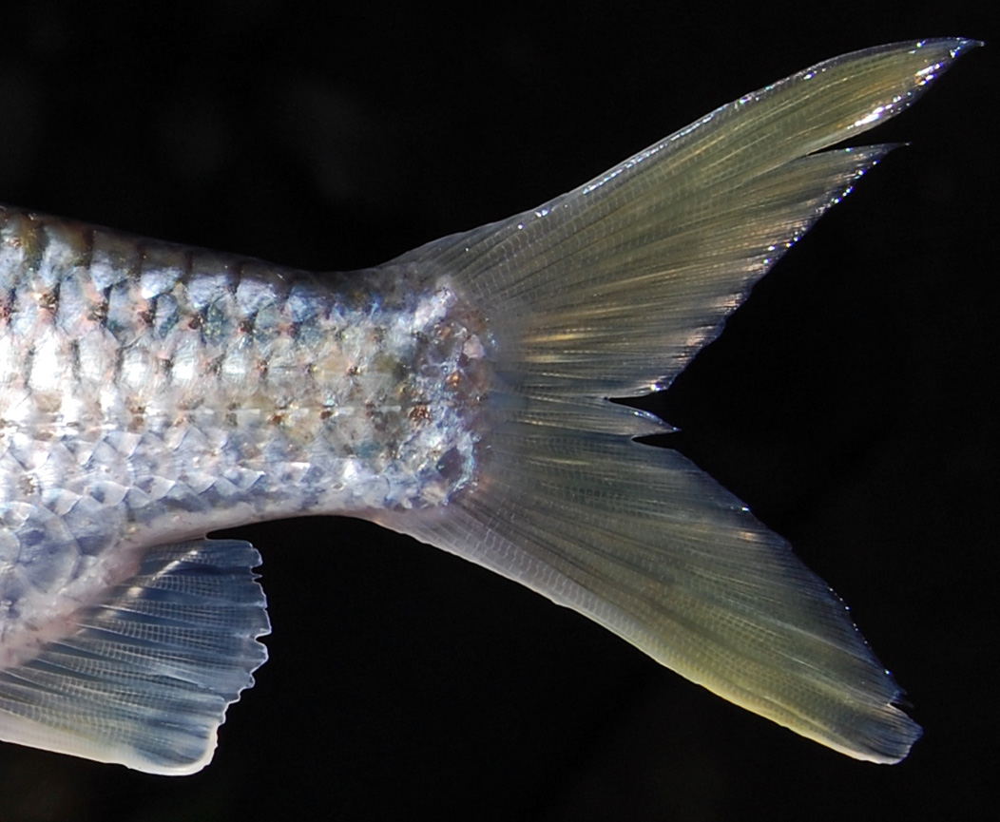
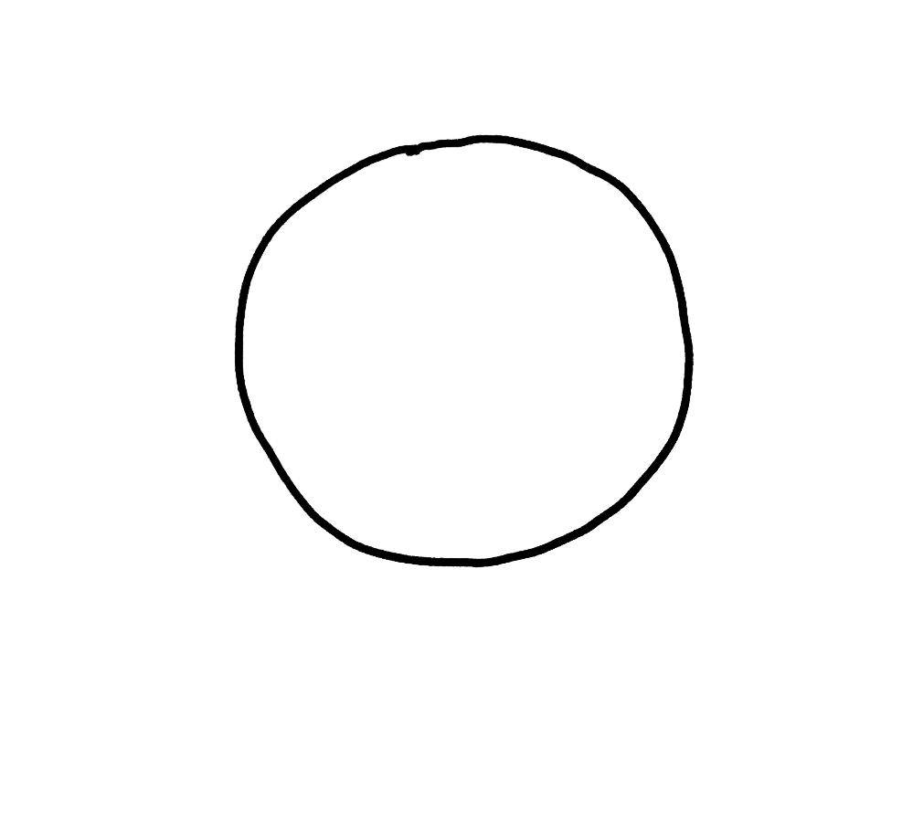
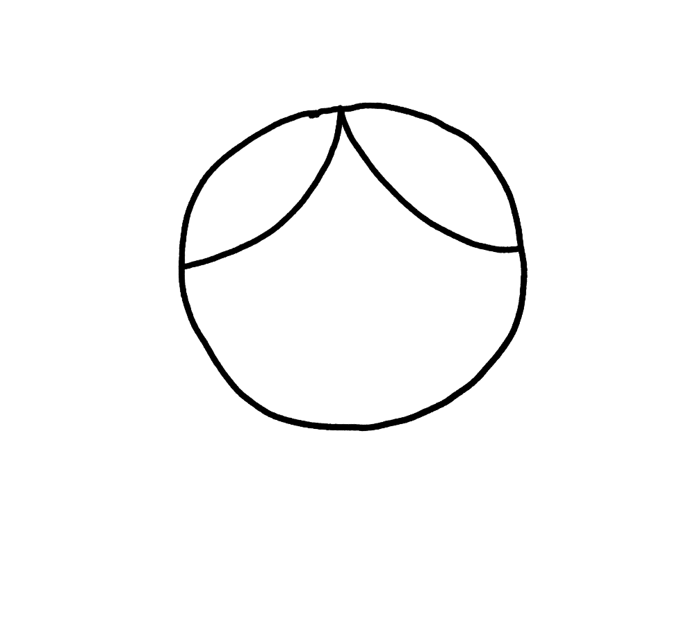
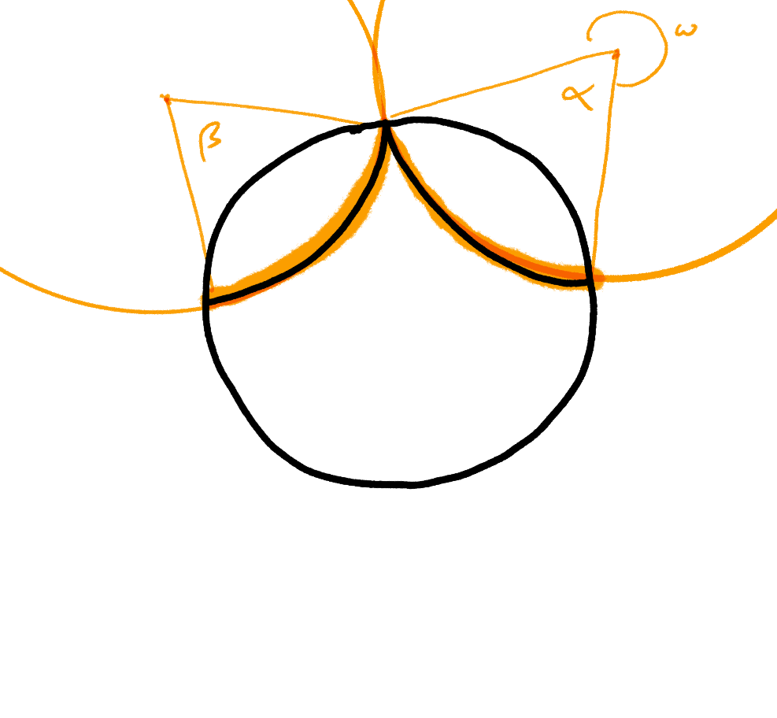
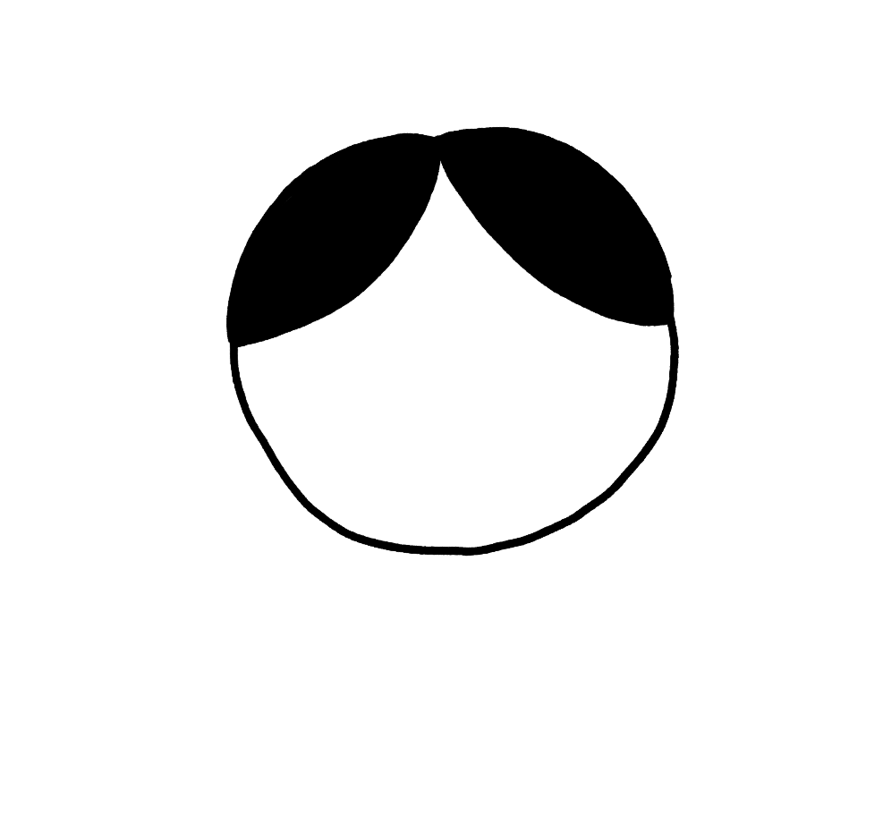
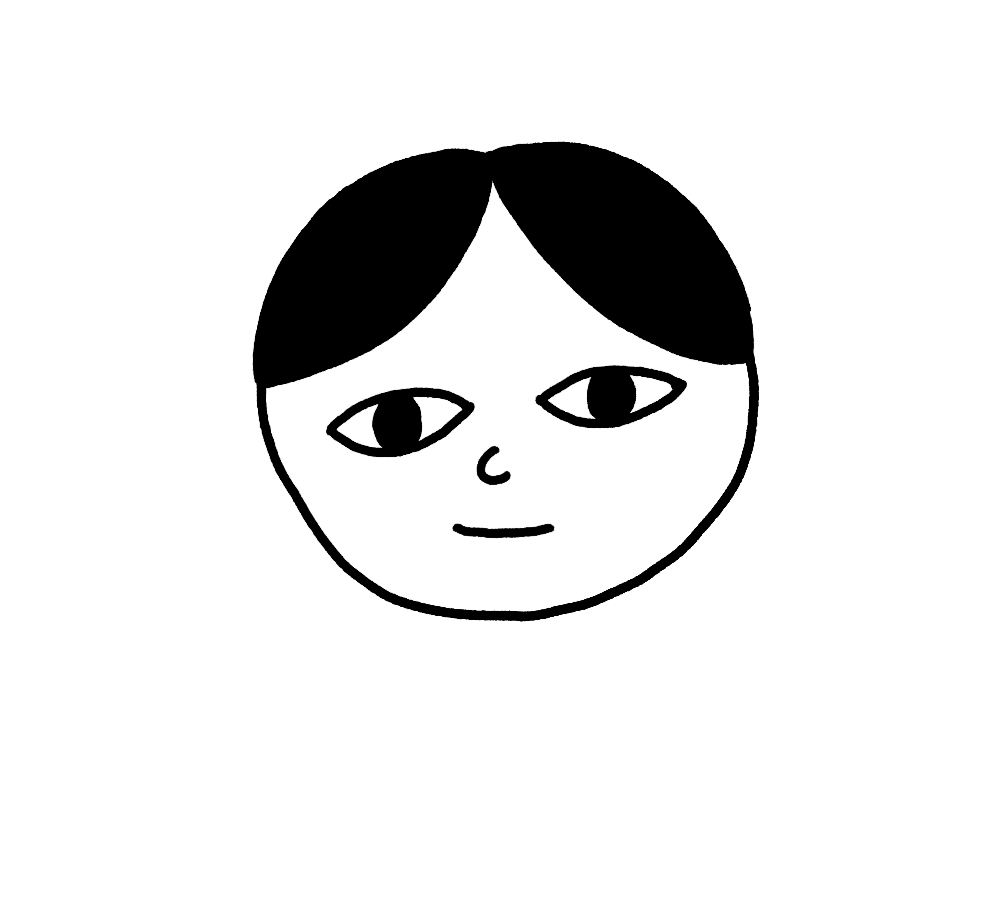
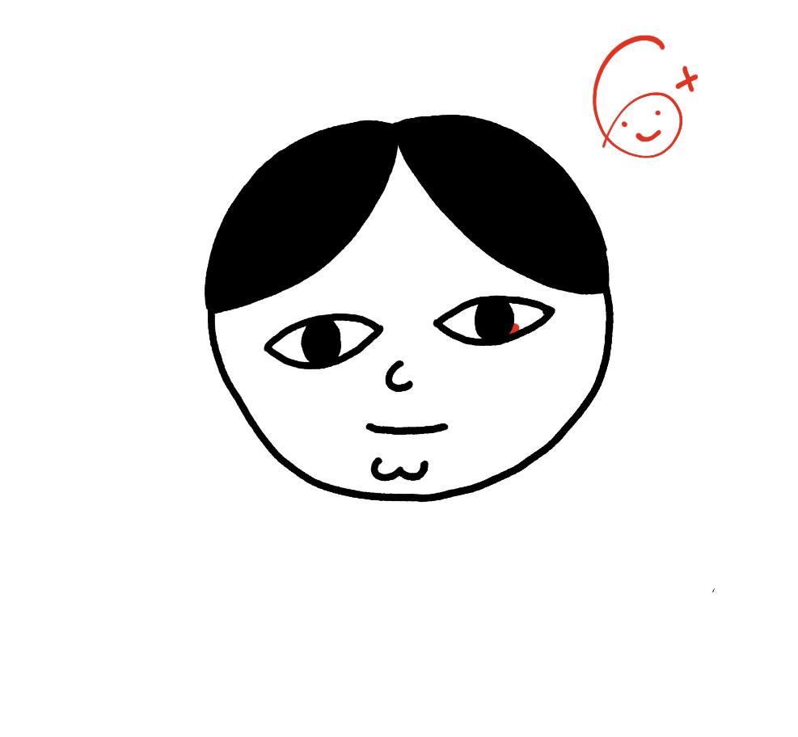
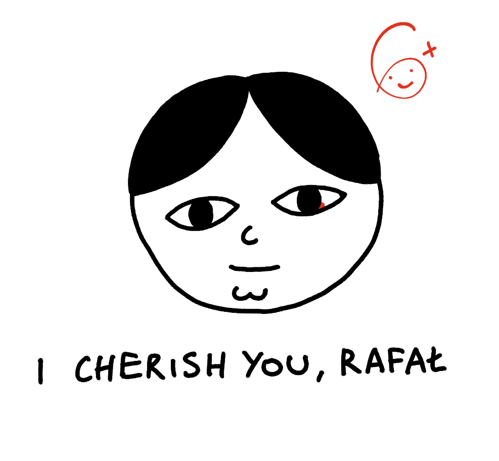

I'm not completely sure where I'm going with this, but stay with me, ok? Let's hold hands. No? OK, fine, that's fine too.

❧

A few months back I was speaking with a startup founder looking for an engineer.  They asked the typical interview question, something along the lines of: "What do you want to do? What drives you?". The response I gave them felt honest at the time, but after the call it was followed by a familiar feeling of emptiness, the feeling I get after interviews which seemingly, *technically* went well. Technically. *Technically correct is the best kind of correct*, as my fellow 10x developer friend once told me. I'd never speak with them again. I wasn't honest.

I realised that 3-4 days later, as I was cutting out a picture of a homocercal tail fin and pasting it onto a picture of my dog and listening to some synthwave downloaded from itch.io: I was working on [Meat GPT](https://meat-gpt.sonnet.io). Is this what I want to be doing? I'm fucked. I was born poor and I will die poor.

Homocercal caudal fins are symmetrical ([CC](https://en.wikipedia.org/wiki/Fish_fin#/media/File:Barb_gonio_080525_9610_ltn_Cf.jpg))

The truth is, I felt that even *that* was more useful than whatever those (arguably much more accomplished and smarter than me) people were doing. When it comes to finding jobs in tech the usefulness of your work is inversely proportional to the salary. The more you get paid, the more useless you are. We, as a species, are screwed.

**Anyway, let's draw a Janusz!**

What's a Janusz you ask? It doesn't matter. And it's pronounced yah-noosh, like baba ganoush.

### What you'll need:

- something to draw with
- something to draw on
- 5 minutes of your time (or as long as you like, the longer, the better)

I'll be using Procreate, since I'm used to it, but pick whatever tools you have at hand. **Don't overthink it.**

1\. Draw a circle (or mostly a circle). This will be the head of Janusz. Draw it slightly above the centre of the page. We'll need that space later.

2\. Draw 2 arcs coming from the top of the head to the sides. These will mark Janusz's hairline.
 
  

Sometimes it helps to visualise two ellipses meeting at the centre and overlapping with the circle forming the head. A *Vitruvian* Janusz, so to speak:

3\. Did you know that Leonardo named his work after a famous Roman architect? Now fill the spaces to give Janusz a healthy dark hairline.

4\. Perfect. I like to plump it up a little bit at the top:

5\. Time for the eyes. Note that the pupils are slightly elongated, a bit like in the drawings by [Jon Klassen](https://i.cbc.ca/1.4270907.1504213418!/fileImage/httpImage/image.jpg_gen/derivatives/16x9_780/jon-klassen.jpg). Janusz's eyes are deep and dark like the Silesian coal mines. If you stare into them for too long you'll feel what French call _l’appel du vide_. I warned you.

6\. Time for the lips and the nose. Don't worry about getting his nose perfect. Perfect noses lack character.

7\. Now let's give him a chin.

The dimple reminds me of a radio presenter who used to keep me company during the nights when I had to work, following afternoons I spent studying for exams. His biography is titled: *How I didn't become a saxophonist*.
   
Who is your favourite owner of a dimple? Do they play any instruments?

8\. We're almost there! Now, draw a big **6+** in the top right corner, ideally using a different colour. Red or green is suitable for Janusz at this time of the year. You can add a smiley face at the bottom. 

Why 6+ and why a smiley face? Because Poland uses a numeric scale for grades: 5 is the equivalent of an A, 6+ is an out of bounds `Exception`. And Janusz *is* exceptional.

9\. Finally, take your drawing and use the empty space we saved up for later to write these words: I cherish you `<insert your name here>`. Janusz thinks you're great. Because *you* **made** him. And you know what? You are great. You're fantastic.

Drawing helps me get out of my head. I hope that next time you need to get out of yours, it'll get a bit easier.

Hugs.
R.

- PS. Share your Janusz with me! You can use my [email](mailto:hello@sonnet.io), [mastodon](https://mastodon.cloud/@raf), or [twitter](https://twitter.com/rafalpast).
- PPS. Check my [meeting notes](https://potato.horse) for more drawings of Janusz, like [Janusz Detective](https://www.potato.horse/p/4ZPPRo37jC3hrFg4RCX5rz), [Jodie Foster Nut](https://www.potato.horse/p/6ChJKGuyRCltoTFqj3zMCK)  and more!