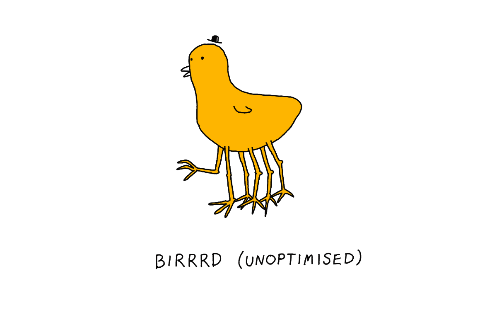
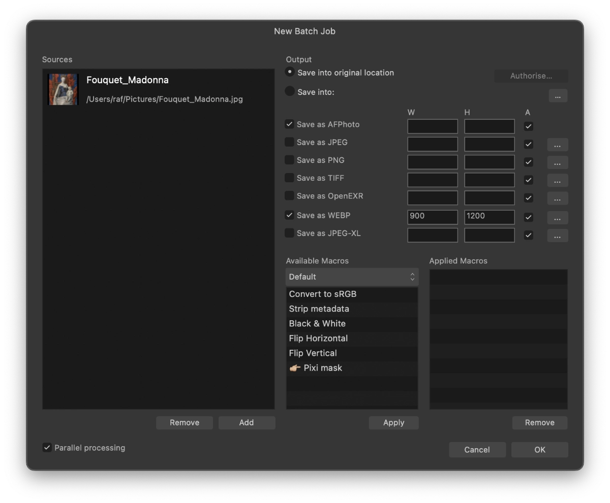

(Last updated on 2023-11-21)



## Problem:

Obsidian doesn't optimise images out of the box. This site, especially, is full of screenshots or images that don't compress well with PNG. All of this works nicely locally, but can take *minutes* on slower connections. I want to be [kind](<../Be kind, be curious>) to my users.

I had some issues with the [Image Converter](obsidian://show-plugin?id=image-converter) plugin and I'd like to optimise images only selectively. **Give Image Converter a go before following my approach.**

### Solution 1: Convert using [ffmpeg](https://ffmpeg.org/download.html)

```bash
for i in *.png; do ffmpeg -i "$i" "${i%.*}.webp"; done
```

### Solution 2:  Batch process with [Affinity Photo](https://affinity.serif.com/en-gb/)

Since you're here, you might also want to check out the [Alternatives to Adobe](<../Alternatives to Adobe>).
