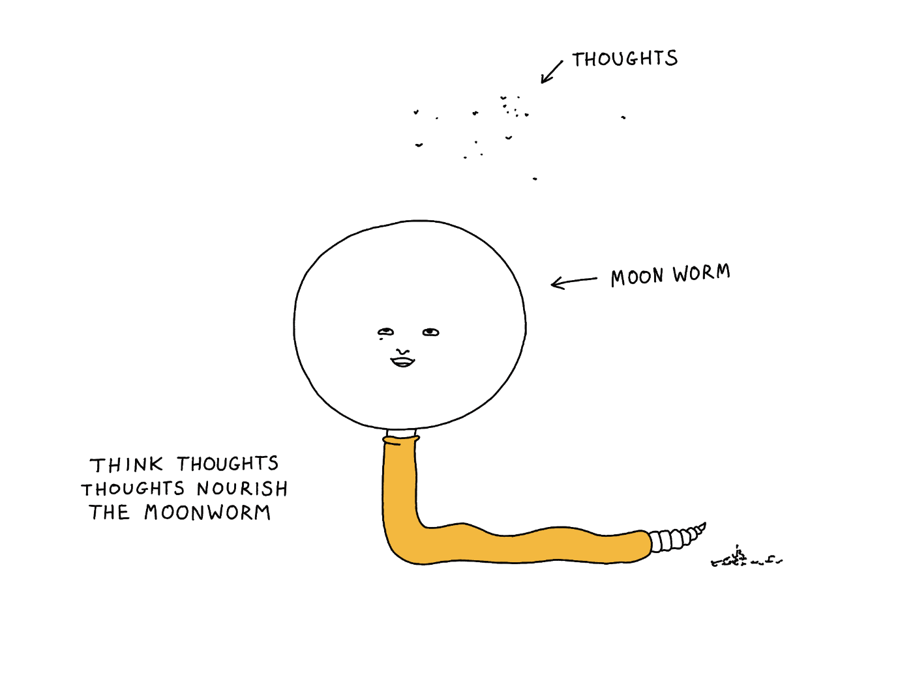
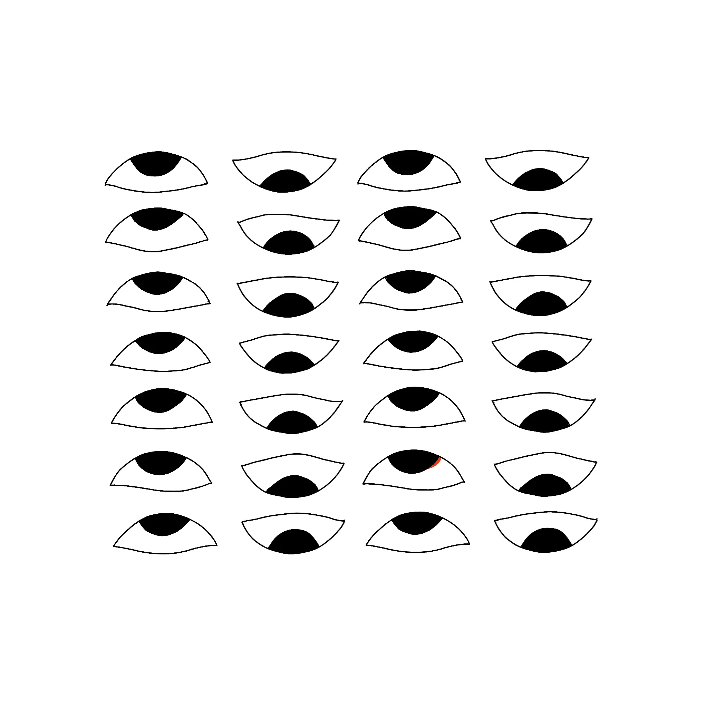
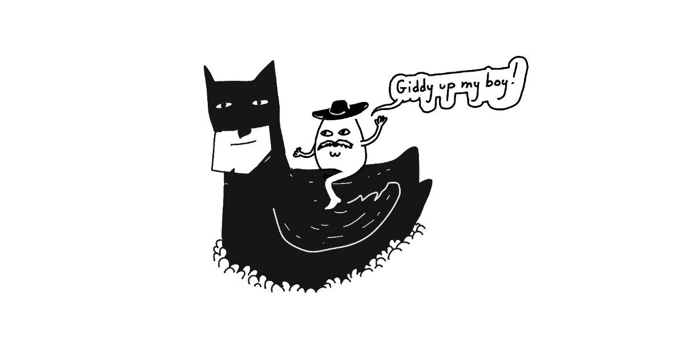

I'm trying to get back into a [regular posting schedule](<../Share your unfinished, scrappy work>), so I hope you won't mind keeping things a bit less techy for a minute (or sixty). I'll do my best to follow the rules of this site: [spark your curiosity](<../Be kind, be curious>), entertain you or, at the very least, inspire you (because you'll realise you can do it even better!). 

Now, enough with the [disclaimers](<../Disclaimer>), it's Moonworm time™:

I used to be an insomniac, the 2-3 hours of sleep per night variety. This has improved gradually over 20-ish years. But, not unlike other people with permanent matches installed under their eyelids, I developed a somewhat paranoid, controlling relationship with my sleep. 

For instance, I had a set of rules meant to guarantee uninterrupted sleep. These ranged from the sensible: 

- *take a hot shower before bed*
- *go to bed before xx:xx* 

to the less orthodox ones: 

- *under any circumstances, do **not** think about the [Wunderbaum](https://wunderbaum.com/wb/home-wb) car scent during the day, because you if you do, **you will wake up**. You're not thinking about it? Good. I'm so happy you're not thinking about Wunderbaum.*

To be clear, I was aware of how irrational that sounds, but the muscle memory, the reflex, stayed. Most people with herpetophobia know that snakes are not *just waiting out there to get them*. And they're *mostly* right.

That's all to say I was a little bit of a control freak when it came to sleep. And not in the rational *let's-maintain-good-sleep-hygiene* kind of way. That made some things scarier that they should have been. If to adult-me, the prospect of skipping a night is a nuisance, to teenage-me it felt like punishment, and when I was a young adult – it was confusing torture, one I couldn't think my way out of.

Luckily, despite and because of this (mildly paranoid) context, I came up with another rule, one that would override all of the above: ***if it was late, but I felt inspired, I didn't give a shit about sleep***. I'd just skip the night and take my sweet time to: write, draw, practice calligraphy, code a little toy, make a little sculpture from a scrap of wood. I'd never rush, and never judge myself in that state, just do the thing. I wouldn't feel scared of the dark or worry about being late to work. 

And, what still amazes me is that it all came with such ease! The usual anxiety that accompanies insomnia was mostly absent (just the like the refreshing, resinous and, dare I say, slightly soapy aroma we all [love and enjoy™ 🌲](https://wunderbaum.com/wb/home-wb?referral=PLEASE_SPONSOR_ME_WUNDERBAUM_YOU_OWE_IT_TO_ME_ALL_THE_MIDNIGHT_DREARY_CAN_I_PLURALISE_THAT_WORK_EVEN_WAIT_I_FORGOT_TO_INTRODUCE_MYSELF_ITS_ME_RAFAL)).

---

Any creative pursuit can feel both exhilarating (flow, [Dog mode](<../Dog mode>)) and dreadful, anxiety-inducing (staring at a blank piece of paper, ruminating). A big part of the latter is that when we see the blank piece of paper, we protest against it. We try to brute-force it out of existence, then deus-ex-machina something else in its place (that *something else* perhaps being a sense of safety).

Of course we all know that's not how it works. You came with a donkey preinstalled in your head. The harder you pull it in one direction, the stronger it resists. Also, every time it brays it sounds more like *fuck-you* than *hee-haw*. Mine's called Adalbert by the way.

*(No, I did not write myself into a corner, [you did](https://youtu.be/jK60Jpe0ito?t=42)!)* 

What I'm trying to say here (poorly): what worked for me then, and what seems to work now is to *give myself permission to give up control*. Give up control over something I couldn't control in the first place. [Acceptance is Defiance](<../Acceptance is Defiance>).

If you're in any way an over-thinker like me: give yourself permission to do art (uppercase, lowercase). It also does not matter whether you're good at it. 

Correction: it helps if you're somewhat terrible at it. Lower that bar until you can't even trip on it. And if you do, [tell me about it](https://sonnet.io/posts/hi)!

Thanks for reading!
