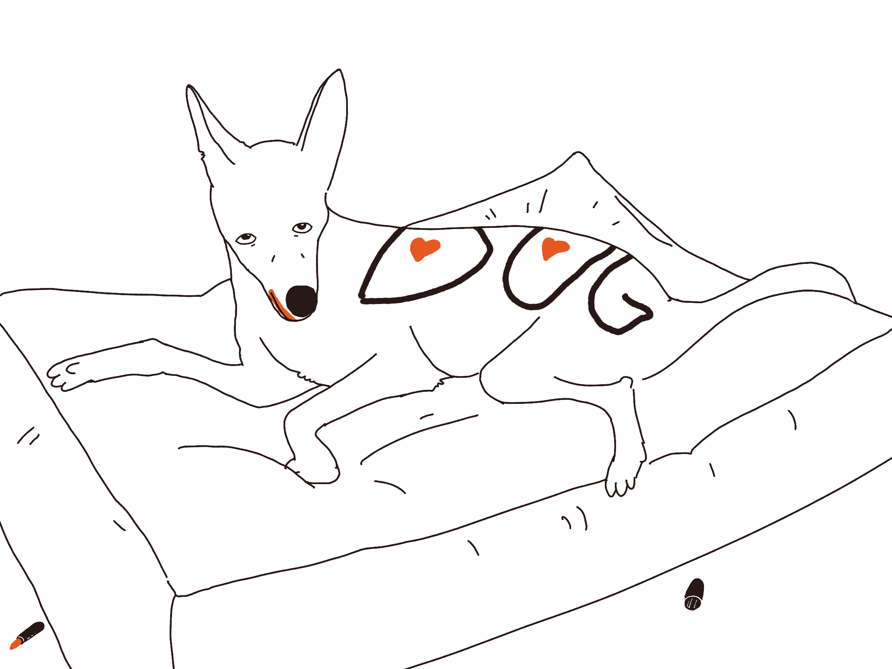

**Next time you want to leave a comment, write a post and link that to the thread. Self-publishing, even short-form content will make you wiser and calmer.**

Here's what to expect:

**You'll focus more on sharpening your mind, deepening and structuring your knowledge better.** We learn better through writing. 

**You'll be less emotion- and karma-driven.** Writing a comment ≠ writing. Our activity on social media is inherently performative and based on compulsion. This might sound obvious, but some obvious ideas need to be experienced to be understood. To me, the moment I grokked it happened when I was moving my drawings from Instagram to [potato.horse](https://potato.horse). I realised that suddenly coming up with labels for my drawings, wrapping them in little silly stories, and frankly — just saying what **I wanted** to say — became so much easier. It felt like unbuttoning a collar that's too tight. I got my voice back. I still mirror my content to IG, but I publish to my site first, because framing is important.

**Your post will be of higher quality than the comment.** 

**You'll own the thing you wrote.** Don't get fooled that you need to rent your voice from a third-party.

**You'll be able to share and reuse the comment later.** For instance, I wrote [useRainbow()](https://sonnet.io/posts/use-rainbow) because someone reverse-engineered the code of potato.horse and as as way of saying thanks I replied with a short technical follow up. Using a comment thread felt really constraining, and somewhat dumbed down. So a few days later I followed up with an article. That article got thousands of views, was republished on CSS Tricks, someone even ran a Twitch stream reimplementing the technique using WebComponents. And, keep in mind that I have almost no social media following. If I left with a comment, it'd drown in a the usual karma-driven shitpost competition Reddit threads are.

Incidentally, most of the traffic to my [main blog](https://sonnet.io) comes from the comments linking to my posts on social media or Hacker News, not from submissions. Having a link I can share in a relevant and useful context means that I can contribute to a conversation with much higher quality.

**You'll interact with people at a deeper level.** People appreciate self-published content much more. On social media, so many of us perform and consume instead of creating. This became obvious to me during my [Say hi](http://sonnet.io/posts/hi) calls: people are generally kind. 
The consumers are not to blame here. Remember, the relationship between you and the social media platform you're using using is antagonistic. The environment is designed to pit us against each other, squeeze that sweet engagement juice and turn it into a delicious CPM, but I digress.

**You will feel better.** You will feel like you made something.

And in the worst case you'll stop writing half-way through and realise there was nothing to post. You were not excited, you were just pissed. And that's fantastic! You didn't get tricked into feeling angry, anxious or superior. You took the trap someone set for you and tried to turn it into something better, something of value. You didn't end up with a tangible artefact of your work, but you became a little bit wiser and a little bit calmer. 

I am yet to regret a moment when I chose to sit down and write instead of posting.

I hope you'll give this a try.

Hugs, R.

PS. If you need help with setting up your own site, [message me](https://sonnet.io/) or [Come and Say Hi](https://sonnet.io/posts/hi). I won't be able to build it for you for free, but I'm happy to point you in the right direction.

---

Meta (talking to myself)

This post was much easier to write as I based it on my evergreen notes. Perhaps it's worth to publish the thing not as a blog, but as a digital garden. I feel like it would allow people to read this at a different pace.

At the same time, I don't like the way my content looks when published using Obsidian. I want more control over the design.

