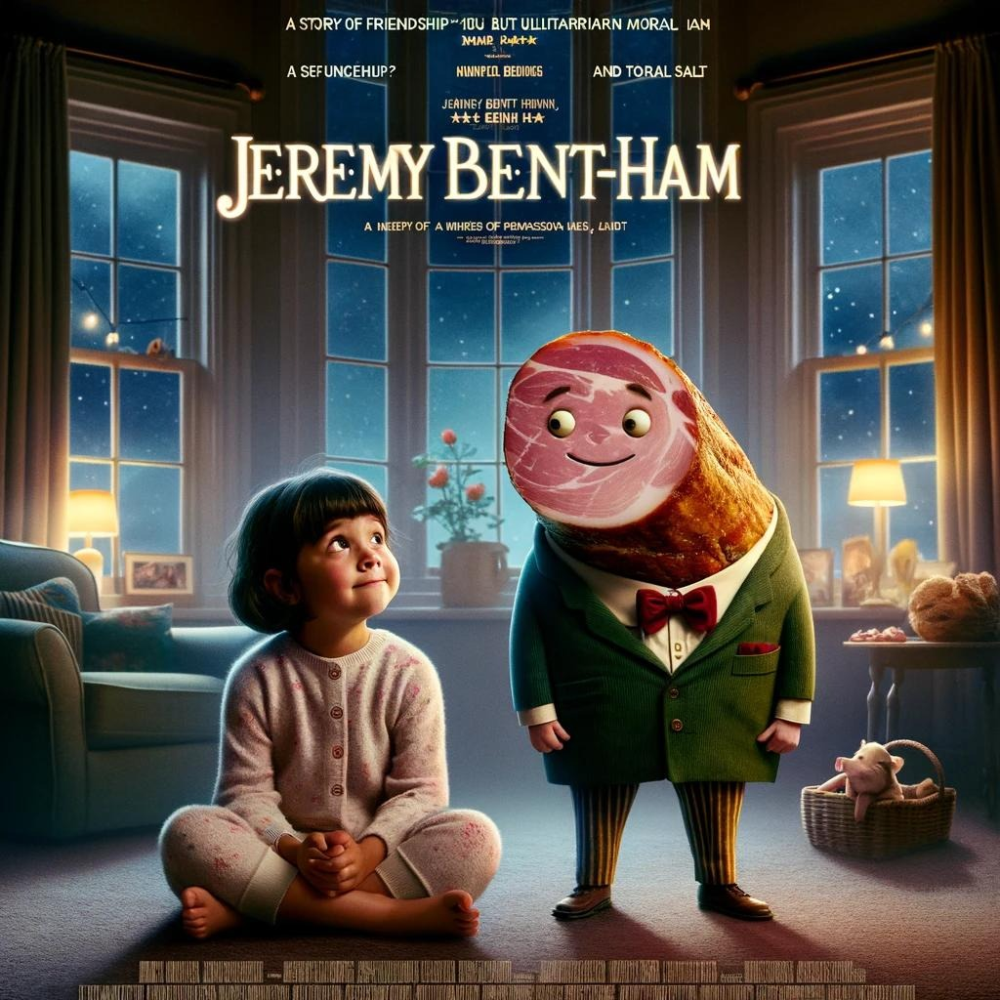
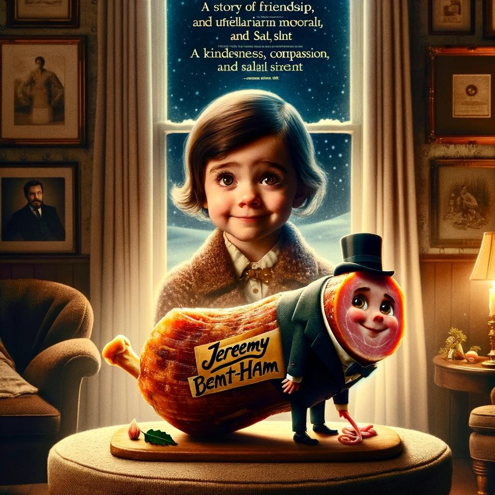

I wrote a pitch for a Christmas movie. My inspiration was a recent philosophical debate spotted in the Hacker News comment section and my previous failed startup idea: [Roland Topor Fidget Spinner](<../Roland Topor Fidget Spinner>). Here we go:

*IN A WORLD...*

*Nikki is 5 years old. Her parents need to urgently leave the house, but due to an earlier mishap with a babysitter and financial difficulties decide to leave her only with Jeremy Bentham — a leg of cured ham, acting as both source of sustenance and moral support.*

*Jeremy Bent-ham is a story of friendship, utilitarian morality and a proof that even in the darkest times — kindness, compassion, and salt are the best cure.*

*Jeremy Bent-ham: A Sefungehup?*

Related: [Medieval Content Farm and Procedural Cheese](<../Medieval Content Farm and Procedural Cheese>)
