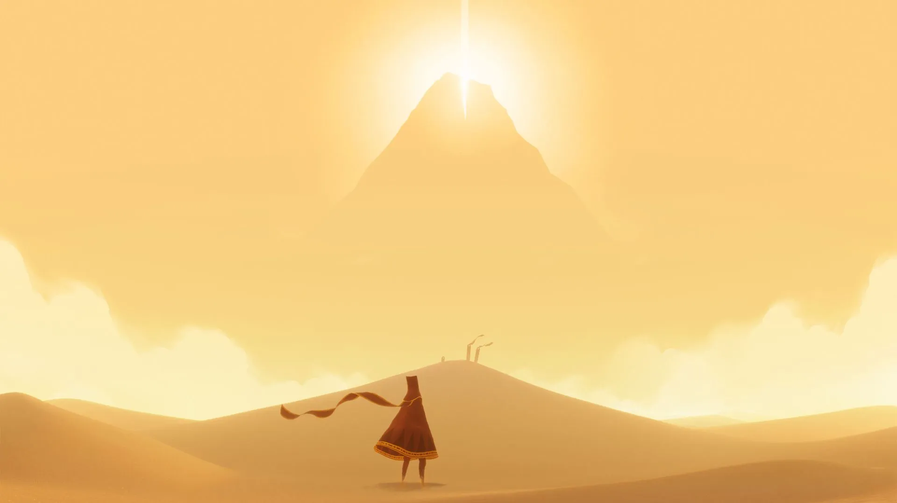

The goal of Journey is to reach the Mountain. The Mountain rises above the horizon, far away, behind the dunes of a seemingly never-ending desert. The story is simple, far from unique: the protagonist travelling to axis mundi to find their beginning-end. I'd still rather not spoil it completely here, as it's told so beautifully.

Journey is one of the few games I finished with tears in my eyes. The reason I teared up at the end was not the story, but a particular mechanic used in the game. Here's how it works:

The game has built-in coop mode. You meet unnamed players during the climb up the mountain, but you can't communicate with them directly through text or audio. The only way to do it is through movement: you can get closer to them and press a button to make a little chirp. Timing it well allows you to recharge the energy of the other player and let them fly for a bit longer. That's it.

What's beautiful about this mechanic is that:

- People come and go, hang out with you for however long they want.
- Since the only means of communication is movement, you gradually develop a language, and that language is dance!

It works so well for me because:

**I'm cheesy and [sentimental](<../2 cheesy existential metaphors>).** (the first reader of this note burst out laughing, but I'm keeping it [anyway](<../111>))

**It says so much with so little.** Just like with any other form of art, it tricks me into building the story in my own mind, but the story is not made from words, but non-verbalised thought-dumplings (filled with memories, sensations). Not all stories can be told with words.

## References
[10 years later, there’s still nothing like Journey’s multiplayer - The Verge](https://www.theverge.com/2022/3/13/22972989/journey-10-year-anniversary-multiplayer-jenova-chen-austin-wintory)

