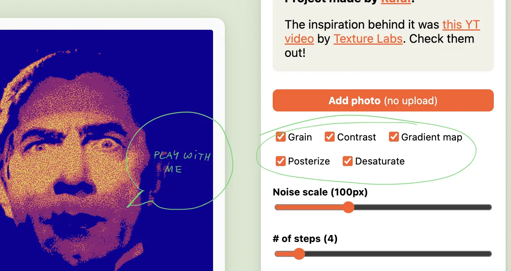
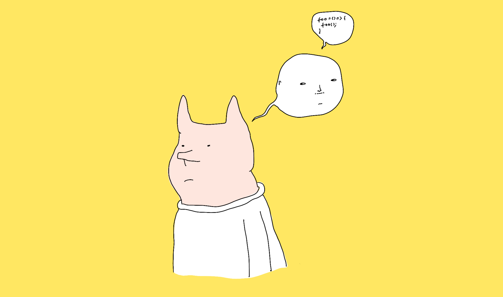

Hi there! This one will be quick. Let's let the code speak for itself for a change.


A week back or so I saw a [video by a channel called Texture Labs](https://www.youtube.com/watch?v=1poWgZWpsiY&t=22s) explaining a simple shading technique using gradients, grain and posterise. I thought it would be a fun thing to play with, so here you go. [Just Some Innocent Gradient Fun](https://grain.potato.horse) is a simple graphics editor demonstrating the technique mentioned in the video.


> [!NOTE] **Check it out [here](https://grain.potato.horse/).**

<marquee style='font-family: cursive; font-size: 2em'>
or <a href='//grain.potato.horse' target='_blank'>heeere</a> 
</marquee>

### How it works:

The video does a pretty good job explaining the effect itself, so I recommend watching it out for more context. The process boils down to 4 steps:

1. desaturate the base image
2. apply the noise
3. reduce the number of colours to 3-5 steps (e.g. using *posterize*)
4. apply a gradient mask

I prefer learning by playing, tweaking, and breaking things. So I added a bit of UI to control different parts of the effect, in case you're similar to me in that regard:



### How it works in HTML + CSS

If you're interested in a longer write-up, [let me know](mailto:hello@sonnet.io). Today, we're [half-assing](<../Half-ass it>) things. 

In short, the image is wrapped in a bunch of HTML elements called *Layers*. Each *Layer* has a `filter: url(#some-svg-filter)` applied to it. Those `#some-svg-filter` IDs point to an invisible SVG element with SVG filter definitions. 

```html
  <div
	className={styles.layer}
	style={ { filter: 'url("#posterize")' } }
>
	
```


```jsx
  <svg xmlns="http://www.w3.org/2000/svg" version="1.1" style="display: none;">
    <defs>
      <filter id="posterize">
        <feComponentTransfer>
          <feFuncR type="discrete" tableValues={posterSteps} />
          <feFuncG type="discrete" tableValues={posterSteps} />
          <feFuncB type="discrete" tableValues={posterSteps} />
        </feComponentTransfer>
      </filter>
    ...
    </defs>
 </svg>
```

In a real world scenario, you could do just fine with 1-2 DOM elements because CSS filters can be stacked. I kept them separate to make the code easier to read and mess with.

### What I've learned: 

[Just Some Innocent Gradient Fun/SVG filter quirks](<../Just Some Innocent Gradient Fun/SVG filter quirks>)

### Next steps:

Not much. This was fun to play with, but I'm trying to me more selective with my time since I have more important things to wrap up this year (like the next version of [Ensō](https://enso.sonnet.io)!)

OK, there's one tempting idea: creating a web component that wraps an image element to render it in the style of [Return of the Obra Dinn](https://store.steampowered.com/app/653530/Return_of_the_Obra_Dinn/) or applies a dithering effect like some of the bio entries on this site ([Wislawa Szymborska](<../Wislawa Szymborska>), [Zygmunt Bauman](<../Zygmunt Bauman>)).

### Why I made it:

1. [Share your unfinished, scrappy work](<../Share your unfinished, scrappy work>)
2. [Dog mode](<../Dog mode>)
3. [Why make toys, why play?](<../Why make toys, why play?>)


(I needed to get out of a rut, and sometimes making useless things helps me get back on track.)

Thanks for reading, see you tomorrow!



