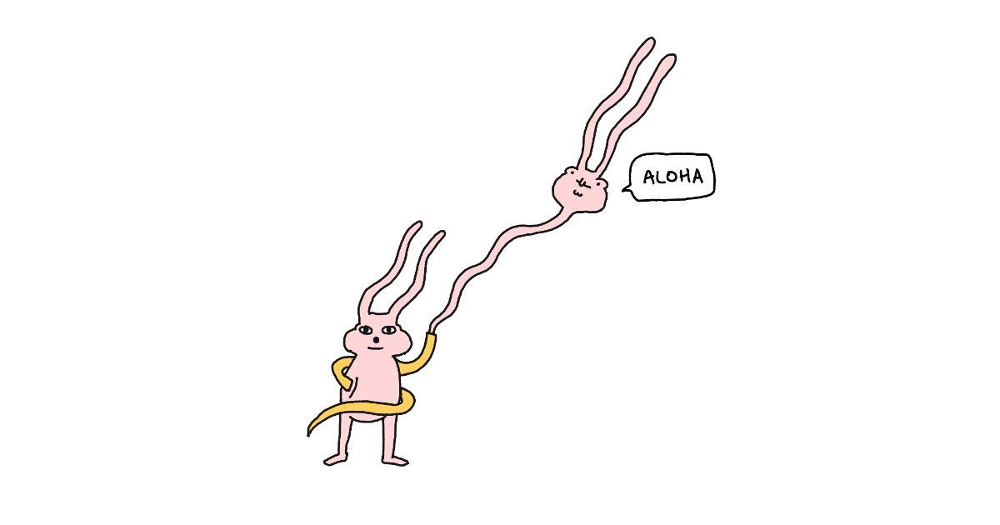
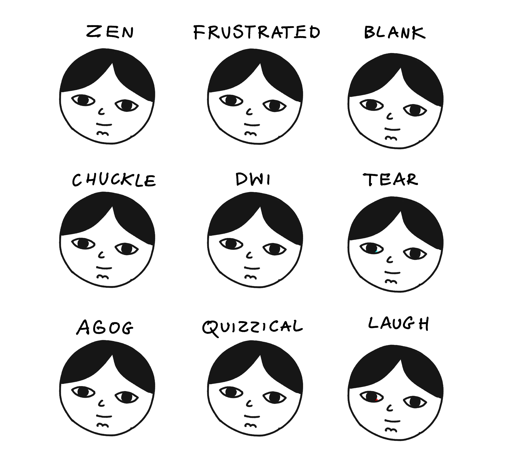

I liked Steph Ango's avatars [almost as much as the Notion design team](https://x.com/kepano/status/1838906680517554617), so I decided to share some of the ones I made for myself ages ago. 

Before we get there: this was meant to be a silly little note I'd share to warm up a bit and get back to a more regular writing schedule, but it seems that I (accidentally, and against my better judgment) DID learn something: 

1. *Kepano* and *kepasa* (which is how Ango calls these avatars) are *[hawaiianisations](https://en.wikipedia.org/wiki/Hawaiianization)* of his first name, thus *Kepasa* ← *que pasa*. 
2. Hawaiian has only 13 distinct [phones](<../Phone (linguistics)>)
3. Hawaiian is a critically endangered language with fewer than 300 native speakers.

Back to kepasa. Here's Steph's for reference:

And here's my Janusz:

Unfortunately the *polonisation* of *que pasa* would produce the same sound as in Hawaiian, so we'll stick with Janusz for this facet of my personal brand now.

Finally, I am aware that my hyperrealistic drawing style can seem intimidating to unexperienced artists, but if you want to give it a go, check out [How to draw a Janusz](<../How to draw a Janusz>).

But why [stop there](<../The Janusz I Live In>)?