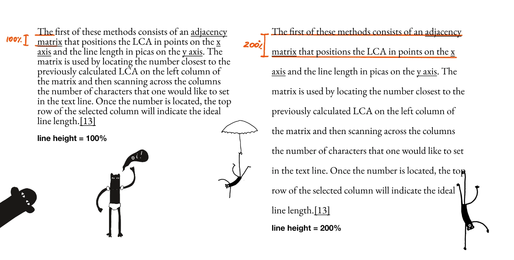
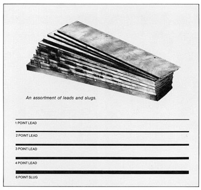

I was going to post a longer note but I'm both a typography and languages nerd and this little \#til tickled my brain in stereo.

## Line height and leading

In typography *line height* (or more precisely *interline* height) is the space between two adjacent lines of text:

*Don't worry about the monkeys, they just want your attention*

In a more traditional typesetting context, line height is usually called leading (*/led-ing/* not */leed-ing/*). But why is that? This has to do with the fact that historically spacing between lines of text was achieved through filling the gaps with lead strips (called leads, hence the pronunciation). 

Currently both terms can be used interchangeably, although leading is more common in more classic DTP software (e.g. InDesign or QuarkXPress).

## Line length and measure

The difference between line length and measure is a bit more subtle. And, it depends on the type of unit used.

*Technically*, line length should be used to describe the width of a block of text measured in pixels, inches, points, picas, etc... However, when we are talking about *characters per line*, we're talking about the *measure*.

Languages constantly evolve and, obviously, I don't think it matters which term you choose. Just make sure people can understand what you're talking about. 

(If you really want to sound smarter, but on the cheap, just replace *basically* with *essentially* in your vocab. *[Essentially](<../Essentially>)* is the *Marks and Spencer* of useless words.)

## References

- [The Thing With Leading in CSS · Matthias Ott – User Experience Designer](https://matthiasott.com/notes/the-thing-with-leading-in-css)
- [Line length | Butterick’s Practical Typography](https://practicaltypography.com/line-length.html)

