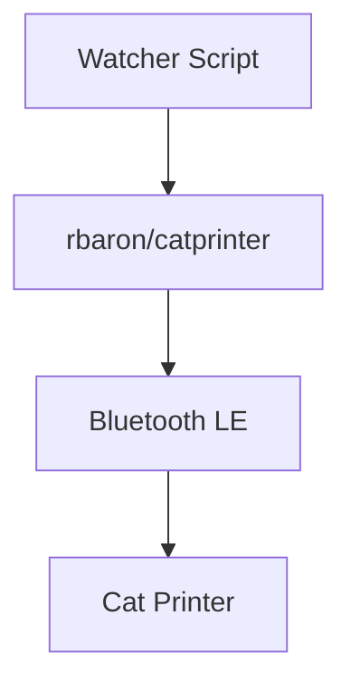

## Scope

1. integrate with the site
2. no scale, just a one-off project for me
3. later, maybe, put it in a nice wooden box and give to someone

### My setup:

Intel Mac running [GitHub - rbaron/catprinter: 🐱🖨](https://github.com/rbaron/catprinter)
*(It's my local server and I'm connecting to it via ssh from an M1 Machine, because of a driver issue)*

- Watcher Script: A script watching a dir and calling rbaron/catprinter

### Next

- watcher can poll Vercel KV with a queue of print jobs
- build a simple webhook/UI for adding items to the queue

## What's hard
- matching the right cat printer version with the right client lib
	- could be solved by buying the white-labelled version on the cheap

## TIL

- more python than node libs available
- needed to decompile java code to see the printer ids, mangled command ids etc...

### References:
[Cat Printer – tools and resources](<../Cat Printer – tools and resources>)

#article-idea 

