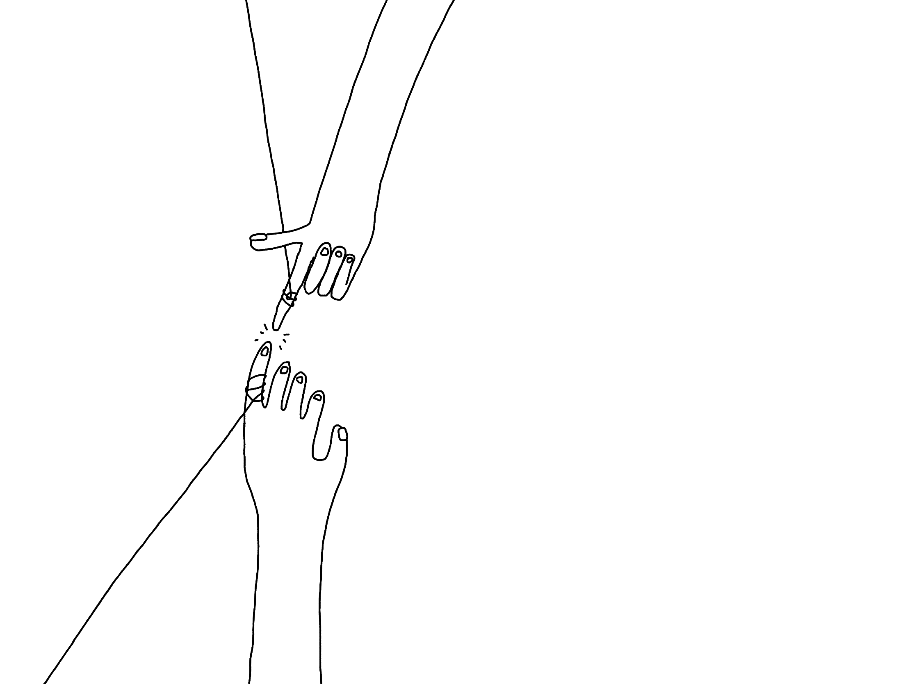
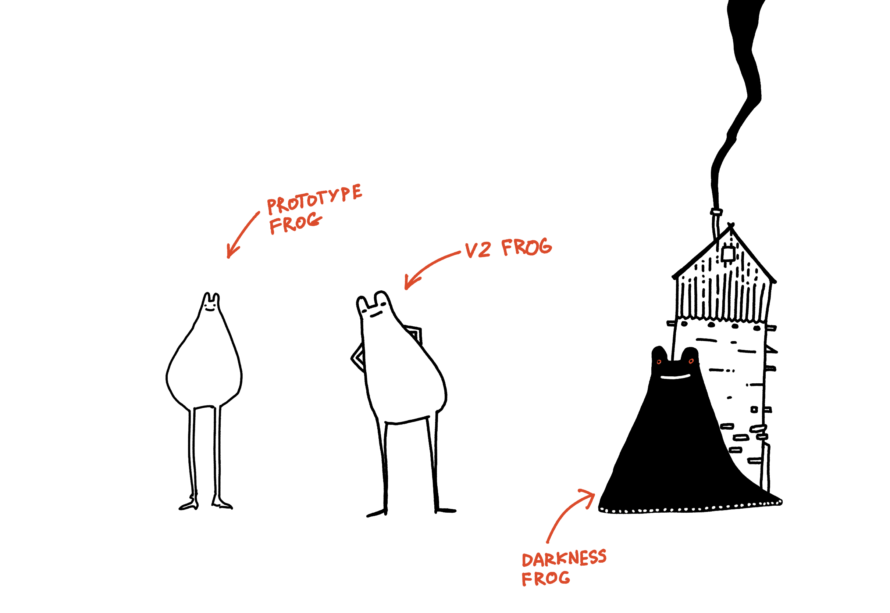
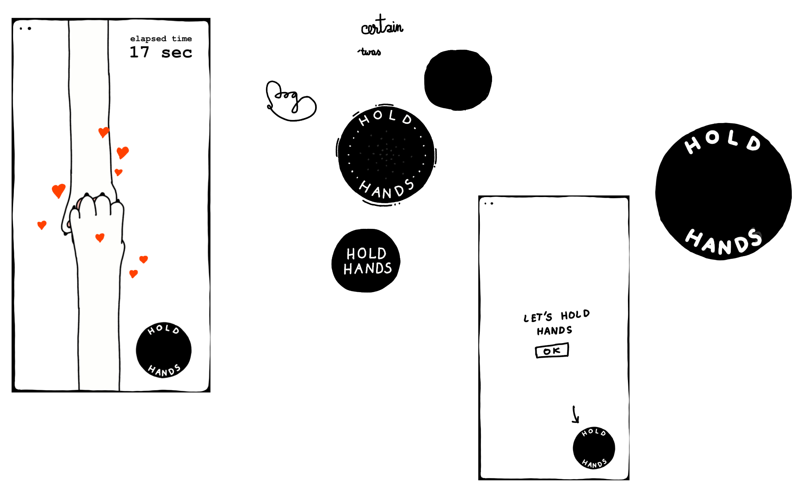
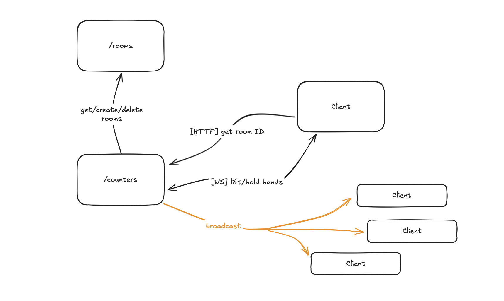
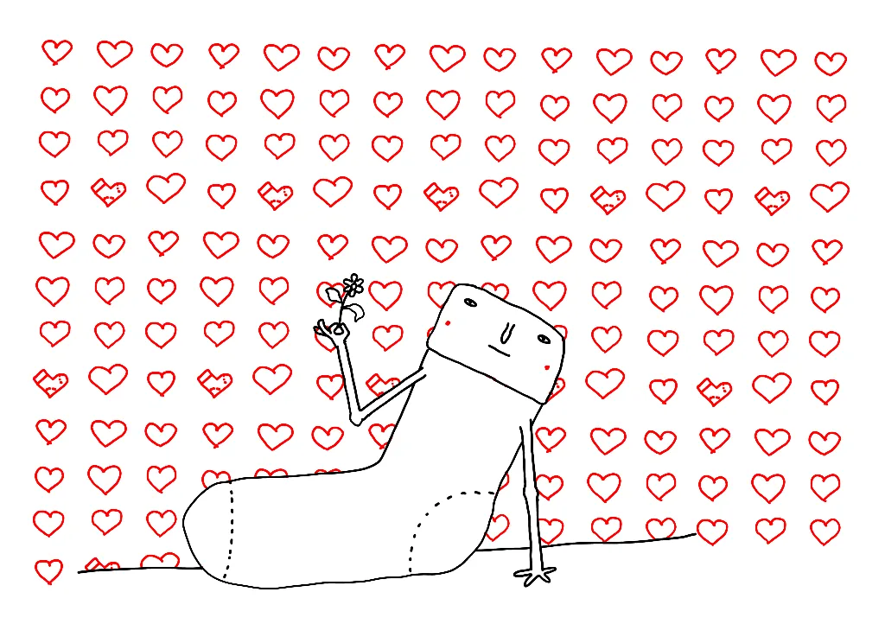
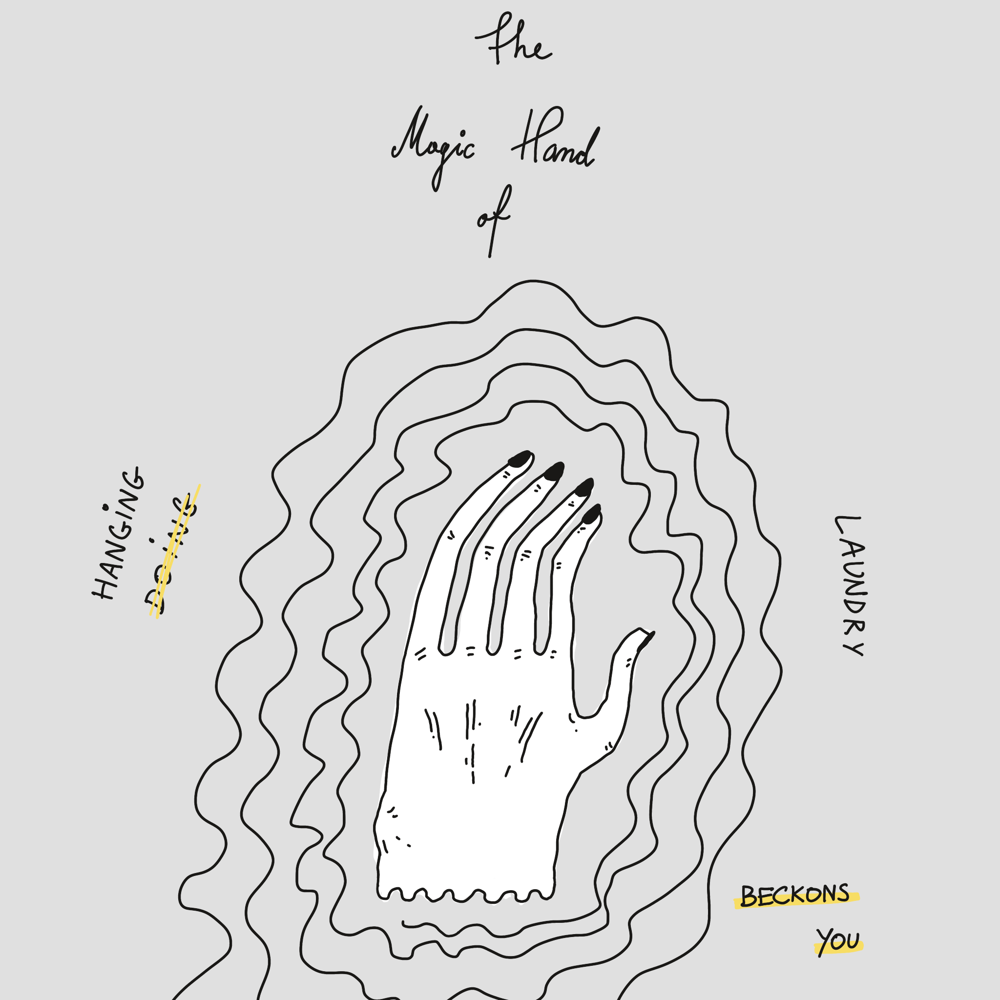
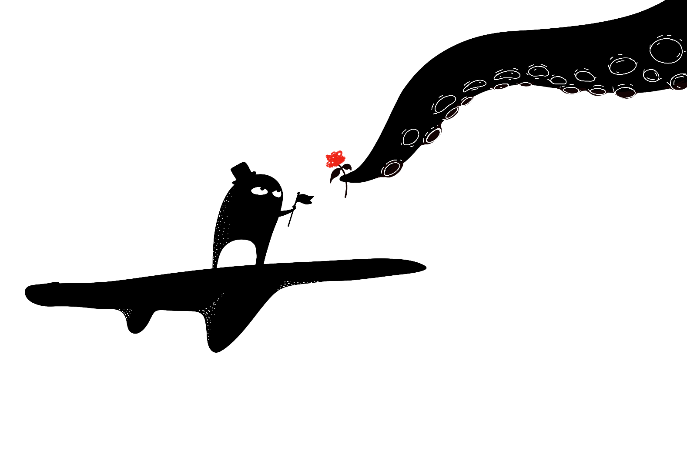

[Embed](<../How to draw a Janusz>){data-embed data-target="#^571932"}

No it's NOT fine!

**[Let's Hold Hands](https://hands.sonnet.io)** is a tiny web app where you can: 

1. hold hands.

### You can use it in two ways:

- invite a friend via a link
- wait for a person to join the pair (new users are automatically assigned to the first available pair/room)

**The entire thing takes 34-45 seconds. [Give it a go](https://hands.sonnet.io) and let me know what you think!**

## Why I made it

**Short version:** it's a fun communication problem! 

I also...

I also <a href='https://www.potato.horse/p/6YN10cl5OF9Ld6RGdWfP6C' target='_blank'>really</a> need to learn how to draw hands that don't look like they previously belonged to a Lich (dare I say, second-hand?)

**Slightly longer version:**

I enjoy working on and learning about toys/games that facilitate: 

- non-verbal communication, 
- anonymous and serendipitous encounters between people.

An example of a game that achieves this so well is [Journey](<../Journey>), where players can communicate through a series chirps and movements, only being able to learn each other's names at the end of the game (also, a completely optional step).

<video src='https://res.cloudinary.com/dlve3inen/video/upload/v1740748898/chirps.mp4' controls></video>

One of my projects dealing with a similar subject matter is [Space Kalimba/Nothing, Together](<../Sit., (together) devlog 002 – Space Kalimba>) from 2023. That tool itself is pretty trivial: you join a room as a little nameless star. You can click on another star on the screen and send it a short melody. That's it.

One of the things I've learned when I was messing with *Nothing, Together* was this: *the non-verbal interactions we have with people through a medium like this can feel deeper and more important than communicating through text*. How did I learn about this? People would bring it up ([Say Hi](<../Say Hi>)). 

Why does it work? [I'm still fermenting this in my head](<../Games and Toys and Non-verbal Communication>), but here's the gist: when we don't have words, the only thing left is touch. And playing with *Nothing, Together* feels a bit like touch. 

## How I made it

Over 2-3 weeks, in short bursts, instead of writing here. I also spent a weekend on getting the matching algorithm right.

### Process

The process was as follows:
- spike a simple AI-prompted prototype (2-3 hours)
	- good enough to get a feeling of having something tangible in our hands
	- almost all of that code needed to be rewritten (that's ok, one thing at a time)
- rewrite with better visuals, sketch in separate sessions (a few days)
	- often I draw and code at the same time, but in this case it was good to take a break from this for a day and spend a few minutes before bed doodling imaginary UIs
- rinse and repeat 
- share with the [Say Hi](<../Say Hi>) friends during calls to: 
	- see if this works, and 
	- if I'm communicating the idea well
- rinse and repeat...

Here are some example Procreate sketches I used for the UI:

Related: [Share your unfinished, scrappy work](<../Share your unfinished, scrappy work>), [2-2-2 Project Scoping Technique](<../2-2-2 Project Scoping Technique>)
### Stack 

It's pretty rudimentary, so we'll keep it short:

1. Preact w. signals, CSS modules, Typescript for the front-end
2. PartyKit for the backend
3. Vercel to deploy the front-end

Why these tools specifically? 1. and 3. because I don't have to think about those tools when I'm using them. They're somewhat boring and out of my way.

PartyKit is probably the most interesting part of the stack. In short, PartyKit is a WebSocket/HTTP wrapper around [Durable Objects](https://docs.partykit.io/how-partykit-works/) . You define your server-side code as a class with methods that respond to WebSocket messages or HTTP requests. The data associated with the class can be easily persisted. 

I've been building realtime apps since 2011 and now in 2025, PartyKit would be my default choice for a starter project because it's opinionated in a way that suits me. It solves many of the annoyances that normally would detract me from even picking up a project like this. I wish we had PartyKit before we came up with tools like AWS Lambda.

### Matching and managing rooms

We have two PartyKit Parties:

1. Rooms → assigning and managing rooms
2. Counter → receives and broadcasts messages within each hand-holding session

For me the tricky or somewhat unintuitive part here was mapping the PartyKit language into something I'm familiar with, i.e. it feels awkward to have a PartyKit party with only one room, responsible for generating room IDs to be used by other PartyKit rooms ([PartyKit Rooms and Parties](<../PartyKit Rooms and Parties>)). 

### Sketchy rendering effects

Good design feels consistent. The sketches of hands or the hold button are drawn by hand, but I was curious if I could use SVG filters to make the more repetitive parts of the UI, such as buttons.  

I think it looks fine. The main issue there was performance, esp. with more instances of SVG-generated backgrounds. Surprisingly, the culprit was not memory but computation related. I'll post another write-up on that later ([How to create sketchy visuals in SVG](<../How to create sketchy visuals in SVG>)).   

### Procedural animation

Hands are animated and laid out procedurally. The surprisingly tricky part here was the layout. Hands need to be distributed evenly but their distance needs to work for most aspect ratios so their lengths needed to be calculated. I noticed that I got a bit lost in that, so I created a separate project where I isolated the problem and tackled it separately.

### Getting the tone right

Another challenge was getting the tone right. I was working on this around the time of Valentines, and this is not a Valentine's Day card. Solution: wait for a week.

## How did it go

At the time of writing this I've shared it only with a small group of people: 

- a homesick friend cried, when they held paws with their friends across the globe
- three brothers were talking on discord, reminiscing about a difficult event from the past, two of them were holding hands in the app (neither of them knows who was the other person) 
- a person I don't know, from a slack channel I visit occasionally sent me this: 

I'm content, what more could I have asked for?

## Next

*The magic hand I drew instead of hanging the laundry, trying to convince myself to hang laundry, an ancient art known as procrastinomancy.* 

First, I'll need to get back to more frequent updates. I got sucked into a few problems I didn't enjoy or have to solve. The more I worked on this, the more I kept raising the bar. I know that what I built is too complex for what it is. The action here is to share a few, smaller technical notes about what I've learned in the past few weeks. That was the next non-technical step. Now, let's talk myriapod:

### Add centipedes 

- the forbidden third mode where more people can crash the same room
	- this is already possible but it's broken

### Broadcast empty rooms so that people who opened the app during low traffic can find a pair

If a person is waiting for a partner for longer than 1 minute, a Bluesky bot will fire a message with the link to the room.

What I would love to see/facilitate are more anonymous, serendipitous interactions between people. That's why to me the 2-person mode where we are paired with strangers feels more interesting and more rewarding.

This works perfectly if the site goes viral and new rooms are created several times per minute, but most usage patterns, with those < 1 minute long sessions, most people are likely to miss each other.

Virality is not the goal here, so adding a little channel with broadcasting empty rooms seems like a good compromise between scale and practicality. 

For instance: I imagine an interaction where someone happens to open Let's Hold Hands when they're feeling down (or just bored), then another person pops up on the screen, their hand reaches out, you hang out for 30s and leave. You leave only knowing that you spent that time with another, nameless human being. There's no expectation to talk, to learn about someone, or even to be *for* someone. Two people in a dark room saying to each other [I am I am I am](<../I am I am I am>). 

That's all for today, thanks for reading!