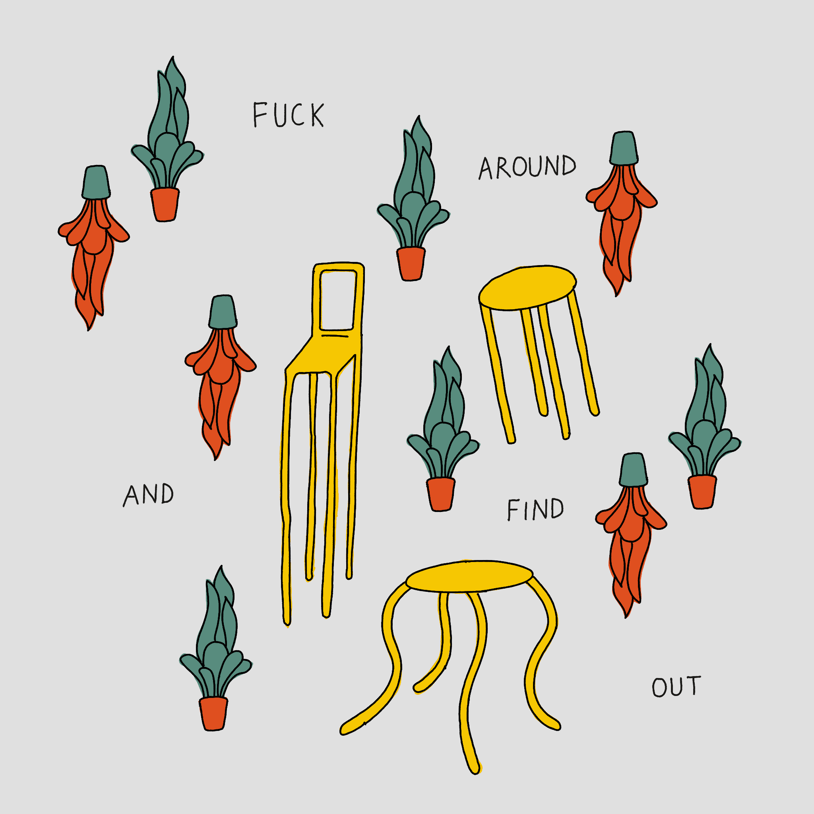
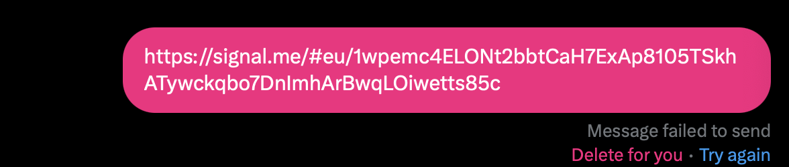

This one will be quick. I've started accumulating projects, but have gotten much worse at sharing them. So, in the spirit of [sharing unfinished, scrappy work](<../Share your unfinished, scrappy work>), let's take a look at:
**[Link in a Box](https://link-in-a-box.vercel.app)**!

## What

*(can you spot the secret message hidden in this link?)*

Link in a Box is a simple web app that allows you to share **otherwise censored** links via DMs on Twitter. 

It's pretty rudimentary, as I built it in the morning before work, so please be kind when sharing feedback (but also — please do share feedback!). That being said, it still works!

## How it works

### Technical parts:

Twitter scans messages to detect matches of signal.me in links, so we:

1. wrap the URL in a HTML link `<a href="https://signal.me/xxx>url</a>` 
2. `base64` encode the HTML markup
3. wrap the markup in a data URI

Steps 1. and 2. deal with preventing Twitter from reading the matches.
Steps 2. and 3. turn the string into a link the browser can render.

**Result:** a link that upon access will display a simple HTML page with a link to the original destination. Hence Link-in-a-box. I love data URIs!

### Non-technical parts revolved mostly around copy:

- I try to give a terse, not too technical explanation of how this works, and
- do my best to make the code easy to inspect and verify 

## Why I made it

### Short version: 

[Be kind, be curious](<../Be kind, be curious>), be of low impulse control.

### Slightly longer version:

Last week I learned that the free speech platform formerly known as Twitter started blocking some Signal Messenger links in DMs. I don't care much about the brain parasite nowadays, but I also learned that many federal workers trying to blow the whistle on DOGE use Signal as a communication tool. 

I already have experience of messing with Twitter through `base64/dataURIs`  (see [Twitter as a CDN - Epic of Gilgamesh in a Tweet](https://sonnet.io/projects#:~:text=Serve%20Pong%2C%20or%20the%20Epic%20of%20Gilgamesh%20from%20a%20single%20tweet.)) and this seemed like an easy project to pick up. 

I also occasionally build tools that reduce our reliance on Twitter, e.g. [xitter.png - privacy-friendly embeds and one-way mirrors](<../xitter.png - privacy-friendly embeds and one-way mirrors>).

It seemed like something that I could fit in 2 hours of work (and it mostly was!).

OK, these were the valid, sensible reasons to pick it up. I will need to think and write about this a bit more, but the short version is this: I picked it up because... *I picked it up*. This might sound familiar to some of you: the moment I verbalised the idea in front of another person, and heard something positive about it, I almost completely lost interest.  My focus switched to *finding reasons not to do it*, to use another person as a surrogate to argue with myself that I didn't have the time or skills to get it done quickly. 

What happened instead: 1) I sat down to work on something else, then 2) I got distracted, and sketched a proof of concept in the time it'd take me to scroll through a feed. What I wrote was a messy two-liner, but since I started moving, the [inertia](<../Inertia - the Good Parts>) kept me going instead of preventing me from starting. Embrace the [Dog mode](<../Dog mode>) then [Muddle Your Way To Success](<../Muddle Your Way To Success>).

## How I made it 

### Scope 

We need to answer these three questions:

1. will it work?
2. will people understand how to use it? (engineers sometimes miss this one)
3. if someone who needs this tool uses it, what can I do to make it safe?

There's the additional question of usage: how many people will actually use it? My answer is that for a 2 hour project, having a single person who understood and found this useful would be amazing. 

Will I accidentally abolish capitalism and become a magnesium based life form? One day. We're getting there.

### Process

1. 2-minute spike in the browser console to see if the `base64` hack works 
	1. it did! *→ question 1 potentially answered*
2. Create an empty project with `Vite` + a Claude prompt to clean up the boilerplate (Cursor is really good at this)
3. Sketch for the first 30 minutes 
4. Reuse the CSS templates/design tokens from [this site](/) and [butter](https://butter.sonnet.io) (mainly CSS vars, basic typography, spacing)
5. Share with people as I was working on it to see if they understand what it does
6. Wrap up the copy and add some doodles, share 

5\. is important. I was quite lucky as I had two [Say Hi](<../Say Hi>) calls that morning. I could use those calls to:

- find the language to describe the problem, and 
- explain the solution. 

[You're much more likely to receive useful feedback.](<../Share your unfinished, scrappy work>) if the work you're sharing is somewhat scrappy, and the interaction with it more playful.

### Technical parts

- vite + CSS modules + basic HTML + TS (no react) - it's a good balance between having a simple toolset and a good DX (yes, there are better ways) 
- deploy to vercel with [yolo](<../yolo>) - it's quick and free ([Web and Feedback Loops](<../Web and Feedback Loops>))
- no custom domain used (so no *links.sonnet.io*)
- no minimisation - make the site code easy to read (very important), even though I used a bundler

I also used my favourite JS state management tool, let's call it Ergo:

[Embed](<../State Management in JS using Proxy>){data-embed data-target="#^30891e"}

### Trust

*A Valentine's Day card I designed this year, more on [potato.horse](https://www.potato.horse/p/2KGcM6vAUboTX9aIzWlLhK). Looks boxy and somewhat sinister, hence its presence here.*

Should anyone trust a shady-looking site hosted on a vercel domain to share Signal invites? No! But there's still something we can do:

- explain how it works
- make the code publicly available
- make the site code easy to read (to verify what is actually being executed on your machine)

I want my users to be somewhat distrustful (cautious) but well-informed. This is especially important in times when our agency in getting access to information is being eroded.

## How did it go?

Link in a Box doesn't use analytics (related: [How I Use Analytics With My Indie Projects](<../How I Use Analytics With My Indie Projects>)) but the network logs showed a few thousand requests, now a few dozen per day. I get a lot of satisfaction from people messaging me to voice feedback or just say thanks for my projects. Will this happen here? Unlikely, but while I was messing with this I came up and got the energy to wrap up two more projects — more on those soon!

That's all for today, thanks for reading!